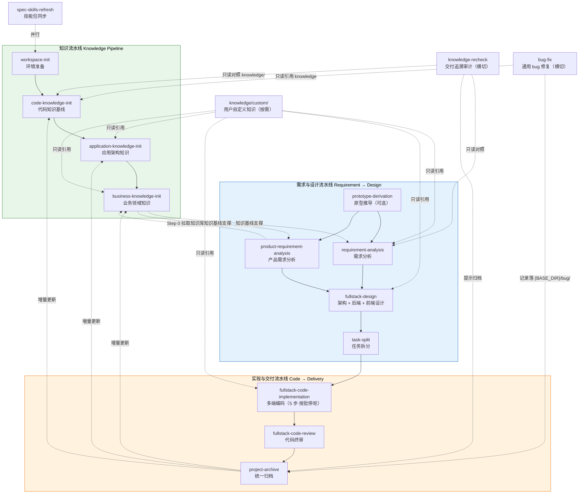
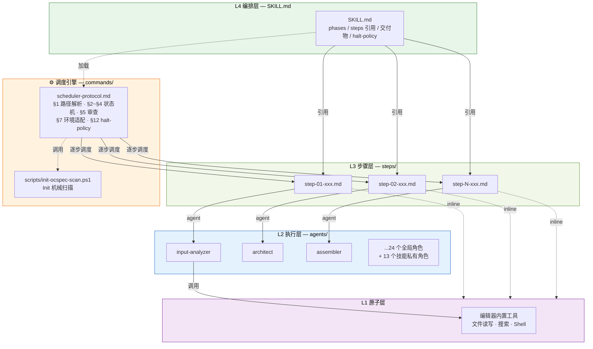
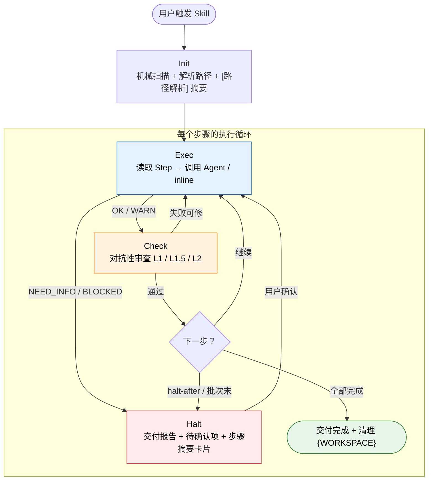
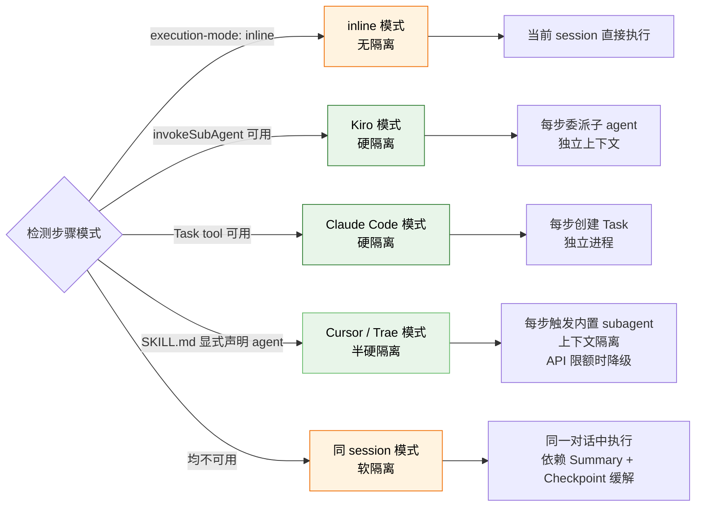

# AI Coding Skills

一套面向 AI 编程助手（Kiro / Cursor / Claude Code / Trae / OpenCode 等）的标准化技能体系，覆盖从需求分析到项目归档的完整软件工程生命周期，并向外延伸到代码约束分析、缺陷根因分析、数据变更影响分析、业务领域架构可视化等专项治理场景。通过分层架构 + 横切调度引擎，将复杂工程任务拆解为可编排、可复用、可审查的原子步骤，让 AI 在不同编辑器和模型下产出一致、可追溯的工程交付物。

技能分为四大族：

| 目录 | 定位 | 数量 |
|------|------|------|
| `skills/` | 端到端主流水线 + 横切质检修复 + 文档处理工具 | 13 主流程 + 2 横切 + 4 文档工具 |
| `analysis/` | 横切专项分析（代码约束 / 缺陷 / SQL 影响） | 3 |
| `arch/` | 业务架构可视化生成 | 1 |
| `tools/` | 元技能（用于设计新技能） | 1 |

## 快速开始

在支持的 AI 编辑器中，使用触发词即可启动对应技能：

| 触发词 | 技能 |
|--------|------|
| "空间初始化" / "一键拉代码" | `workspace-init` |
| "更新技能" / "sync skills" | `spec-skills-refresh` |
| "初始化代码知识" / "code knowledge" | `code-knowledge-init` |
| "应用架构" / "梳理应用架构" | `application-knowledge-init` |
| "业务架构" / "梳理业务架构" | `business-knowledge-init` |
| "分析原型" / "prototype derivation" | `prototype-derivation` |
| "需求分析" / "requirement analysis" | `requirement-analysis` |
| "产品需求分析" / "product requirement analysis" | `product-requirement-analysis` |
| "前后端设计" / "fullstack design" | `fullstack-design` |
| "任务拆分" / "task split" | `task-split` |
| "代码实现" / "fullstack code" | `fullstack-code-implementation` |
| "代码评审" / "code review" | `fullstack-code-review` |
| "项目归档" / "archive" | `project-archive` |
| "交付追溯审计" / "知识库复检" / "需求复检" | `knowledge-recheck` |
| "修 bug" / "bug fix" / "修复问题" | `bug-fix` |
| "代码约束分析" / "deadcode" / "异常处理治理" | `code-constraint-analyzer` |
| "缺陷分析" / "根因分析" / "问题定位" | `defect-analyzer` |
| "数据订正影响分析" / "SQL 影响分析" | `sql-impact-analyzer` |
| "业务架构HTML" / "业务知识库生成" | `bus-domain-analysis` |
| "agent skill 设计" / "技能设计" | `agent-skill-design` |

技能启动后，Scheduler 自动机械扫描并解析路径变量、按 Phase → Step 顺序驱动 Agent 执行、每步 Checkpoint 分级审查、按停轮策略在 Phase 末或每个批次后输出交付报告等待确认。

---

## 技能清单与流水线

`skills/` 下 13 个主流程技能构成三条流水线，2 个横切技能可独立使用：



### 知识流水线

从源码逆向推导，构建项目的三层知识基线；另支持按需挂载用户自定义补充知识：

| 技能 | 步骤数 | 产出 | 说明 |
|------|--------|------|------|
| `workspace-init` | 3 | 工作区仓库目录 | 按 repos.txt 批量 clone/更新仓库，校验并修复异常 |
| `spec-skills-refresh` | 3 | 技能文件同步 | 从 git 拉取最新技能包，同步 `skills/` + `agents/` + `commands/` 到各编辑器目录 |
| `code-knowledge-init` | 5 | `knowledge/code/` 下 4~5 份文档 | 扫描源码生成模块、接口、数据库、外部依赖等代码级知识（自带 7 个 PowerShell 扫描脚本） |
| `application-knowledge-init` | 4 | `knowledge/application/` 下 3 份文档 | 逆向推导系统架构拓扑、应用主数据、组件清单 |
| `business-knowledge-init` | 6 | `knowledge/business/` 下 4 份文档 | 逆向推导业务全景、流程用例、领域模型、能力附录 |

#### 知识库结构

知识库位于 `{OCSPEC_ROOT}/knowledge/`（即 `{KNOWLEDGE}`），由 Scheduler Init 解析路径变量后供各技能引用：

```text
ocspec-<xxx>/
  knowledge/
    code/<项目名>/            ← {CODE_KNOWLEDGE}   技能产出，project-archive 可融合更新
    application/              ← 应用架构终稿        技能产出，project-archive 可融合更新
    business/                 ← 业务领域终稿        技能产出，project-archive 可融合更新
    custom/                   ← {CUSTOM_KNOWLEDGE} 用户按需维护，只读引用（见下节）
    _workspace/               ← 知识库初始化技能的中间产物（base-dir-scope: ocspec-root）
```

| 层级 | 路径 | 来源 | 更新方式 |
|------|------|------|----------|
| 代码 | `knowledge/code/<项目名>/` | `code-knowledge-init` | 技能产出 + `project-archive` 增量融合 |
| 应用 | `knowledge/application/` | `application-knowledge-init` | 同上 |
| 业务 | `knowledge/business/` | `business-knowledge-init` / `bus-domain-analysis` | 同上 |
| **自定义** | **`knowledge/custom/`** | **用户/团队手工维护** | **只读引用；技能与归档均不写入** |

Init 时在 `[路径解析]` 摘要中输出 `CUSTOM_KNOWLEDGE_STATUS`：`present`（目录存在且含 `.md` 文件）或 `absent`（不存在或未使用）。`absent` 时各步骤自动跳过 custom 引用，不阻塞流水线。

#### 自定义知识（`custom/`，按需）

`custom/` 用于沉淀**技能无法从源码反推、但项目长期需要**的业务知识，例如：术语表、制度与合规规则、第三方对接手册、历史规格说明等。与单次需求的 `requirements/<需求>/requirement/` 不同，custom 是跨需求、跨迭代的团队知识。

**启用方式**（项目按需，非必建）：

```text
ocspec-<xxx>/knowledge/custom/
  README.md              ← 建议：文档索引与适用范围说明
  glossary/              ← 示例：术语、缩写
  regulations/           ← 示例：制度、审计规则
  integrations/          ← 示例：外部系统对接说明
  ...                    ← 子目录由团队自由组织，文件统一 Markdown
```

**引用规则**（详见 `commands/scheduler-protocol.md` §1.5.1）：

- **只读**：涉及知识库阅读的技能在 `CUSTOM_KNOWLEDGE_STATUS=present` 时引用；`absent` 时跳过，不 Halt
- **读取顺序**：先读 `custom/README.md`（若存在）获取索引，再按需读取相关子目录
- **优先级**：代码结构、接口、架构拓扑以 `code/` / `application/` / `business/` 为准；制度、术语、对接规范等补充信息以 `custom/` 为准
- **融合隔离**：`project-archive` / `knowledge-fuser` **不得**向 `custom/` 写入或融合

**当前消费 custom 的技能**：`requirement-analysis`、`product-requirement-analysis`、`application-knowledge-init`、`business-knowledge-init`、`fullstack-design`、`fullstack-code-implementation`、`project-archive`（归档步骤仅只读对照）。

### 需求与设计流水线

| 技能 | 步骤数 | 产出 | 说明 |
|------|--------|------|------|
| `prototype-derivation` | 4 | `requirement/prototype-derivation.md` | 从 Axure/Figma 原型推导模块映射、规则摘录、冲突矩阵与交接说明 |
| `requirement-analysis` | 3 | `requirement/requirement.md` | 5W1H 分析建模 → 事实源门禁核验 → 成稿；含评审清单 |
| `product-requirement-analysis` | 5 | `requirement/requirement.md` | 产品视角：拉取知识库(Step 0) → 头脑风暴与建模 → 事实源门禁 → 成稿 → 知识库同步清理 |
| `fullstack-design` | 7 | `design/architecture-design.md` + `backend-design.md` + `frontend-design.md`（入口索引）+ 分端设计文件 | 架构设计（应用清单、依赖、改造矩阵）→ 后端建模/接口/时序 → 前端架构与组件；分端文件按涉及目标端生成 |
| `task-split` | 2 | `task/task-split.md` | 拆分为带 `batch_id` 前缀的可落地任务清单（先后端、后前端），含依赖关系 |

### 实现与交付流水线

| 技能 | 步骤数 | 产出 | 说明 |
|------|--------|------|------|
| `fullstack-code-implementation` | 5 | 业务仓库代码变更 + `{WORKSPACE}/` 闸门记录 | 按 task-split 主分类分批（6 类端前缀）：解析批次 → 单批编码 → 小节评审（P0）→ 停轮闸门 → 终局编译/构建闸门；`halt-policy: per-batch-mandatory`，每批必须停轮等确认 |
| `fullstack-code-review` | 9 | `{WORKSPACE}/review/review-log.md` + `commit-suggestion.md` | 全局设计合规 → 后端/Android/iOS/前端模块级审查 → 影响分析 → 汇总交付 → 增量复核（最多 3 轮）；跳过小节评审已覆盖的 P0 项 |
| `project-archive` | 3 | `{ARCHIVE}/code-archive.md`、`appliaction-archive.md`、`business-archive.md` + 知识库融合更新 | 端到端统一归档，增量更新 code/application/business 三层知识（不含 `custom/`） |

> `fullstack-code-review` 的 Step 03b（Android）/ Step 03c（iOS）为条件步骤，仅在对应端有代码变更时执行。

### 横切质检与修复

| 技能 | 步骤数 | 产出 | 说明 |
|------|--------|------|------|
| `knowledge-recheck` | 3 | `{BASE_DIR}/knowledge-recheck/knowledge-quality-report.md` | 对照需求或代码范围与 knowledge 下 **code / application / business 三层**沉淀及归档状态，禁止抽样、逐条穷尽，输出分层缺口与未归档提示 |
| `bug-fix` | 7 | `{BASE_DIR}/bug/bug-fix-log.md`（追加式）+ 业务仓库代码变更 | 接报与分级(L1/L2/L3) → 定位与影响面冻结 → 修复方案 → 实施 → 验证 → 回归防护 → 记录；不进入 design→task-split→code 主流水线 |

### 分析与架构技能（`analysis/` + `arch/`）

这两个技能族**自包含**：不依赖 `skills/` 的流水线上下文，各自携带私有的 `agents/`、`checkpoints/`、`references/`，可单独投放到编辑器配置目录使用；产出以自包含 HTML 报告为主（内联 CSS，浏览器直接查看）。

| 技能 | 步骤数 | 产出 | 说明 |
|------|--------|------|------|
| `analysis/code-constraint-analyzer` | 10 | `upgrade/{scene}_{date}/analysis_{riskLevel}.html` | Java 代码库治理：无效/冗余/重复代码 + 异常处理二分法（系统异常可重试 vs 业务异常不可重试）+ Debug 日志「关键链路×量级」矩阵决策；按 high/medium/low 分级，附 before/after 方案与单测覆盖 |
| `analysis/defect-analyzer` | 8 | `{问题简称}问题分析与修复.html`（工作区根） | 缺陷根因分析：Step 1 明确性门禁（不明确即停止提问）→ 链路时序梳理 → 根因定位 → 可复现示例 → 影响评估 → 修复方案（改代码前强制作用域分析）→ 质量校验 |
| `analysis/sql-impact-analyzer` | 9 | `{场景}_data_impact_analysis.html` + `sql-impact/check_before.sql` / `check_after.sql` / `rollback.sql` | 生产数据订正影响分析：SQL 解析 → 多仓库代码链路追踪（Entity→Mapper XML→Service→EOD Job）→ 字段合理性校验 → ER 关联传导 → 重复数据风险 → 后置功能影响 → P0/P1/P2 分级 |
| `arch/bus-domain-analysis` | 10 | `{OCSPEC_ROOT}/knowledge/business/{domain}/` 下 HTML 文档包 + `{OCSPEC_ROOT}/common/` 公共资源 | 业务领域架构可视化：Step 0 系统级总览 `business_arch.html`（**强制停止**）→ Step 0.5 全部纵向领域仅总览（**再次强制停止**）→ 用户指定领域+场景后下钻生成用例时序页与应用内 code 时序页 |

三个分析技能共享同一套设计范式：**事实源优先**（所有结论须带 `文件路径:行号` 引用）、**多仓库全覆盖**、**独立 subagent 交叉校验**、**模板驱动输出**。`bus-domain-analysis` 额外遵循**代码驱动**（禁止臆造功能）、**占位符纪律**（仅允许 `[待确认]`，且打标签前必须完成最低限度检索）、**防猜测命名**三类强制约束。

### 元技能（`tools/`）

| 技能 | 步骤数 | 产出 | 说明 |
|------|--------|------|------|
| `tools/agent-skill-design` | 6 | `{skill-name}/` 完整技能目录（SKILL.md + steps + checkpoints + references + agents + README） | 借鉴 `sql-impact-analyzer` 的分阶段/校验驱动/模板引用范式，引导完成 5W1H 澄清 → Phase/Step 划分 → agent 模式分配 → 质量机制 → 产出模板 → 自动组装；全步骤 inline 执行 |

### 文档处理工具

以下技能不属于主流程，而是作为辅助工具支撑流水线中的文件解析场景。例如需求分析阶段，用户提供的原始材料可能是 PDF、Word、Excel 或 PPT 格式——将这些 Skill 放置在编辑器配置目录下，当用户在对话中提及或传入相关格式文件时，AI 会根据 Skill 描述中的触发词匹配到对应技能进行处理。

| 技能 | 支持格式 | 典型场景 |
|------|---------|---------|
| `pdf` | `.pdf` | 解析 PDF 格式的需求文档、合同、规格说明书；填表、合并拆分、OCR |
| `docx` | `.docx` | 解析 Word 格式的需求文档、会议纪要，或生成带目录/页眉的交付文档 |
| `xlsx` | `.xlsx` / `.csv` / `.tsv` | 解析 Excel 格式的数据字典、接口清单、测试用例表 |
| `pptx` | `.pptx` | 解析 PPT 格式的产品方案、架构评审材料，或生成汇报稿 |

### 多端支持

前端设计与编码均按「入口索引 + 分端文件」组织，支持五类目标端：

| `batch_id` 前缀 | 目标端 | 编码 Agent | 分端设计文件 |
|-----------------|--------|-----------|-------------|
| `BE-` | 后端 | `backend-coder` | `design/backend-design.md` |
| `FE-` | PC Web | `frontend-coder` | `design/frontend-web.md` |
| `iOS-` | iOS 原生 | `ios-coder` | `design/frontend-ios.md` |
| `Android-` | Android 原生 | `android-coder` | `design/frontend-android.md` |
| `HMOS-` | 鸿蒙 | `hmos-coder` | `design/frontend-hmos.md` |
| `H5-` | H5 | `frontend-coder` | `design/frontend-h5.md` |

`fullstack-design` 仅生成本次涉及的目标端设计文件；`fullstack-code-implementation` 默认先全部后端批次再全部前端批次；`fullstack-code-review` 按端加载对应 review/quality/p0 清单（`references/backend|frontend|ios|android|p0/`）。

---

## 架构

四个业务层级 + 一个横切调度引擎，共五个组件：

| 层 | 名称 | 载体 | 职责 |
|----|------|------|------|
| L4 | Goal（编排层） | `<skill>/SKILL.md` | 定义做什么、交付什么、步骤顺序、停轮策略 |
| L3 | Step（步骤层） | `<skill>/steps/step-XX.md` | 单步完整声明：execution-mode + agent + 参数 + 执行指令 + Summary 配置 |
| L2 | Agent（执行层） | `agents/<name>.md` 或 `<skill>/agents/<name>.md` | 角色化能力定义，通用可复用 |
| L1 | Primitive（原子层） | 编辑器内置工具 | 文件读写、搜索、Shell 等原子操作 |
| ⚙ | Scheduler（调度引擎） | `commands/scheduler-protocol.md` | 横切驱动 L4→L3→L2 运转的运行时 |

Scheduler 不属于业务层级——它先于所有层被加载，读取 L4 的步骤清单，逐步调度 L3，将参数注入 L2 执行。

`analysis/`、`arch/`、`tools/` 下的技能是**自包含单元**：L4/L3/L2 全部收敛在技能目录内部（私有 `agents/` 无 frontmatter，仅供本技能 subagent 使用），只共享 Scheduler 协议。



执行时序：

```mermaid
sequenceDiagram
    participant U as 用户
    participant SK as SKILL.md (L4)
    participant SCH as Scheduler (⚙)
    participant ST as step-XX.md (L3)
    participant AG as Agent (L2)
    participant P as 编辑器工具 (L1)

    U->>SK: 触发 Skill
    SK->>SCH: 加载调度协议
    SCH->>SK: 读取 phases / steps 清单 + halt-policy
    SCH->>P: 机械扫描 ocspec-* 目录
    SCH->>SCH: 初始化状态机 + 输出 [路径解析] 摘要

    rect rgb(240, 248, 255)
        note over SCH,P: Scheduler 驱动的步骤循环（每步重复）
        SCH->>ST: 读取当前步骤声明
        alt execution-mode: agent
            SCH->>AG: 注入角色定义 + 步骤参数 + Summary
            AG->>P: 调用原子工具
            P-->>AG: 工具结果
            AG-->>SCH: 产出文件 + STATUS_REPORT
        else execution-mode: inline
            SCH->>P: 直接执行步骤指令
            P-->>SCH: 工具结果
            SCH->>SCH: 产出文件 + STATUS_REPORT
        end
        SCH->>SCH: Checkpoint 审查 (L1/L1.5/L2) → 步骤摘要卡片 → 状态转移
    end

    SCH-->>U: 交付报告 + 待确认项
```



---

## 运行机制

以下机制由 Scheduler 统一驱动，权威定义见 `commands/scheduler-protocol.md`。

### 路径变量与 Init

Init 阶段（写任何文件之前）必须完成：

1. **机械扫描**（§1.2.1）：在工作区根执行 `commands/scripts/init-ocspec-scan.ps1`（或等价 `Get-ChildItem`）列出全部 `ocspec-*` 目录，将**原始输出**写入 `[路径解析]` 摘要。禁止凭记忆或推断填写候选；扫描已列出 ≥1 个目录时**严禁**兜底新建第二个 `ocspec-*`；命令失败或未执行则直接 Halt。
2. **变量解析**（§1.1~§1.2）：`{OCSPEC_ROOT}` → `{KNOWLEDGE}` / `{CODE_KNOWLEDGE}` / `{CUSTOM_KNOWLEDGE}` → `{BASE_DIR}` → `{REQ}` / `{DESIGN}` / `{TASK}` / `{ARCHIVE}` / `{WORKSPACE}`。
3. **scope 分支**（§1.1.1）：SKILL.md 的 `base-dir-scope` 决定落盘根——`requirement`（默认，`{BASE_DIR}` = `{OCSPEC_ROOT}/requirements/<需求>_<yyyymmdd>/`，`{WORKSPACE}` = `{BASE_DIR}/_workspace/`）或 `ocspec-root`（知识库类技能，`{WORKSPACE}` = `{KNOWLEDGE}/_workspace/`）。
4. **落盘禁令**（§1.3）：禁止在工作区根创建 `_workspace/`、`requirements/`；步骤文本中的 `ocspec-<xxx>` 仅为占位示意，执行时必须替换为已解析的实际路径。

### 状态机



Agent 在产出末尾附加 STATUS_REPORT（§11），Scheduler 据此决策：

| 状态码 | 含义 | 动作 |
|--------|------|------|
| `OK` | 完成，无疑虑 | → Check |
| `WARN` | 完成，有疑虑 | → Check，concerns 记入待确认项 |
| `NEED_INFO` | 缺少信息 | → Halt |
| `BLOCKED` | 无法解决 | → Halt |

STATUS_REPORT 有明确生命周期（§11.3）：仅用于当次调度决策，不写入终稿文档；`{WORKSPACE}` 中的中间产出在用户确认交付后清理（§9.1）。

### 批次闸门与停轮（§12 halt-policy）

技能可在 frontmatter 声明停轮策略，Scheduler 按技能无关语义强制执行：

| 字段 | 取值 | 含义 |
|------|------|------|
| `halt-policy` | `none` / `phase-end` / `per-batch-mandatory` | 未声明时等同 `phase-end`（仅 phase `halt-after` 处停轮） |
| `max-batches-per-turn` | `1` | 一次 user→assistant 回合最多完成的批次/实例数 |
| `requires-user-confirm-between` | `batch_id` | 用户确认前不得启动下一单元 |

`halt-policy: per-batch-mandatory` 下，Scheduler 必须在执行前加载技能声明的扩展协议（当前唯一绑定：`fullstack-code-implementation` → `references/batch-gate-protocol.md`），把其中的步骤顺序、产物路径、用户确认表与通用状态机一并执行；每个批次完成停轮步骤后**必须 Halt**，不得 `Next` 到下一批次。执行 Agent 兼 Scheduler 时（Cursor / Trae 等）还须遵守：停轮即终止本回合、禁止自确认（不得自行把 `user_confirmed` 置 `yes`）、启动前读闸门文件。

### Checkpoint

每步产出经独立 Checkpoint 审查，Scheduler 以对抗性姿态**重新打开产出文件**逐项核对，不凭执行过程中的记忆判断。

三级审查（§5.1）：

| 级别 | 适用条件 | 审查维度 | 输出 |
|------|---------|---------|------|
| L1 | `checkpoint-level: L1` 或未声明 | 结构 + 内容（非空、格式） | 一行摘要 `审查(L1): X/Y 通过` |
| L1.5 | `checkpoint-level: L1.5` | 按步骤 checkpoint 与技能 references（如 `batch-gate-protocol` §8、§12） | 摘要 + 违规项 |
| L2 | `checkpoint-level: L2`（交付步骤） | 全维度：结构 + 内容 + 跨文档一致性 + 完整性 | 完整审查报告表格 |

审查结果驱动状态机：可自动修正的问题直接修正后继续；不可修正的记入 pending-items，在交付报告中呈现给用户。Checkpoint 规则定义在每个技能的 `checkpoints/` 目录下，由 Step 文件元信息的 `checkpoint` 字段指定。每步完成后 Scheduler 另输出 `<!-- STEP_SUMMARY -->` 步骤摘要卡片（§6）。

### 动态实例化

数据量不确定的步骤（如功能设计、模块级审查、按批编码），单次执行可能超出上下文容量。Step 文件声明 `type: template` 后，Scheduler 自动将其拆分为 N 个隔离实例（§4.4）：

1. 从上游产出的清单（功能清单 / `00-task-groups.md` 批次表）中读取条目，每个条目标注复杂度（simple / medium / complex）和依赖关系
2. 按 `context-budget`（每实例上下文预算）贪心装箱，有依赖的条目优先放入同一实例
3. 每个实例只看到自己负责的子集 + Agent 角色定义 + Reference 片段，并**禁止**处理其他实例的范围
4. 所有实例执行完后，Scheduler 按原始顺序合并产出、调整章节编号、汇总 STATUS_REPORT

两种模式：
- 动态模式（默认）：运行时按复杂度估算自动分组，只有 1 组时退化为普通 static 步骤
- 固定模式（`instance-mode: fixed`）：设计时已确定实例数（如按文档类型固定 3/4 个、按批次表固定 N 个），跳过分组直接执行

### Subagent 与上下文隔离

架构的核心目标是控制每个执行单元的上下文量，确保弱模型也能可靠执行。Step 文件可通过 `execution-mode: inline` 声明轻量步骤在当前 session 内执行（不经过 L2 Agent）；其余步骤由 Scheduler 自动检测可用工具，选择最优隔离模式（§7）：



| 执行模式 | 触发条件 | 隔离级别 |
|---------|---------|---------|
| inline | `execution-mode: inline` | 无隔离（当前 session 直接执行） |
| Kiro subagent | `invokeSubAgent` 可用 | 硬隔离（独立上下文） |
| Claude Code Task | `Task` tool 可用 | 硬隔离（独立进程） |
| Cursor / Trae subagent | SKILL.md 显式声明 agent | 半硬隔离（API 限额时降级） |
| 同 session | 均不可用 | 软隔离（Summary + Checkpoint 缓解） |

Subagent 模式下，Scheduler 为每步构造独立 prompt（角色定义 + 步骤参数 + 输入文件 + Reference），每个子 agent 只看到自己需要的信息。inline 模式下，步骤指令直接在当前 session 执行，不构造 subagent prompt、不读取 agent 文件。同 session 模式下，通过 Step 按需加载、Checkpoint 审查、Summary 机制三重手段缓解上下文累积。

部分步骤还带**条件降级**：如 `requirement-analysis` Step 2 在需求项 ≤ 2 且事实源条目 ≤ 15 且无图片时由 agent 降级为 inline；而 `product-requirement-analysis` Step 2 始终委派 agent（知识库真伪与推断升格需大量检索）。

### Summary 机制

多步骤 Skill 中，上游步骤的产出是下游步骤的输入，但完整产出可能很大，直接注入会撑爆上下文。Summary 机制通过配置协作解决：

1. Step 文件内声明 `Summary 配置`：指定摘要输出路径、必须保留的内容（`must-include`）、必须排除的内容（`must-exclude`）和字数上限（`max-length`）
2. 下游步骤通过 `input_files_subagent` 引用 Summary 路径
3. Agent 执行完后按配置提取摘要，写入 Summary 文件供下游消费

两种模式下的行为差异：
- subagent 模式：下游读 Summary 路径（独立上下文，需控制注入量）
- 同 session 模式：下游读完整产出路径（模型已有上下文，可直接引用）

### 交付报告与待确认项

Phase 末或批次末 Halt 时，Scheduler 输出交付报告（§9）：本阶段产出清单、审查结论、**待确认项**（§8，来源包括 WARN 的 concerns、Checkpoint 无法自动修正项、Agent 标注的 `[需人工确认]` / `[待确认]`、以及技能扩展协议要求的确认表）、下一步建议。待确认项按类别归组呈现，用户确认后才推进。

---

## Agent 角色表

### 全局 Agent（`agents/`，24 个）

由 Step 文件的元信息按需调用，按被引用的技能数排序：

| Agent | 角色 | 复用 | 被调用的 Skill |
|-------|------|------|---------------|
| `assembler` | 文档组装师 | 8 | application-knowledge-init, business-knowledge-init, code-knowledge-init, knowledge-recheck, product-requirement-analysis, prototype-derivation, requirement-analysis, task-split |
| `input-analyzer` | 输入分析师 | 4 | business-knowledge-init, fullstack-code-review, knowledge-recheck, prototype-derivation |
| `architect` | 架构师 | 3 | application-knowledge-init, business-knowledge-init, fullstack-design |
| `code-reviewer` | 代码审查师 | 3 | bug-fix, fullstack-code-implementation, fullstack-code-review |
| `build-verifier` | 构建验证师 | 2 | bug-fix, fullstack-code-implementation |
| `document-generator` | 文档生成师 | 2 | application-knowledge-init, business-knowledge-init |
| `ops-executor` | 运维执行师 | 2 | product-requirement-analysis, workspace-init |
| `requirement-modeler` | 需求建模师 | 2 | product-requirement-analysis, requirement-analysis |
| `requirement-verifier` | 需求事实源核验师 | 2 | product-requirement-analysis, requirement-analysis |
| `backend-coder` | 后端编码师 | 1 | fullstack-code-implementation（`BE-` 批次） |
| `frontend-coder` | 前端编码师 | 1 | fullstack-code-implementation（`FE-` / `H5-` 批次） |
| `ios-coder` | iOS 编码师 | 1 | fullstack-code-implementation（`iOS-` 批次） |
| `android-coder` | Android 编码师 | 1 | fullstack-code-implementation（`Android-` 批次） |
| `hmos-coder` | 鸿蒙编码师 | 1 | fullstack-code-implementation（`HMOS-` 批次） |
| `function-designer` | 功能设计师 | 1 | fullstack-design |
| `bug-analyzer` | Bug 分析师 | 1 | bug-fix |
| `archive-writer` | 归档撰写师 | 1 | project-archive |
| `knowledge-fuser` | 知识融合师 | 1 | project-archive |
| `code-scanner` | 代码扫描师 | 1 | code-knowledge-init |
| `tech-detector` | 技术栈探测师 | 1 | code-knowledge-init |
| `domain-designer` | 领域设计师 | 1 | business-knowledge-init |
| `process-modeler` | 流程建模师 | 1 | business-knowledge-init |
| `prototype-extractor` | 原型提取师 | 1 | prototype-derivation |
| `task-splitter` | 任务拆分师 | 1 | task-split |

### 技能私有 Agent（13 个）

自包含技能族各自携带，仅服务本技能，不与全局 `agents/` 混用：

| 所属技能 | 私有 Agent |
|---------|-----------|
| `analysis/code-constraint-analyzer` | `deadcode-scanner`, `redundancy-scanner`, `duplication-scanner`, `exception-scanner`, `debuglog-scanner`, `scan-verifier` |
| `analysis/defect-analyzer` | `quality-checker`（另有 `context-gatherer` / `general-task-execution` 由内联指令构造） |
| `analysis/sql-impact-analyzer` | `quality-checker` |
| `arch/bus-domain-analysis` | `code-scanner`, `data-model-analyzer`, `use-case-detail-analyzer`, `code-sequence-analyzer`, `cross-verifier` |

---

## 规范与目录结构

技能包通过编辑器配置目录分发，agents / commands / skills 三层平级放置在对应编辑器的配置目录下：

```
.<编辑器>/                            # .kiro/ 或 .cursor/ 或 .claude/ 或 .trae/ 或 .opencode/
├── agents/                          # L2 执行层：24 个全局角色化 Agent
│   ├── input-analyzer.md
│   ├── architect.md
│   ├── assembler.md
│   └── ...
├── commands/                        # ⚙ 调度引擎
│   ├── scheduler-protocol.md        #   §1~§12 权威协议
│   └── scripts/
│       └── init-ocspec-scan.ps1     #   Init 机械扫描 ocspec-* 候选
└── skills/                          # L4 编排层 + L3 步骤层
    ├── <skill-name>/                #   主流水线 / 横切技能
    │   ├── SKILL.md                 #     编排声明（frontmatter + Phases / Steps / 交付物）
    │   ├── steps/                   #     步骤声明（agent + 参数 + 指令 + Summary 配置）
    │   ├── checkpoints/             #     质量门禁规则（L1 / L1.5 / L2）
    │   ├── references/              #     领域规范与模板
    │   ├── script/ | scripts/       #     可选：扫描/同步脚本
    │   └── README.md                #     可选：技能说明
    └── <self-contained-skill>/      #   analysis/ arch/ tools/ 下的自包含技能
        ├── SKILL.md
        ├── steps/
        ├── checkpoints/
        ├── references/              #     含 HTML 模板（report-template.html / *-template.html）
        ├── agents/                  #     私有 Agent（无 frontmatter）
        └── protocol.md              #     可选：技能内部执行协议
```

| 编辑器 | 项目级配置目录 | 全局配置目录 |
|--------|---------------|-------------|
| Kiro | `.kiro/` | `~/.kiro/` |
| Cursor | `.cursor/` | `~/.cursor/` |
| Claude Code | `.claude/` | `~/.claude/` |
| Trae | `.trae/` | `~/.trae/` |
| OpenCode | `.opencode/` | `~/.config/opencode/` |

Scheduler 运行时按 `commands/scheduler-protocol.md` §10 **三级回退**解析 `{COMMANDS_ROOT}` / `{AGENTS_ROOT}`：Tier 1 项目级 `.xxx/` → Tier 2 工作区根 `commands/`、`agents/` → Tier 3 编辑器全局配置目录；三级均失败则 Halt。

`spec-skills-refresh` 的同步范围为 `skills/` + `agents/` + `commands/`（默认分支 `main`，sparse-checkout 浅克隆，先删后写、仅备份与远端同名的技能目录，本地 DIY 技能不受影响）。

---

## 设计理念

- **关注点分离**：SKILL.md 声明"做什么"，Scheduler 决定"怎么编排"，Agent 负责"怎么做"，References 约束"做到什么标准"
- **按需隔离**：轻量步骤声明 `execution-mode: inline` 在当前 session 直接执行，避免不必要的 subagent 开销；复杂步骤通过 subagent 或 Template 实例化控制上下文规模
- **对抗性审查**：Checkpoint 不信任执行者的记忆，重新打开文件逐项核对，并按 L1/L1.5/L2 分级控制审查成本
- **机械可复现**：路径决策不靠记忆——Init 强制机械扫描 `ocspec-*` 并把原始输出写入 `[路径解析]` 摘要，落盘禁令违反即 Init 失败
- **人在环上**：停轮策略（`halt-policy`）把"用户确认"变成状态机的一等公民；批次闸门禁止 AI 自确认、禁止跨批次连续执行
- **事实源优先**：所有结论须可追溯到需求编号（REQ-*）、设计章节、代码基线（`文件路径:行号`）或自定义知识文档；未找到引用时明确标注"需人工确认"，禁止臆造
- **自包含可移植**：`analysis/` / `arch/` / `tools/` 技能自带 agents 与模板，可脱离主流水线单独投放使用
- **渐进式采用**：每个技能可独立使用，也可组合为端到端流水线；`knowledge/custom/` 按需启用，不影响未使用该目录的项目
- **编辑器无关**：同一套技能定义在 Kiro / Cursor / Claude Code / Trae / OpenCode 下行为一致
