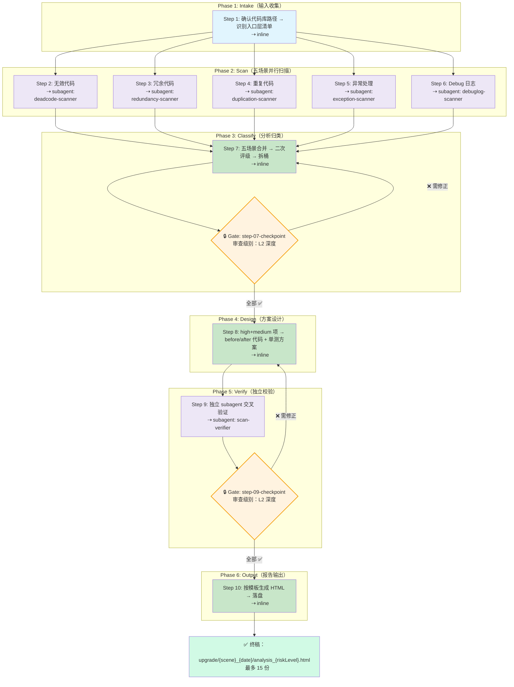

# code-constraint-analyzer（代码约束分析）

## 概述

扫描 Java 代码库，针对无效代码（注释代码/入口不可达代码）、冗余代码（N+1查询等反模式）、重复代码（可抽取共用逻辑）、异常处理（吞没/误分类/无重试）、Debug 日志（缺失/冗余/敏感）五大场景进行系统化分析，输出含定位证据、风险评级、优化方案（before/after 代码 + 单测覆盖）的 HTML 报告。

## 目录结构

```text
code-constraint-analyzer/
├── SKILL.md                              # 技能编排入口
├── README.md                             # 本文件
├── steps/
│   ├── step-01-intake.md                 # 输入收集与范围确认
│   ├── step-02-deadcode-scan.md          # 无效代码扫描
│   ├── step-03-redundant-scan.md         # 冗余代码扫描
│   ├── step-04-duplicate-scan.md         # 重复代码扫描
│   ├── step-05-exception-governance.md   # 异常处理治理扫描
│   ├── step-06-debuglog-governance.md    # Debug 日志治理扫描
│   ├── step-07-classify.md               # 分析归类与风险分级
│   ├── step-08-solution-design.md        # 优化方案设计（before/after + 单测）
│   ├── step-09-quality-check.md          # 独立质量校验
│   └── step-10-report-generation.md      # HTML 报告生成
├── checkpoints/
│   ├── step-07-checkpoint.md             # 分类校验门禁（L2）
│   └── step-09-checkpoint.md             # 终审校验门禁（L2）
├── references/
│   └── report-template.html              # HTML 报告模板
└── agents/
    ├── deadcode-scanner.md               # 无效代码子代理
    ├── redundancy-scanner.md             # 冗余代码子代理
    ├── duplication-scanner.md            # 重复代码子代理
    ├── exception-scanner.md              # 异常处理子代理
    ├── debuglog-scanner.md               # Debug 日志子代理
    └── scan-verifier.md                  # 独立校验子代理
```

## 执行流程图



## 执行流程详解

### Phase 1: Intake — 输入收集（1 步）

| 步骤 | 执行模式 | 输入 → 输出 |
|------|----------|------------|
| **Step 1** 输入收集 | `inline` | 用户指定代码库路径 → 扫描范围清单（入口层清单 + 技术栈） |

> **为什么用 inline**：需要与用户交互确认代码库路径、确认入口层识别结果，不适合委派给子代理。

---

### Phase 2: Scan — 五场景并行扫描（5 步）

| 步骤 | 执行模式 | Agent | 核心任务 |
|------|----------|-------|---------|
| **Step 2** 无效代码 | `subagent` | deadcode-scanner | 注释代码 + 入口不可达代码 |
| **Step 3** 冗余代码 | `subagent` | redundancy-scanner | N+1 查询、重复调用、资源泄漏等反模式 |
| **Step 4** 重复代码 | `subagent` | duplication-scanner | 重复代码块 + 重复模式（校验/异常/DTO转换） |
| **Step 5** 异常处理 | `subagent` | exception-scanner | 系统/业务异常二分、吞没/误分类/无重试 |
| **Step 6** Debug 日志 | `subagent` | debuglog-scanner | Debug 矩阵治理 + 关键节点日志缺失分析 |

> **为什么用 subagent**：五场景各自需要大量的 grep/glob/read 搜索操作，且彼此完全独立，并行 subagent 可最大化搜索效率。每个 subagent 只读文件系统，互不干扰。

#### subagent 配置一览

| Agent | 搜索重点 | 产出 |
|-------|---------|------|
| deadcode-scanner | `//.*(if\|for\|while\|return)` / `catch ... {}` 空 catch / 入口可达性分析 | `deadcode-scan.md` |
| redundancy-scanner | 循环内 `mapper.` 调用 / `new.*Stream` 未 close / 循环内 String `+` | `redundant-scan.md` |
| duplication-scanner | 8 行窗口相似度 ≥ 80% / 校验序列 3+ 次 / `BeanUtils.copyProperties` 批量 | `duplicate-scan.md` |
| exception-scanner | `catch.*Exception` 仅 log / `@DubboReference` 无 retries / `throw new X(getMessage())` | `exception-scan.md` |
| debuglog-scanner | `log.debug` 全量 / `password\|token` 敏感 / Controller/RPC 入口日志缺失 | `debuglog-scan.md` |

---

### Phase 3: Classify — 分析归类（1 步 + 1 门禁）

| 步骤 | 执行模式 | 输入 → 输出 |
|------|----------|------------|
| **Step 7** 分析归类 | `inline` | 五份 subagent 扫描结果 → 按场景+风险拆桶的分桶表 |

> **为什么用 inline**：归类是合并+二次评级的集中决策过程，需要统一上下文，inline 更利于一致性判断。

---

### Phase 4: Design — 方案设计（1 步）

| 步骤 | 执行模式 | 输入 → 输出 |
|------|----------|------------|
| **Step 8** 方案设计 | `inline` | Step 7 high+medium 分桶 → before/after 代码 + 单测覆盖方案 |

> **为什么用 inline**：方案设计是写代码的过程（before/after + 单测用例），无需外部搜索，inline 即可完成。

---

### Phase 5: Verify — 独立校验（1 步 + 1 门禁）

| 步骤 | 执行模式 | Agent | 核心任务 |
|------|----------|-------|---------|
| **Step 9** 质量校验 | `subagent` | scan-verifier | 抽样 ≥ 30% 核对事实源 + 分级合理性审查 + 漏检补充 |

> **为什么用 subagent**：校验必须由独立审查者视角执行，不能复用扫描者上下文，subagent 确保"不信任前置结论"的立场。

---

### Phase 6: Output — 报告输出（1 步）

| 步骤 | 执行模式 | 输入 → 输出 |
|------|----------|------------|
| **Step 10** HTML 报告生成 | `inline` | Step 7+8 产出（经 Step 9 校验通过）→ `upgrade/{scene}_{date}/analysis_{riskLevel}.html` |

> **为什么用 inline**：纯写文件操作，inline 即可完成。

---

### 🔒 门禁（Gate）机制

本技能在两个关键决策点设置门禁：

| 门禁 | 位置 | 审查级别 | 触发时机 |
|------|------|---------|---------|
| **Gate 1** | `step-07-checkpoint.md` | L2 深度 | Step 7 分桶完成后 |
| **Gate 2** | `step-09-checkpoint.md` | L2 深度 | Step 9 校验完成后 |

#### Gate 1: 分桶正确性（Step 7 → Step 8）

| 检验维度 | 检查项 |
|----------|--------|
| 分桶正确性 | 每条发现是否正确分配到对应场景桶（无跨场景混淆） |
| 数据一致性 | 五份扫描产出发现总数 = 分桶后总数 |
| 分级合理性 | high 级别抽查 5 条 → medium 抽查 3 条 → 同级标准一致 |

#### Gate 2: 终审校验（Step 9 → Step 10）

| 检验维度 | 检查项 |
|----------|--------|
| 事实源真实性 | 抽样 ≥ 30%（≥ 10 条），逐条核对源文件行号与代码片段 |
| 分级终审 | 假阳性率 ≤ 10% → 无应升未升/应降未降 |
| 方案完整性 | 所有 high 项有 before/after + ≥ 3 个单测 case |
| 覆盖完整性 | 扫描覆盖全部模块 → 入口层清单无遗漏 |

#### 门禁判定与重试

```
全部 ✅ → 进入下一步
存在 ❌ → 回到对应步骤修正，重新触发门禁（最多 2 次）
仅 ⚠️ → 标注后进入下一步，不阻塞
超过 2 次仍有 ❌ → 标注 [需人工确认] 后强制通过
```

---

## 风险分级

| 等级 | 无效代码 | 冗余代码 | 重复代码 | 异常处理 | Debug 日志 |
|------|---------|---------|---------|---------|-----------|
| **high** | 入口可达的关键路径中有注释掉的业务逻辑 | N+1查询在高峰期调用 | 核心交易链路中的重复逻辑块 | 系统异常被吞没/核心链路无重试/空catch | 关键链路+高频/含敏感信息 |
| **medium** | 非入口方法未被引用 | 循环内重复调用同一服务 | 跨模块的相似工具方法 | 异常分类错误/包装丢失/非核心链路无重试 | 辅助链路+高频/关键链路+中频/大对象序列化 |
| **low** | 未使用的 import / 局部变量 | 不必要的临时变量 / 冗余判空 | 同一文件内的轻微重复 | 仅 catch 粒度问题/非入口层 | 非关键链路/低频/冗余日志 |

### 关键节点日志缺失分析（Debug 日志补充维度）

除 debug 日志治理外，还分析以下 4 类关键节点是否缺少必要 INFO 日志：

| 节点类型 | 必打日志 | 缺失风险 |
|----------|---------|---------|
| 入口流量日志 | Controller / RPC / MQ 入参出参 + 耗时 | 0项满足→high |
| 关键 Service 功能日志 | 状态流转/金额计算/审批等关键步骤 | 无日志→high |
| 外部调用日志 | RPC/HTTP 调用入参+出参+耗时+异常 | 无日志→high |
| 中间件组件日志 | MQ消费/定时任务执行/缓存命中 | 无日志→medium |

## 产出物与路径约定

| 产出 | 路径 | 作用 |
|------|------|------|
| 分析报告 | `upgrade/{scene}_{date}/analysis_{riskLevel}.html` | 终稿（最多 15 份） |
| 中间产物 | `upgrade/{scene}_{date}/_workspace/code-constraint/` | 步骤间传递（交付后删除） |

- scene：`deadcode` / `redundant` / `duplicate` / `exception` / `debugLog`
- riskLevel：`high` / `medium` / `low`

## Agent 职责矩阵

| 步骤 | 执行方式 | Agent | 做什么 |
|------|----------|-------|--------|
| Step 1 输入收集 | `inline` | — | 确定代码库路径、技术栈、入口层定位 |
| Step 2 无效代码 | `subagent` | deadcode-scanner | 注释代码 + 入口不可达代码 |
| Step 3 冗余代码 | `subagent` | redundancy-scanner | N+1查询、重复调用、可简化逻辑 |
| Step 4 重复代码 | `subagent` | duplication-scanner | 重复逻辑块、可抽取共用模块 |
| Step 5 异常处理 | `subagent` | exception-scanner | 系统/业务异常二分，吞没/误分类/无重试 |
| Step 6 Debug 日志 | `subagent` | debuglog-scanner | Debug 矩阵治理 + 关键节点日志缺失 |
| Step 7 分析归类 | `inline` | — | 五场景合并 → 二次评级 → 按场景拆桶 |
| Step 8 方案设计 | `inline` | — | high+medium 项出优化方案+单测方案 |
| Step 9 质量校验 | `subagent` | scan-verifier | 抽样 ≥ 30% 事实源验证 + 分级/漏检审查 |
| Step 10 报告生成 | `inline` | — | 按模板生成 HTML 报告并落盘 |
