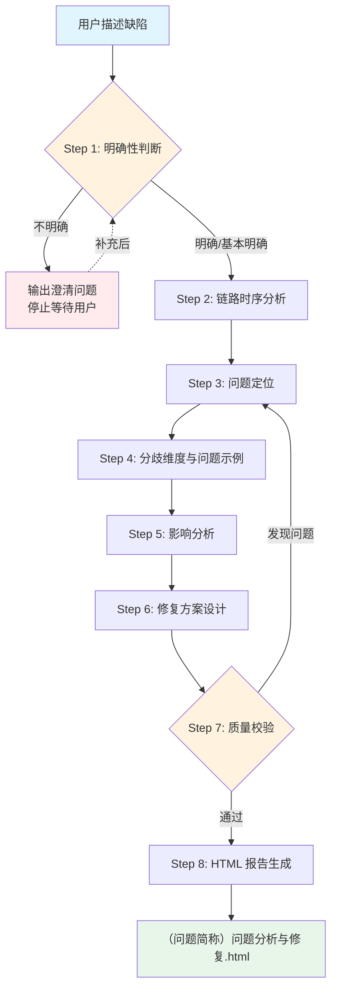

# 缺陷分析与修复技能

## 概述

针对生产/测试环境发现的功能缺陷（bug），自动完成**链路时序梳理 → 根因定位 → 问题示例构造 → 影响评估 → 修复方案设计**，输出结构化的缺陷分析与修复报告（单一 HTML）。

核心特点：
- **先澄清再分析**：Step 1 是硬性门禁，问题描述不明确时先向用户提问补充，不带假设开工。
- **方法论驱动**：以「事实源优先、时序为纲、根因优先于表象」为核心，适用于一切缺陷分析，而非绑定单一问题。
- **subagent 质量校验**：由独立审查者重新验证事实源、复算示例，确保报告不误导订正。

## 目录结构

```text
defect-analyzer/
├── SKILL.md                              # 技能编排入口：phases、steps、方法论与执行原则
├── README.md                             # 技能说明文档
├── steps/
│   ├── step-01-intake-clarify.md         # 输入接收与明确性判断（门禁）
│   ├── step-02-sequence-analysis.md      # 链路时序分析（subagent）
│   ├── step-03-root-cause.md             # 问题定位（根因定位）
│   ├── step-04-examples.md               # 分歧维度与问题示例构造
│   ├── step-05-impact.md                 # 影响分析
│   ├── step-06-fix-solution.md           # 修复方案设计
│   ├── step-07-quality-check.md          # 质量校验（subagent）
│   └── step-08-report-generation.md      # HTML 报告生成
├── checkpoints/
│   ├── step-01-checkpoint.md             # 输入明确性判断清单（门禁）
│   └── step-07-checkpoint.md             # 质量校验清单
├── references/
│   └── report-template.html              # HTML 报告模板（七段式）
└── agents/
    └── quality-checker.md                # 质量校验 agent 指令
```

## 核心方法论（六步）

1. **澄清问题**：确认现象/场景/范围是否明确，不明确先问。
2. **梳理链路时序**：画清目标数据在哪几条链路被读写、分别何时执行。
3. **定位根因**：找到产生分歧的确切代码机制，区分权威源与消费方。
4. **构造示例**：用具体数值展示「预期 vs 实际」。
5. **评估影响**：错误值波及哪些下游、多严重、生产是否真实暴露。
6. **设计修复**：代码修复 + 数据订正 + 逐条后置影响分析。

## 执行流程图



## 报告结构（七段式）

| 段落 | 来源 Step | 核心内容 |
|------|----------|---------|
| 一、链路时序分析 | Step 2 | 链路 A/B/C 时序图 + 矛盾点 |
| 二、问题定位 | Step 3 | 问题代码 + 问题点清单 + 权威源界定 |
| 三、分歧维度 | Step 4 | 分歧对照表 + 边界一致条件 |
| 四、问题示例 | Step 4 | 具体数值示例 + 后果直观描述 |
| 五、影响分析 | Step 5 | 影响面 + 严重度 + 生产暴露条件 |
| 六、修复方案与逐条影响分析 | Step 6 | 代码修复 + 订正 SQL + 逐条影响 |
| 七、验证与防回归 | Step 6 | 验证清单 + 执行顺序 + 一句话结论 |

## 使用方式

在对话中描述缺陷并触发关键词即可。描述越具体，分析越准：

```
帮我做缺陷分析：MAD 快照表 mb_invoice_mad_snapshot 的宽限日
和账单 MbInvoice 的宽限日不一致，导致 EOD 逾期判定提前。
代码在 foreign-smartmodelbank 仓库。
```

若描述不够明确，技能会先反问澄清（现象/场景/范围），补充后再进入分析。

## 产出物

| 产出 | 路径 | 说明 |
|------|------|------|
| 缺陷分析与修复报告 | `{问题简称}问题分析与修复.html` | 最终交付，含七段式分析 |

## 与 sql-impact-analyzer 的关系

- `sql-impact-analyzer`：输入是**已确定的订正 SQL**，分析其下游影响。
- `defect-analyzer`：输入是**一个缺陷现象**，先定位根因，再给修复（含订正 SQL）；其 Step 6 的「订正后逐条影响分析」复用了数据变更影响分析的方法。

当你已经有订正 SQL、只想评估影响时用前者；当你面对一个 bug、需要从现象查到根因并修复时用后者。
