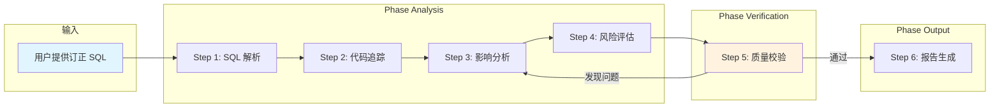

# 数据变更影响分析技能

## 概述

针对生产数据订正 SQL，自动完成表结构识别、代码链路追踪、后置功能关联、风险评估，输出结构化影响分析报告（HTML）。通过 subagent 质量校验确保分析的完整性和事实准确性。

## 目录结构

```text
sql-impact-analyzer/
├── SKILL.md                          # 技能编排入口：定义 phases、steps、交付物与执行原则
├── README.md                         # 技能说明文档
├── steps/
│   ├── step-01-sql-parsing.md        # SQL 解析与目标识别
│   ├── step-02-code-tracing.md       # 代码链路追踪
│   ├── step-03-impact-analysis.md    # 后置功能影响分析
│   ├── step-04-risk-assessment.md    # 风险评估与分级
│   ├── step-05-quality-check.md      # 质量校验（subagent）
│   └── step-06-report-generation.md  # HTML 报告生成
├── checkpoints/
│   └── step-05-checkpoint.md         # 质量校验清单
├── references/
│   └── report-template.html          # HTML 报告模板
└── agents/
    └── quality-checker.md            # 质量校验 agent 指令
```

## 执行流程图



## 使用方式

在对话中提供订正 SQL 并触发关键词即可：

```
请分析以下数据订正 SQL 的影响：

UPDATE mb_acct_schedule SET end_date = '20260701', next_deal_date = '20260701'
WHERE internal_key = '2575790717';
```

## 产出物

| 产出 | 路径 | 说明 |
|------|------|------|
| 影响分析报告 | `{场景}_data_impact_analysis.html` | 最终交付，含 SQL 概览、逐条分析、风险汇总 |
