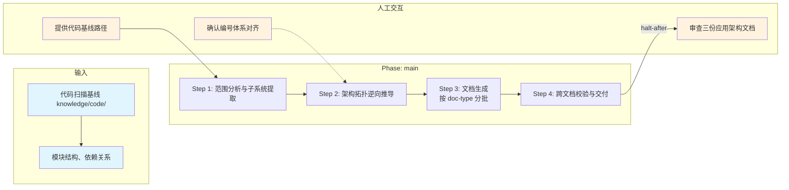

# 应用架构知识生成技能

## 概述

用于基于代码扫描基线生成应用架构知识。它以 `knowledge/code/` 基线为输入，按 4 步完成范围分析、拓扑推导、文档生成与跨文档校验，最终产出 3 份应用架构文档。

## 目录结构

```text
application-knowledge-init/
├── SKILL.md                                      # 技能编排入口：定义 phases、steps、交付物与执行原则
├── README.md                                     # 技能说明文档：面向使用者的说明、流程图与能力概览
├── steps/
│   ├── step-01-scope-analysis.md                 # 扫描基线目录并识别子系统范围
│   ├── step-02-topology-analysis.md              # 逆向推导系统拓扑与编号体系
│   ├── step-03-doc-generation.md                 # 按文档类型分批生成 3 份应用架构文档
│   └── step-04-cross-doc-verification.md         # 执行跨文档校验并完成交付
├── checkpoints/                                  # 各步骤与最终交付的校验规则
│   ├── step-01-checkpoint.md
│   ├── step-02-checkpoint.md
│   ├── step-03-checkpoint.md
│   └── step-04-final.md
└── references/
    ├── application-architecture-standard.md      # 应用架构主规范与总则
    ├── application-system-architecture-spec.md   # 系统架构文档规范
    ├── applications-and-domains-spec.md          # 应用与领域主数据文档规范
    ├── application-components-spec.md            # 应用组件文档规范
    └── application-architecture-task-template.md # 大项目分批生成任务模板
```

## 执行流程图



## Agent 职责矩阵

| 步骤 | 负责的 Agent | AI 做什么 | 人工需要做什么 |
|------|-------------|-----------|---------------|
| **Step 1** 范围分析 | `input-analyzer` | 扫描 knowledge/code/ 基线目录，提取子系统摘要、识别应用边界 | 提供代码基线路径 |
| **Step 2** 架构拓扑 | `architect` | 逆向推导系统架构拓扑、生成 APP-*/AG-*/AC-* 编号体系、对齐 S-*/DO-* | 确认编号体系与现有 system 的对齐方式 |
| **Step 3** 文档生成 | `document-generator` | 按 doc-type（3 份文档）分批生成完整应用架构文档 | 无（自动执行） |
| **Step 4** 跨文档校验 | `assembler` | 跨文档一致性校验（编号/图/表/文本对齐）、L2 审查 | **审查三份应用架构文档**：通过后完成交付 |

## 核心能力

- 系统架构拓扑推导（应用层级、部署架构）
- 应用/领域主数据建模（APP-*/AG-*/AC-* 编号体系）
- 应用组件清单与依赖关系
- 逆向推导架构拓扑（从代码结构推导）
- 跨系统集成点识别
- 图-表-文本编号一致性校验
- 动态分批执行（按 doc-type 分批生成）

## 产出物

| 产出 | 路径 | 作用 |
|------|------|------|
| 系统架构 | `ocspec-<xxx>/knowledge/application/application-system-architecture.md` | 系统架构与调用拓扑 |
| 应用与领域 | `ocspec-<xxx>/knowledge/application/applications-and-domains.md` | 应用与领域主数据 |
| 应用组件 | `ocspec-<xxx>/knowledge/application/application-components.md` | 应用组件清单 |

## 架构层级

| 层 | 载体 | 本技能对应 |
|----|------|-----------|
| L5 编排层 | `SKILL.md` | `skills/application-knowledge-init/SKILL.md` |
| L4 步骤层 | `steps/` | `skills/application-knowledge-init/steps/step-01~04.md` |
| L3 调度层 | `commands/` | `commands/scheduler-protocol.md`（共享） |
| L2 执行层 | `agents/` | `agents/input-analyzer.md`、`agents/architect.md`、`agents/document-generator.md`、`agents/assembler.md` |

