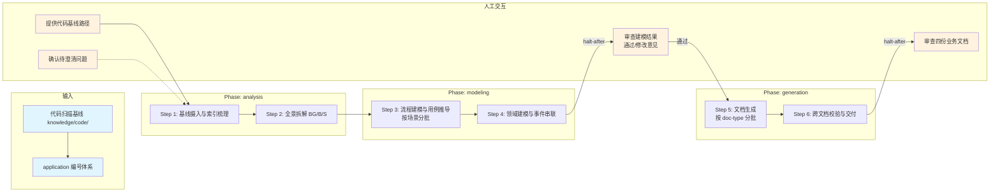

# 业务架构知识生成技能

## 概述

用于基于代码扫描基线逆向生成业务架构知识。它以 `knowledge/code/` 基线和应用编号体系为输入，按 6 步完成全景分析、流程与领域建模及文档生成，最终产出 4 份业务架构文档。

## 目录结构

```text
business-knowledge-init/
├── SKILL.md                                      # 技能编排入口：定义 phases、steps、交付物与执行原则
├── README.md                                     # 技能说明文档：面向使用者的说明、流程图与能力概览
├── steps/
│   ├── step-01-baseline-intake.md                # 摄入代码基线与输入真相源，建立分析索引
│   ├── step-02-panorama-analysis.md              # 逆向拆解业务全景，形成 BG/B/S 结构
│   ├── step-03-process-modeling.md               # 按场景分批进行流程建模与用例推导
│   ├── step-04-domain-modeling.md                # 提炼领域对象、领域事件与业务编排关系
│   ├── step-05-doc-generation.md                 # 按文档类型分批生成 4 份业务文档
│   └── step-06-cross-doc-verification.md         # 跨文档一致性校验并完成最终交付
├── checkpoints/                                  # 各步骤与最终交付的校验规则
│   ├── step-01-checkpoint.md
│   ├── step-02-checkpoint.md
│   ├── step-03-checkpoint.md
│   ├── step-04-checkpoint.md
│   ├── step-05-checkpoint.md
│   └── step-06-final.md
└── references/
    ├── business-domain-knowledge-standard.md     # 业务知识主规范与总则
    ├── business-overview-and-planning-spec.md    # 全景与规划文档规范
    ├── business-process-and-use-cases-spec.md    # 流程与用例文档规范
    ├── business-domain-and-orchestration-spec.md # 领域与编排文档规范
    ├── business-capability-and-appendices-spec.md# 能力与附录文档规范
    └── business-domain-task-template.md          # 大项目分批建模任务模板
```

## 执行流程图



## Agent 职责矩阵

| 步骤 | 负责的 Agent | AI 做什么 | 人工需要做什么 |
|------|-------------|-----------|---------------|
| **Step 1** 基线摄入 | `input-analyzer` | 分析输入真相源、梳理索引、提取技术栈与模块结构 | 提供 knowledge/code/ 路径；确认待澄清问题 |
| **Step 2** 全景拆解 | `architect` | 基于代码基线逆向推导 BG/B/S 全景、业务规划 | 无（自动执行） |
| **Step 3** 流程建模 | `process-modeler` | 按场景(S-*)动态分批，逐场景流程建模与用例推导 | 无（自动分批执行） |
| **Step 4** 领域建模 | `domain-designer` | 领域对象(DO)定义、领域事件(DE)建模、流程-事件串联 | 无（自动执行） |
| **Step 5** 文档生成 | `document-generator` | 按 doc-type（4 份文档）动态分批生成完整业务文档 | 无（自动执行） |
| **Step 6** 跨文档校验 | `assembler` | 跨文档一致性校验（编号/追溯关系/术语）、L2 审查，产出四份文档 | **审查四份业务文档**：通过后完成交付 |

## 核心能力

- 业务全景推导（BG → B → S 层级拆解）
- 业务流程建模（阶段 → 活动 → 任务 → 步骤）
- 用例推导与 Given-When-Then 规范
- 领域对象（DO）定义与领域事件（DE）建模
- 状态机与状态流转推导
- 业务能力映射与技术成熟度评估
- 需求追溯矩阵（S-* → DO-* → DE-* 映射）
- 跨文档一致性校验（四份文档编号体系对齐）
- 动态分批执行（按场景复杂度自适应分批）

## 产出物

| 产出 | 路径 | 作用 |
|------|------|------|
| 业务全景与规划 | `ocspec-<xxx>/knowledge/business/business-overview-and-planning.md` | BG/B/S 全景 + 业务规划 |
| 业务流程与用例 | `ocspec-<xxx>/knowledge/business/business-process-and-use-cases.md` | 流程建模 + 用例说明 |
| 领域与编排 | `ocspec-<xxx>/knowledge/business/business-domain-and-orchestration.md` | DO/DE 建模 + 流程串联 |
| 能力与附录 | `ocspec-<xxx>/knowledge/business/business-capability-and-appendices.md` | 能力映射 + 技术附录 |

## 架构层级

| 层 | 载体 | 本技能对应 |
|----|------|-----------|
| L5 编排层 | `SKILL.md` | `skills/business-knowledge-init/SKILL.md` |
| L4 步骤层 | `steps/` | `skills/business-knowledge-init/steps/step-01~06.md` |
| L3 调度层 | `commands/` | `commands/scheduler-protocol.md`（共享） |
| L2 执行层 | `agents/` | `agents/input-analyzer.md`、`agents/architect.md`、`agents/process-modeler.md`、`agents/domain-designer.md`、`agents/document-generator.md`、`agents/assembler.md` |

