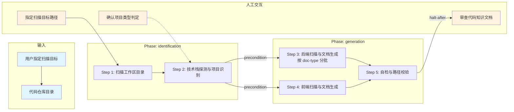

# 代码知识还原与初始化技能

## 概述

用于从源码和构建配置中生成标准化代码知识文档。它以目标代码仓库为输入，按 5 步完成扫描目标识别、技术栈探测、前后端扫描与自检交付，最终产出 `knowledge/code/` 下的项目知识文档和 `scan-plan.md`。

## 目录结构

```text
code-knowledge-init/
├── SKILL.md                                      # 技能编排入口：定义 phases、steps、交付物与执行原则
├── README.md                                     # 技能说明文档：面向使用者的说明、流程图与能力概览
├── steps/
│   ├── step-01-scan-target.md                    # 扫描工作区并识别候选代码库
│   ├── step-02-tech-detect.md                    # 探测技术栈并生成 scan-plan
│   ├── step-03-backend-scan.md                   # 扫描后端结构并生成后端知识文档
│   ├── step-04-frontend-scan.md                  # 扫描前端结构并生成前端知识文档
│   └── step-05-self-check.md                     # 校验产物路径与内容完整性
├── checkpoints/                                  # 各步骤与最终交付的校验规则
│   ├── step-01-checkpoint.md
│   ├── step-02-checkpoint.md
│   ├── step-03-checkpoint.md
│   ├── step-04-checkpoint.md
│   └── step-05-final.md
├── references/
│   ├── unified-scan-task-template.md             # 通用扫描流程与 scan-plan 规范
│   ├── backend/                                  # 后端项目、数据库、接口、外部依赖规范
│   └── frontend/                                 # 前端项目初始化与文档规范
└── script/                                       # PowerShell 扫描脚本集合
    ├── controller-scan.ps1
    ├── dubbo-scan.ps1
    ├── entity-scan.ps1
    ├── mapper-xml-scan.ps1
    └── model-scan.ps1
```

## 执行流程图



## Agent 职责矩阵

| 步骤 | 负责的 Agent | AI 做什么 | 人工需要做什么 |
|------|-------------|-----------|---------------|
| **Step 1** 扫描目标 | `input-analyzer` | 扫描工作区目录，列出候选代码库，识别项目类型 | 指定扫描目标路径（可多目标） |
| **Step 2** 技术探测 | `tech-detector` | 识别前端/后端/一体化/移动端/跨端/小程序属性，探测技术栈；后端走注册表生成 scan-plan，前端类不走本注册表 | 确认项目类型判定（当存在歧义时） |
| **Step 3** 后端扫描 | `code-scanner` | 按 4 种后端文档类型分批扫描：项目设计、数据模型、接口清单、外部依赖 | 无（自动执行，precondition: 包含后端特征） |
| **Step 4** 前端扫描 | `code-scanner` | Web/一体化/Android/鸿蒙/iOS/跨端/小程序：目录、路由/界面、接口、技术栈与约束 | 无（自动执行，precondition: 包含前端特征） |
| **Step 5** 自检 | `assembler` | 自检与路径校验、L2 审查、[强制停止] | **审查代码知识文档**：通过后完成交付 |

## 核心能力

- 项目类型识别（纯前端 / 纯后端 / 一体化 / Android·鸿蒙·iOS 客户端 / 跨端 / 小程序）
- 技术栈探测（语言、框架、数据库、中间件、构建工具、移动端 SDK）
- 后端文档生成：
  - 项目设计（目录结构、模块划分、核心业务流程）
  - 数据模型（表结构、ER 图、字段规范）
  - 接口清单（Controller 扫描、接口表格）
  - 外部依赖（业务系统、第三方服务、基础设施）
- 前端文档生成（Web SPA、传统一体化模板、Native 三端、跨端与小程序：目录结构、路由/界面入口、接口调用清单、UI 与开发约束）
- 全量扫描（不得省略，不得以"等"代替）
- 增量扫描（对比已有 scan-plan，仅重新扫描变更部分）
- 多目标并行（2-3 目标可并行，4+ 分批执行）
- PowerShell 扫描脚本执行

## 产出物

| 产出 | 路径 | 作用 |
|------|------|------|
| 后端项目 | `{CODE_KNOWLEDGE}/backend-project.md` | 目录结构、模块划分、核心业务流程 |
| 后端数据模型 | `{CODE_KNOWLEDGE}/backend-database/index.md`（入口）；大型项目分册见同目录 `{module}.md`、`er-diagram.md` | 表结构、ER 图、字段规范 |
| 后端接口 | `{CODE_KNOWLEDGE}/backend-interface/index.md`（入口）；大型项目分册见同目录 `{module}.md` | Controller/RPC/消息等接口清单 |
| 后端外部依赖 | `{CODE_KNOWLEDGE}/backend-external-dependency.md` | 外部系统调用清单 |
| 前端项目 | `{CODE_KNOWLEDGE}/frontend-project.md` | 目录结构、路由、组件、接口调用 |
| 扫描元数据 | `{CODE_KNOWLEDGE}/scan-plan.md` | 扫描元数据（保留） |

> `{CODE_KNOWLEDGE}` = Init 解析的 `{OCSPEC_ROOT}/knowledge/code/<项目名>/`。**禁止** Agent 新建 `ocspec-<仓库名>`。

## 架构层级

| 层 | 载体 | 本技能对应 |
|----|------|-----------|
| L5 编排层 | `SKILL.md` | `skills/code-knowledge-init/SKILL.md` |
| L4 步骤层 | `steps/` | `skills/code-knowledge-init/steps/step-01~05.md` |
| L3 调度层 | `commands/` | `commands/scheduler-protocol.md`（共享） |
| L2 执行层 | `agents/` | `agents/input-analyzer.md`、`agents/tech-detector.md`、`agents/code-scanner.md`、`agents/assembler.md` |

