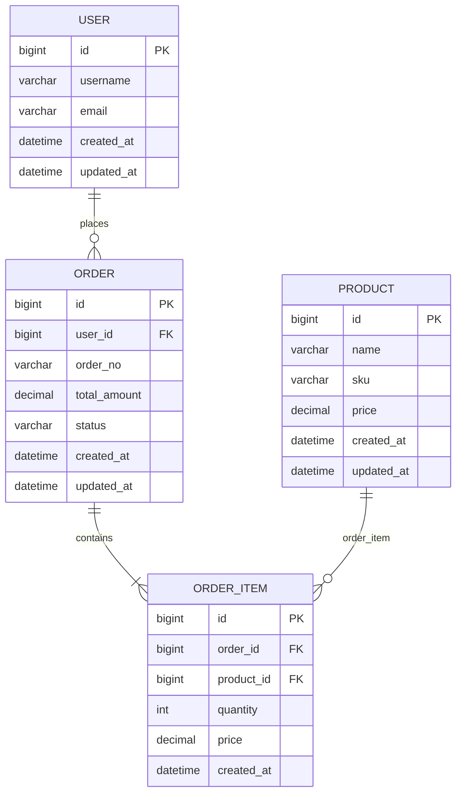

# 数据模型

本文档是项目初始化标准中涉及的数据模型设计相关内容。

**强制执行扫描任务模板**：生成数据模型文档时，**必须**按 [unified-scan-task-template.md](../../unified-scan-task-template.md) 任务模板中的数据模型扫描注册表执行扫描流程。**不得**跳过扫描步骤直接生成数据模型文档。

---

## 0 提取原则（确定性提取 + 语义补全 + 并集 + 溯源）

本节为数据模型扫描的总原则，优先级高于下文各细则。

### 0.1 两层职责分离

| 层 | 由谁做 | 负责 | 禁止 |
|----|--------|------|------|
| 确定性提取 | 脚本（entity-scan / ddl-scan / mapper-xml-scan） | 表、表名、字段名、类型、来源、文件:行号；实体字段注释含 Javadoc、独立行 `//`、**行尾 `//`** | 不做业务语义猜测 |
| 语义补全 | 子代理 | 仅补 `[需人工确认]` 的字段/表说明（读实体源码 + Mapper XML + DDL COMMENT + 字段名语义） | 不改字段名/类型/结构/来源/溯源 |

出错时据此定位：漏表/错表 → 提取层问题；说明不准 → 补全层问题。

### 0.2 多源并集（不取交集，避免遗漏）

数据表来源多路取**并集**，每表标注来源；**不是所有项目都有完整 DDL，取交集会漏表**：

| 来源 | 提供 | 权威度 |
|------|------|--------|
| ORM 实体（`@TableName`/`@Table`/`@Entity`） | 表名、字段、Java 类型、业务语义 | 字段语义权威 |
| DDL（`CREATE TABLE`/`ALTER`/`COMMENT`） | 表名、精确列类型/约束、列说明；覆盖无实体的表 | 列类型/约束权威 |
| MyBatis XML（`resultMap`/SQL 表名） | 补充无注解实体的表 | 兜底覆盖 |

合并规则：只在单一来源出现的表也**全部保留**并标注 `来源: entity/ddl/both`。

**字段类型优先级（强制）**：按来源决定字段"类型"列取值——

| 表来源 | 字段类型以谁为准 | 字段说明以谁为准 |
|--------|----------------|----------------|
| both（实体+DDL） | **实体类型**（Java 类型，如 `Long`/`String`/`BigDecimal`） | 见 §0.2.1（取 DDL COMMENT 与实体注释中**首个非空**者） |
| 仅实体 | **实体类型** | 实体注释（含 §0.2.1 所列来源） |
| 仅 DDL | **DDL 类型**（如 `bigint`/`varchar(20)`） | DDL COMMENT |

- 即：**只要来源含实体（both 或仅实体），字段类型一律以实体类为准**；**仅 DDL 的表才用 DDL 类型**。
- both 表中若某列仅 DDL 有、实体无（实体未声明该字段），该列保留 DDL 类型并可标注来源 DDL。
- 类型来自 Java 推断（无 DDL 佐证）的标 `(推断)`；DDL 精确类型不标 `(推断)`。
- 说明与类型的取源相互独立：both 表"类型"用实体、"说明"按 §0.2.1 合并，**不得**因一侧无注释而丢弃另一侧已有注释。

### 0.2.1 说明合并（both / 多源，强制）

**原则**：实体与 DDL 并存时，若一侧有注释、另一侧无注释，**取有注释的一侧**；两侧均有则按下列优先级取首个非空（非 `[需人工确认]`、非空白）。

**实体字段注释来源**（`entity-scan.ps1` 须全部支持）：
1. 字段上方 Javadoc / 独立行 `//`
2. **行尾 `//`**：`private Type fieldName; // 说明`

**both 表 — 字段说明**（按序取首个非空）：
1. DDL `COMMENT ON COLUMN`
2. 实体字段注释（§0.2.1 实体来源 1～2）

**both 表 — 表说明**（按序取首个非空）：
1. DDL `COMMENT ON TABLE`
2. 实体类 Javadoc
3. 回退为「由实体 {ClassName} 映射」（**不得**因缺 Javadoc 直接输出 `[需人工确认]`）

**同名列多写法**：实体列名（驼峰/ `@TableField`）与 DDL 列名（下划线）映射为同一物理列时，说明从两侧合并后**归并到一行**，不得因列名写法不同重复输出两行且一行有说明、一行 `[需人工确认]`。

仅当上述来源均为空，且语义补全层（字段名推断等，见 §1.1）仍无法得到自然中文说明时，才标 `[需人工确认]`。

### 0.3 真注解识别（防误判）

实体表识别须满足：**剥注释后**命中真注解（`@TableName(`/`@Table(` 带括号，或 `@Entity` 独立注解），且注解位于 `public class` 声明前的注解区；类上带 `@RestController`/`@Controller`/`@Service`/`@Component`/`@Configuration`/`@SpringBootApplication`/`@Mapper`/`@FeignClient` 的**一律排除**。禁止因 Javadoc 中出现 `@Table:` 等注释文本而误判为实体表。

### 0.4 表名归一化去重

统一小写、去 schema 前缀（`a.b`→`b`）、去引号/反引号作为去重 key。备份/临时表（`_bk`/`_bak`/`_tmp`/`_temp`/`_backup`）单列"疑似备份表"，不计入业务表并集。

### 0.5 溯源与对账（可审计）

- **溯源（每表必含）**：人读——表标题下 `> 来源类型: entity/ddl/both` + `> 溯源: 文件:行号`；机读——`{WORKSPACE}/code/` 下 `entity-provenance.json` / `ddl-provenance.json` / `merged-tables.json`。
- **对账门禁**：`db-merge.ps1` 产出 `reconcile-report.md`，列"仅实体/仅DDL/双有/疑似备份"四清单；差异须逐项归因。
- **伪字段**：脚本须过滤 Java 关键字/非标识符（`if`/`for`/`constraint` 及 `CREATE TABLE IF NOT EXISTS` 误切）；文档中不得残留此类伪字段行。

---

## 1 数据模型内容规范

数据模型设计涵盖表结构设计、表关系（ER 图）等，与领域模型对应，支撑持久化与查询。本节规定**字段、表、ER 的内容规则**；**产出目录与分册判定**见 §2。

### 1.1 表结构设计

列出各业务模块涉及的数据表，说明表名、说明、主要字段及约束。

**全量表展示（必须遵循）**：
- 表结构章节须**全量展示**所有识别到的表，不得只列出部分表或示例表。
- 识别范围：所有带 `@TableName`（MyBatis-Plus）或 `@Table` / `@Entity`（JPA/Hibernate）的实体类对应的表，或 DDL 中出现的表（以项目实际扫描为准），**全部**纳入文档并逐表输出字段表。
- 统计概要中须注明“扫描到表约 N 张（全量展示）”。

**多数据源处理**：
- 若项目使用 `dynamic-datasource`（`@DS` 注解）或手动配置多 DataSource，须在表结构中标注数据源归属（如"数据源: master"/"数据源: slave"）
- 若项目使用 ShardingSphere 分表，仅记录逻辑表名（如 `t_order`），在备注中说明分表规则（如"按 user_id 取模分 16 表"）
- ER 图中跨数据源的表关系须用虚线标注"跨库关联"

**无集中式 DDL 时的补充数据来源**（集中式 DDL 指项目根目录或专用目录（如 `db/`、`sql/`、`migration/`、`flyway/`、`liquibase/`）下统一存放的建表脚本。散落在各模块 `resources/` 下的 SQL 文件也视为集中式 DDL，只要其路径可通过 grepSearch 统一匹配）：
- 若仓库中**未发现集中式建表脚本目录**（如 `db/migration`、`sql/ddl`、`**/*.sql` 等，以项目实际路径为准），则须从以下来源**补充表与 ER 信息**，仍保证全量表展示与表关系说明：
  - **实体别名包（MyBatis/MyBatis-Plus）**：从 MyBatis/MyBatis-Plus 配置中读取 `typeAliasesPackage`（如 `com.example.cms.entity`），扫描该包下所有实体类；通过 `@TableName`、`@TableId`、`@TableField` 及字段类型推断表名与列信息，用于表结构及字段表。
  - **JPA 实体扫描**：扫描带 `@Entity` 或 `@Table` 注解的实体类（可从 `@EntityScan` 配置的包路径或 `persistence.xml` 中确定扫描范围，若无显式配置则扫描主包及子包下所有 `@Entity` 类）；通过 `@Table(name=...)` 推断表名（无 `@Table` 时按类名转下划线推断），`@Id` / `@EmbeddedId` 推断主键，`@Column(name=...)` 推断列名，`@JoinColumn` / `@ManyToOne` / `@OneToMany` 等推断表间关系，用于表结构、字段表及 ER 图。
  - **Mapper XML**：扫描项目中实际配置的 mapper 路径，从 **SQL 片段**（`<select>`/`<insert>`/`<update>`/`<delete>` 中的表名与列）、**ResultMap**（`<resultMap>` 的 `type` 与列映射）、以及**条件拼接**（`<if>`/`<where>` 中出现的列名）中提取表名与列名，用于补全表列表、字段列表；并根据 SQL 中的多表关联（JOIN、子查询引用）推断表间关系，用于 ER 图与表关系说明。
- 合并策略：以实体 + DDL（若存在）为主表与字段来源；Mapper XML（MyBatis 项目）或 JPA 关系注解（JPA 项目）用于补全 DDL 中未出现的表/列，以及补充 ER 关系；同一表多来源时以 DDL 为准，无 DDL 时以实体 + Mapper/JPA 注解推断结果为准，并在说明中注明“部分表/关系由实体与 Mapper XML / JPA 注解推断”。

**回填与判定规则（必须遵循）**：
- **字段映射**：实体字段与数据库列名按以下优先级映射：
  - MyBatis-Plus：`@TableId(value=...)` / `@TableField(value=...)` > 驼峰转下划线（如 `dateCreated -> date_created`）。
  - JPA：`@Column(name=...)` > `@JoinColumn(name=...)` > 驼峰转下划线。
- **忽略字段**：`@TableField(exist = false)`（MyBatis-Plus）或 `@Transient`（JPA）标注的字段不进入表结构文档。
- **必填判定**：仅当 DDL 中显式声明 `NOT NULL` 时标记为 `是`；无 DDL 时可回退到 JPA `@Column(nullable = false)` 标记为 `是`；均未显式声明时一律标记为 `否`。
- **默认值判定**：优先取 DDL 中 `DEFAULT` 值；无 `DEFAULT` 时标记为 `[无默认值]`。
- **说明判定**：字段说明按 §0.2.1 合并（DDL `COMMENT ON COLUMN` 与实体注释——含 Javadoc、独立行 `//`、**行尾 `//`**——取首个非空者）。若仍仅为字段名本身、英文标识符、驼峰/下划线命名，或不能形成自然中文说明，则不得直接原样输出。此时"说明"必须基于字段名语义拆分并翻译为中文业务说明（如 `createTime -> 创建时间`、`userName -> 用户名称`、`isDeleted -> 是否删除`、`remark -> 备注`、`application_id -> 应用ID`、`created_by -> 创建人`）；仅当结合上下文仍无法判断语义时，"说明"统一输出 `[需人工确认]`，不得输出英文、拼音、下划线的"说明"，严禁省略"说明"。
- **表说明判定**：按 §0.2.1 合并（`COMMENT ON TABLE` > 实体类 Javadoc >「由实体 xxx 映射」）。
- **索引判定**：从 DDL 的 `PRIMARY KEY`、`UNIQUE`、`CREATE INDEX`、`ALTER TABLE ... ADD CONSTRAINT` 中提取并汇总；无 DDL 时可回退到 JPA `@Table(indexes = {...})` 及 `@Table(uniqueConstraints = {...})` 中声明的索引与唯一约束。无 DDL 项目，索引信息在文档头部统一说明"本项目无 DDL，索引信息无法推断"，各表不再逐一标注 `[需人工确认] 无 DDL 可推断索引`。
- **值规范化**：默认值与说明中的换行、连续空白需折叠为单空格，避免 Markdown 表格错列。

**继承关系处理**：
- `@MappedSuperclass` / MyBatis-Plus 基类：须递归扫描父类字段，合并到子类对应的表结构中。在备注中标注"继承自 {基类名}"
- `@Inheritance(SINGLE_TABLE)`：一个表对应多个实体类时，合并所有子类字段到同一表，在备注中说明"单表继承，鉴别列: {discriminator_column}"
- `@Inheritance(JOINED)`：每个子类对应独立表，在 ER 图中用继承关系线连接
- `@Inheritance(TABLE_PER_CLASS)`：每个具体类对应独立表，父类字段在每个子表中重复出现

**软删除标识**：
- `@TableLogic`（MyBatis-Plus）或 `@Where`/`@SQLDelete`（Hibernate）标注的字段，在字段说明中追加"（软删除标记）"
- 在表级备注中标注"本表使用软删除，删除字段: {field_name}"

**MyBatis-Plus 特殊注解处理**：
- `@TableField(fill = FieldFill.INSERT/INSERT_UPDATE)`：在字段说明中追加"（自动填充）"
- `@Version`：在字段说明中追加"（乐观锁）"
- `@TableLogic`：在字段说明中追加"（软删除标记）"
- `@EnumValue`：字段类型标注为枚举对应的 DB 类型，说明中注明枚举类名
- `@TableField(typeHandler = JacksonTypeHandler.class)` 等：字段类型标注为 `json`/`text`，说明中注明"JSON 存储"

**Java → DB 类型推断（无 DDL 时使用）**：

| Java 类型 | 默认 DB 类型 | 说明 |
|-----------|-------------|------|
| Long/long | bigint | - |
| Integer/int | int | - |
| String | varchar(255) | 有 `@Column(length=N)` 时用 varchar(N) |
| BigDecimal | decimal(19,2) | 有 `@Column(precision=P, scale=S)` 时用 decimal(P,S) |
| Boolean/boolean | tinyint(1) | - |
| Date/LocalDate | date | - |
| LocalDateTime/Timestamp | datetime | - |
| byte[] | blob | - |
| Enum | varchar(32) | 有 `@Enumerated(EnumType.ORDINAL)` 时用 int |

注：推断类型须在字段表"类型"列后标注 `(推断)` 以区分 DDL 定义的精确类型。

**枚举表/字典表标注**：
- 符合以下特征的表标注为"字典表"：表名含 `dict`/`enum`/`config`/`code`/`type`，或字段数 ≤ 5 且含 `code`+`name`/`value` 组合
- 字典表在 ER 图中以灰色背景或虚线框区分，避免关系线过密
- 字典表可集中在一个独立小节"字典表清单"中列出，不与业务表混排

**输出格式**：
```markdown
#### 表1: [表名]（如：t_user）
- **说明**: [表业务说明]
- **字段**:
  | 字段名 | 类型 | 必填 | 默认值 | 说明 |
  |--------|------|------|--------|------|
  | id | bigint | 是 | - | 主键 |
  | xxx | varchar(64) | 是 | - | 说明 |
  | created_at | datetime | 是 | CURRENT_TIMESTAMP | 创建时间 |
  | updated_at | datetime | 是 | CURRENT_TIMESTAMP ON UPDATE | 更新时间 |
- **索引**: 主键 id；唯一索引/普通索引（如有）
- **备注**: [其他约束或说明]

#### 表2: [表名]
- **说明**: [表业务说明]
- **字段**: [同上表格形式]
```

### 1.2 全量表清单与模块分组（内容规则）

**全量表展示（必须遵循）**：
- 无论单文件或分册模式，识别到的表须**全量展示**，不得只列出部分表或示例表。
- 识别范围：所有带 `@TableName`（MyBatis-Plus）或 `@Table` / `@Entity`（JPA/Hibernate）的实体类对应的表，或 DDL 中出现的表（以项目实际扫描为准），**全部**纳入文档并逐表输出字段表。
- 统计概要中须注明“扫描到表约 N 张（全量展示）”。

**模块分组规则**（与 §2.1 一致）：
- 模块按实体文件路径 `src/main/java/.../entity/<module>/...` 或 `.../domain/<module>/entity/...` 中的 `<module>` 统计；实体直接放在 `entity` 目录下无子目录时，归为模块 `root`。
- 分组索引表：列为「模块」「表数量」，按表数量降序排列；模块名须为可点击链接 `[模块名](./{module}.md)`（分册模式）或锚点 `[模块名](#模块名)`（单文件模式）。
- 每个模块下的表清单表格列：**表名 | 实体类 | 实体文件**（可选增加「说明」列）。

**单文件模式下的内联分段**（§2.0）：在 `index.md` 内按模块输出 `##### 模块名 {#模块名}` 小节，每节含该模块全量表结构；模块顺序与分组索引一致。

**分册模式下的分卷**（§2.3）：各模块表结构写入 `backend-database/{module}.md`，`index.md` 仅保留统计与模块索引，**不得**含 `#### 表N:` 级字段表格。

---

## 2 文档结构与组织

数据模型统一输出在 **`{CODE_KNOWLEDGE}/backend-database/`** 目录下。入口文件为 **`index.md`**。**不得**在父目录（与 `backend-project.md` 同级）产出 `backend-database.md`。

须先按 §2.3 判定输出模式，再按对应结构组织内容。

### 2.0 单文件模式（默认）

**触发条件**：表总数 ≤ 50 **且** 实体模块数 ≤ 20。

所有内容汇总至 **`backend-database/index.md`**，结构如下：

1. **文档头**：项目名、扫描时间、git commit、数据源、ORM 技术栈、产出决策树结论。
2. **全量表统计**：表总数、字典表/软删除表识别摘要。
3. **分组索引（按实体模块）**：模块索引表（锚点链接至下文同文件内各模块小节）。
4. **全量表清单（按表名排序）**（可选）：汇总表名 | 实体类 | 实体文件。
5. **表结构（按模块分段）**：`##### 模块名 {#模块名}` + 该模块下全部 `#### 表N:` 字段表。
6. **字典表清单**（若存在）：集中列出字典表。
7. **表关系（ER 图）**：关系说明 + Mermaid ER 图（单图节点 ≤ 30，超出按业务域拆分子图）。

### 2.1 功能模块 `{module}`（命名规则）

- **含义**：将**同一实体模块目录**下的多张表归入同一个模块分卷或同文件小节。
- **命名来源**：优先取实体类包名中 `entity` 或 `domain` 包段之后的**下一级包名**；无子包时取 **`root`**。
- **与 backend-interface 对齐**：若 Controller 模块名与实体模块名可一一对应，优先使用相同 `{module}` 命名；无法对应时以实体路径为准并在 `index.md` 说明。

### 2.2 单表结构（四级标题）

- 在对应模块小节或分册内，为每张表创建四级标题 `#### 表N: [表名]`。
- 标题下方输出：说明、字段表、索引、备注（格式见 §1.1）。

### 2.3 分册模式（大型项目拆分）

**触发条件（满足任一即须启用，不得采用 §2.0 单文件模式）**：
- 表总数 > 50
- 实体模块数 > 20

**产出结构**：
- **产出目录** `backend-database/`：所有数据模型文档均在此目录内；**禁止**在父目录产出 `backend-database.md` 或平铺 `backend-database-*.md`。
- **索引文件** `backend-database/index.md`：**仅**包含文档头、数据源决策树摘要、全量表统计、模块索引表、全量表清单（可选）、字典表清单（可选）、ER 关系说明摘要；**不得**包含任何 `#### 表N:` 级字段表格。
- **模块分册** `backend-database/{module}.md`：每个实体模块一份，含该模块下全部表结构。
- **全局分册**（若存在）：`backend-database/dict-tables.md`（字典表）、`backend-database/er-diagram.md`（ER 图，按业务域拆分，每域 ≤ 30 表）。

**模块索引表（index.md 必填）**：

| 模块 | 表数量 | 文件 | 说明 |
|------|--------|------|------|
| order | 17 | [order.md](./order.md) | 订单相关表 |

索引表「表数量」之和须与统计概要中的表总数一致；「文件」列须为**相对于 index.md** 的同目录相对路径链接。

**写入约束**：
- 「每段 ≤ 300 行」是**单次追加写入**的上限，**不是**分册触发条件。
- 分册模式下须**先创建** `backend-database/` 并写入 `index.md`，再逐模块写入 `{module}.md`；ER 图写入 `er-diagram.md` 或 `index.md`（单文件模式）。

### 2.4 内容示例

分册索引 `backend-database/index.md` 节选：

```markdown
# 数据模型

> 输出模式：分册（表 159 > 50）

## 模块索引

| 模块 | 表数量 | 文件 |
|------|--------|------|
| coupon | 15 | [coupon.md](./coupon.md) |
```

分册 `backend-database/coupon.md` 节选：

```markdown
# 数据模型 — coupon

> 主索引：[index.md](./index.md)

#### 表1: c8_coupon_base_rule_info
- **说明**: 卡券规则主表
- **字段**: ...
```

---

## 3 表关系（ER 图）

描述表与表之间的关联关系（一对一、一对多、多对多等），并使用 Mermaid ER 图展示。

**关系说明**：
- 明确外键字段及引用表
- 说明关联类型（如：用户 1-N 订单、订单 N-1 用户）
- 如有中间表，需在 ER 图中体现
- 如 DDL 未显式定义外键（无 `FOREIGN KEY` / `REFERENCES`），应在文档中明确标注“未解析到外键约束，可能由应用层维护关系”，不得臆造物理外键。

**Mermaid ER 图关系方向语法对照**：
- 多对一：子表 `}o--||` 主表（如 `position }o--|| account`，表示 position 多对一 account）
- 一对多：主表 `||--o{` 子表（如 `account ||--o{ position`，表示 account 一对多 position）

**JPA 关系注解 → ER 关系映射**：

| JPA 注解 | ER 关系 | Mermaid 语法 |
|---------|---------|-------------|
| `@ManyToOne` | 多对一 | `子表 }o--\|\| 主表` |
| `@OneToMany` | 一对多 | `主表 \|\|--o{ 子表` |
| `@OneToOne` | 一对一 | `表A \|\|--\|\| 表B` |
| `@ManyToMany` + `@JoinTable` | 多对多（含中间表） | `表A }o--o{ 表B`，中间表单独列出 |
- 注意：关系方向须与文字描述一致，避免图形与说明矛盾。

**输出格式**：
```markdown
#### 表关系说明
- **[表A]** 与 **[表B]**：{关系类型}（如：一对多，表A 主键对应 表B 外键 xxx）
- **[表B]** 与 **[表C]**：{关系类型}
```

#### Mermaid ER 图示例



**图例说明**：
- `||--o{`：一对多（一方可选）
- `||--|{`：一对多（一方必选）
- `PK`：主键，`FK`：外键
- 根据实际表名、字段名替换上述示例中的实体与属性
- 单张 Mermaid ER 图节点数 ≤ 30；超出时按业务域拆分子图（分册模式写入 `er-diagram.md` 或 `er-diagram-{domain}.md`）

---

## 4 禁止表述

- **不得**在 §2.3 分册模式触发后，仍将 `#### 表N:` 级字段表格写入 `backend-database/index.md`。
- **不得**在父目录产出 `backend-database.md` 或平铺 `backend-database-*.md`；所有数据模型文档须位于 `backend-database/` 目录内。
- **不得**将「每段 ≤ 300 行」的追加写入上限误解为分册触发条件或分册替代方案。
- **不得**只列出部分表或示例表；须全量展示所有识别到的表。
- **不得**臆造物理外键或表关系；无 DDL 外键时须标注“未解析到外键约束，可能由应用层维护关系”。
