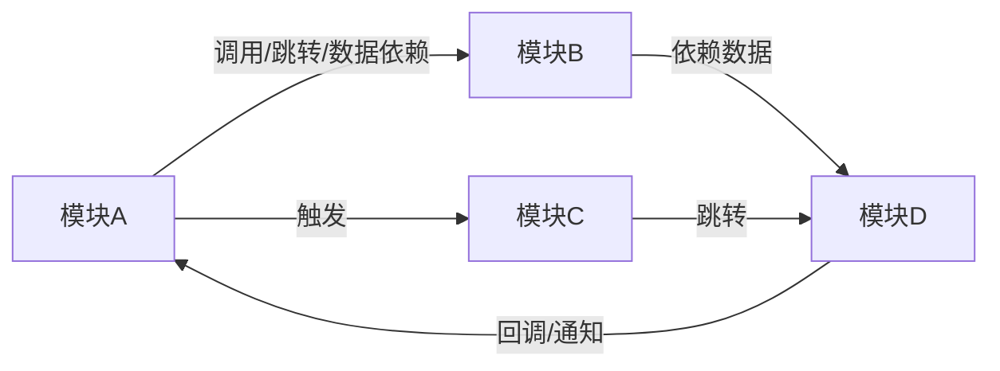

# 项目初始化规范标准

## 一、文档目的与定位

`frontend-project.md` 是项目特定信息的核心文档，用于：

- **为 AI 助手和开发者提供项目上下文**：技术栈、业务模块、目录结构、接口清单等
- **作为增量开发的参考依据**：新功能开发时需遵循项目现有约定
- **统一团队认知**：确保所有成员对项目结构和技术选型有统一理解
- **支持规范体系**：与 `development-standard.md`、`incremental-development.md` 形成完整的规范体系

**生成原则**：
- 基于**实际代码**生成，而非理想设计
- 记录**存量项目现状**，而非重构目标
- 保持**结构化和可搜索**，便于 AI 和人类快速定位信息
- 标注**需人工确认**项，避免 AI 臆造不确定信息

## 传统一体化项目适配

当项目为前后端未分离的一体化项目（如 Java + JSP/Thymeleaf/Freemarker/Velocity 等），不存在 `package.json` 时，仍须生成 `frontend-project.md`，并按以下规则适配各章节：

- **项目名称**：从后端构建文件（`pom.xml` 的 `artifactId`、`build.gradle` 的 `rootProject.name`、`build.xml` 的 `project name`）或仓库目录名获取。
- **技术栈类型**：描述为"一体化项目，前端基于 [模板引擎名称]（如 JSP/Thymeleaf/Freemarker）+ [静态资源方式]"。
- **业务功能模块**：基于页面模板文件（`.jsp`、`.html`、`.ftl`、`.vm` 等）和对应的 Controller 映射关系梳理模块；模块标识以 URL 路径前缀或 Controller 映射路径为准。
- **接口调用清单**：基于页面中的 AJAX 调用（`$.ajax`、`fetch`、`axios` 等）或表单提交（`<form action="...">`）提取接口信息；若页面以服务端渲染为主、无独立 API 调用，可标注"本项目以服务端渲染为主，前端无独立 API 调用层"并省略接口表格。
- **目录结构说明**：基于实际前端资源目录（如 `webapp/`、`static/`、`resources/templates/`、`resources/static/`、`WEB-INF/` 等）生成目录树。
- **技术栈**：列出模板引擎、前端依赖库（jQuery、Bootstrap、LayUI 等，从页面 `<script>` 引用、`lib/` 目录或 CDN 链接扫描）、CSS 框架等；版本号从实际文件名或 CDN 链接提取，无法确定时标注 `[需人工确认]`。
- **UI 风格与组件参考**：从页面模板中提取常用 UI 组件（如 jQuery 插件、Bootstrap 组件、LayUI 模块等）和典型页面模式；参照页面索引列出模板文件路径。
- **项目开发约束**：省略 Node.js 版本和 npm scripts 相关内容；保留环境变量、CI/CD 等通用约束项。

> 除上述适配点外，其余章节结构与字段要求与现代前端项目一致，仅将 `package.json` 相关的生成约束替换为对应的传统项目信息来源。

## 移动端客户端项目适配

当项目为 Android、鸿蒙或 iOS 客户端应用时，仍须生成 `frontend-project.md`。移动端项目的"前端"指面向用户的客户端界面、导航、状态、网络服务层和本地资源，须按以下规则适配各章节：

- **Android 项目识别**：基于 `settings.gradle`、`settings.gradle.kts`、`build.gradle`、`build.gradle.kts`、`gradle.properties`、`AndroidManifest.xml`、`app/src/main/java/`、`app/src/main/cpp/`、`app/src/main/jni/`、`app/src/main/kotlin/`、`app/src/main/res/`、`res/navigation/` 等文件和目录识别。
- **鸿蒙项目识别**：基于 `build-profile.json5`、`hvigorfile.ts`、`oh-package.json5`、`module.json5`、`src/main/ets/`、`src/main/cpp/`、`src/main/resources/`、`pages/`、`abilities/`、`entry/` 等文件和目录识别。
- **iOS 项目识别**：基于 `.xcodeproj`、`.xcworkspace`、`Package.swift`、`Podfile`、`Cartfile`、`*.swift`、`*.m`、`*.mm`、`Info.plist`、`Assets.xcassets`、`*.storyboard`、`*.xib` 等文件和目录识别。
- **项目名称**：Android 从 `settings.gradle(.kts)` 的 `rootProject.name`、应用模块名或仓库目录名获取；鸿蒙从 `app.json5`、`module.json5`、`oh-package.json5` 或仓库目录名获取；iOS 从 `.xcodeproj` 名称、`PRODUCT_NAME`、`CFBundleName` 或仓库目录名获取。
- **技术栈类型**：一句话概括，须以平台身份关键词开头（供下游 Profile 识别），格式为："`[Android 客户端|鸿蒙客户端|iOS 客户端]` + `[主语言]` + `[UI 体系]` + `[构建工具]`"。
  - 主语言：从源码占比、模块默认语言或新建代码约定判定**主语言**（如 Kotlin、Java、ArkTS、Swift、Objective-C）。单一语言工程只写主语言；确认为混合工程时写「主语言为主（含次语言）」，如 `Kotlin 为主（含 Java）`，不得无依据写成 `Kotlin/Java` 这类对等枚举。
  - UI 体系：Android 写 Jetpack Compose 或 XML View（可并存时写主路径）；鸿蒙写 ArkUI；iOS 写 SwiftUI 或 UIKit。
  - 构建工具：Android 写 Gradle；鸿蒙写 Hvigor；iOS 写 Xcode（可附 SPM/CocoaPods/Carthage，仅当工程实际使用）。
  - **禁止**在本字段写入 MVI/MVVM/MVP/MVC 等架构模式；架构模式写入 §六「技术栈」或状态/分层说明。
  - 示例：`Android 客户端 + Kotlin + Jetpack Compose + Gradle`；`鸿蒙客户端 + ArkTS + ArkUI + Hvigor`；`iOS 客户端 + Swift + SwiftUI + Xcode/SPM`。
- **业务功能模块**：基于客户端入口、页面和导航关系梳理模块。Android 扫描 `Activity`、`Fragment`、Compose `@Composable`、Navigation Graph；鸿蒙扫描 `Ability`、`Page`、`@Entry`、路由配置；iOS 扫描 `ViewController`、SwiftUI `View`/`Scene`、Storyboard/XIB、Coordinator/Router。
- **接口调用清单**：从移动端网络层提取接口。Android 重点扫描 Retrofit 注解、OkHttp/Ktor 请求封装；鸿蒙扫描 `@ohos.net.http`、`request`、自定义 API 服务；iOS 扫描 `URLSession`、Alamofire、Moya 或自定义网络封装。
- **目录结构说明**：基于真实工程结构生成目录树，覆盖源码、页面/视图、导航、组件、网络服务、状态/本地存储、资源、权限与构建配置；不存在的分类不得臆造。
- **技术栈**：版本号从 Gradle Version Catalog、`build.gradle(.kts)`、`oh-package.json5`、`hvigorfile.ts`、`Package.swift`、`Podfile.lock`、`Cartfile.resolved`、Xcode 构建设置等实际文件提取，无法确定时标注 `[需人工确认]`。
- **UI 风格与组件参考**：Android 从 Compose Theme、XML style/theme、常用 View/Composable 提取；鸿蒙从 ArkUI 组件、资源主题和样式常量提取；iOS 从 SwiftUI View、UIKit 组件、Asset Catalog、Storyboard/XIB 和 Design Token 提取。
- **项目开发约束**：省略 Node.js/npm 相关项（除非项目实际使用 React Native、跨端构建或 Node 工具链）；改为记录 SDK/API Level、构建命令、签名/证书、权限声明、环境配置、CI/CD 与发布渠道等移动端约束。

> 除上述适配点外，移动端客户端项目仍沿用本文档的章节结构、内容标准和生成约束；所有模块、页面、接口、依赖和版本必须来自实际代码与工程配置。

## 跨端与小程序项目适配

当项目为 Flutter、React Native 或小程序（微信/uni-app/Taro 等）时，仍须生成 `frontend-project.md`，并按以下规则适配：

- **识别**：Flutter 看 `pubspec.yaml`（含 `flutter`）；React Native 看 `package.json` 含 `react-native`；小程序看 `project.config.json` / `app.json`+pages，或 `taro`/`@dcloudio/uni-app` 等依赖。
- **技术栈类型**：须以可识别关键词开头，例如：`跨端-Flutter + Dart + Flutter + Flutter CLI`、`跨端-ReactNative + TypeScript + React Native + Metro`、`小程序-微信 + TypeScript + 原生小程序 + 微信开发者工具` / `小程序-uni-app + Vue + uni-app + Vite`。下游 fullstack Profile 若无专属枚举，暂按 `web` 处理，但技术栈类型字段必须保留上述关键词供人工与后续扩展识别。
- **业务功能模块 / 路由**：Flutter 扫描 `lib/` 路由与 Widget；RN 扫描导航容器与 Screen；小程序扫描 `app.json` pages 与分包。
- **接口调用清单**：从项目实际网络层提取（Dart `http`/`dio`、RN `fetch`/axios、小程序 `wx.request` / uni.request 等）。
- **目录结构 / 技术栈 / 开发约束**：基于真实工程；RN 可同时记录 JS 层与 `android/`/`ios/` 原生目录要点；小程序记录 `app.json`、权限与后台配置路径。
- 其余章节结构与生成约束同现代前端；禁止臆造未出现的跨端能力。

> 跨端/小程序与 Native 三端同仓时，按 Step 1 候选拆分或在备注标明子工程，避免混扫。

## 二、业务总览

**格式**：
```markdown
## 业务总览

- **项目名称**: `项目名称（kebab-case）`
- **技术栈类型**: 简要描述（Web 如：`[框架名称] + [语言名称] 单页应用，基于 [构建工具名称] 构建`；Native 如：`Android 客户端 + Kotlin + Jetpack Compose + Gradle`；跨端/小程序见「跨端与小程序项目适配」）
- **业务背景**: [项目业务背景说明，1-2 句话]
```

**内容标准**：
- **项目名称**：使用代码仓库名称（kebab-case），用反引号包裹
- **技术栈类型**：一句话概括项目类型和主要技术栈；建议不超过 50 字，**混合语言或信息较长时允许不超过 80 字**。Web/一体化须体现应用形态；Native 须含平台身份关键词（`Android 客户端` / `鸿蒙客户端` / `iOS 客户端`）；跨端/小程序须含 `跨端-Flutter` / `跨端-ReactNative` / `小程序-` 前缀
- **业务背景**：简要说明项目的业务背景和核心价值

**生成约束**：
- 现代前端项目须从 `package.json` 的 `name` 字段或仓库名称获取项目名称
- 传统一体化项目（无 `package.json`）须从后端构建文件（`pom.xml` 的 `artifactId`、`build.gradle` 的 `rootProject.name`、`build.xml` 的 `project name`）或仓库目录名获取项目名称
- 移动端客户端项目须从对应平台工程配置或仓库名称获取项目名称：Android 使用 `settings.gradle(.kts)`、应用模块或仓库名；鸿蒙使用 `app.json5`、`module.json5`、`oh-package.json5` 或仓库名；iOS 使用 `.xcodeproj`、`PRODUCT_NAME`、`CFBundleName` 或仓库名
- 技术栈类型需基于 `package.json` 依赖和项目结构推断；传统一体化项目基于模板引擎类型和静态资源方式推断；移动端项目基于平台工程配置、**实际命中的**主语言、UI 体系与构建工具推断——语言以主语言为准，混合工程用「主语言为主（含次语言）」表述，不得用无依据的斜杠对等枚举；**架构模式不写入本字段**；混合说明过长时可总览只写主语言，细节写入 §六「语言」
- 业务背景需基于代码注释、README 或实际业务逻辑推断

## 三、业务功能模块

**格式**：
```markdown
## 业务功能模块

### 功能模块列表

- **模块名称 (`module-id`)**: 模块功能简要描述
  - 核心功能: 功能点 1、功能点 2、...
- **模块名称 (`module-id`)**: 模块功能简要描述
  - 核心功能: 功能点 1、功能点 2、...
...

### 核心业务流程

1. 业务流程 1：流程主线简要描述
   - 入口：说明从哪个模块、菜单、路由或页面进入
   - 关键步骤：按顺序说明主要页面动作、数据流转或接口调用
   - 涉及模块：列出本流程关联的业务模块
   - 输出结果：说明流程完成后的状态、产物或后续流向

   **流程图/时序图**（每条核心业务流程必须附带一张 Mermaid 图，根据流程特点选择 `sequenceDiagram` 或 `flowchart`）：

   ```mermaid
   sequenceDiagram
       participant 用户
       participant 模块A
       participant 模块B
       用户->>模块A: 操作入口（如点击菜单/按钮）
       模块A->>模块B: 请求数据/调用服务
       模块B-->>模块A: 返回结果
       模块A-->>用户: 展示结果/反馈
   ```

2. 业务流程 2：流程主线简要描述
   - 入口：...
   - 关键步骤：...
   - 涉及模块：...
   - 输出结果：...

   **流程图/时序图**：

   ```mermaid
   flowchart LR
       A[步骤1] --> B{条件判断}
       B -->|是| C[步骤2a]
       B -->|否| D[步骤2b]
       C --> E[结束]
       D --> E
   ```

3. 业务流程 3：流程主线简要描述
   - 入口：...
   - 关键步骤：...
   - 涉及模块：...
   - 输出结果：...

   **流程图/时序图**：
   （同上，每条流程必须附带一张 Mermaid 图）
...

### 模块依赖关系

> **说明**：本节描述的是上述「功能模块列表」中各**业务功能模块**之间的依赖与协作关系，而非目录结构层面的文件依赖。须通过 Mermaid 图表达全项目业务流程维度的模块关系，使读者能理解模块间的调用方向、数据流转和业务协作全貌。

#### 模块关系总览图

使用 Mermaid `graph` 图展示所有功能模块之间的依赖与数据流向，节点为功能模块列表中的模块，边标注关系语义（如「调用」「依赖数据」「触发」「跳转」等）：



- 每个节点对应功能模块列表中的一个模块（使用模块名称与 `module-id`）
- 边上标注关系类型（调用、跳转、数据依赖、事件触发、回调通知等）
- 须覆盖功能模块列表中的**所有模块**，不遗漏

#### 核心业务流程时序图

> **说明**：每条核心业务流程已在上方「核心业务流程」章节中内联附带了对应的 Mermaid 时序图或流程图。此处不再重复，仅作为交叉引用提示。如需查看某条流程的图表，请直接定位到对应的核心业务流程编号项。
```

**内容标准**：
- **模块列表**：按业务重要性或流程顺序排列，每个模块包含模块名称、路由、核心功能简要描述
- **模块标识**：使用 kebab-case，与路由或目录名保持一致
- **核心功能**：基于代码逻辑，用简洁的语言描述 2-5 个核心功能点
- **模块依赖关系**：基于功能模块列表（而非目录结构）中的所有模块，使用 Mermaid `graph` 图展示模块间的依赖与数据流向全貌，边标注关系语义（调用、跳转、数据依赖、事件触发等）；须覆盖功能模块列表中的所有模块，不遗漏
- **核心业务流程**：用编号列表描述主要业务流程，说明模块间的协作；**每条核心业务流程必须紧跟一张 Mermaid 图（`sequenceDiagram` 时序图或 `flowchart` 流程图，根据流程特点选择）**，描述该流程中功能模块之间的交互时序与业务动作；每一点下方可继续用无序列表拆分"入口、关键步骤、涉及模块、输出结果"等内容

**生成约束**：
- 必须基于**实际代码文件**生成，不能臆造不存在的模块
- 每个模块至少包含**路由**和**核心功能**
- 移动端项目的"路由"可对应 Android Activity/Fragment/Navigation Graph/Compose 导航 ARouter，鸿蒙 Ability/Page/Router，iOS ViewController/SwiftUI Scene/Coordinator/Storyboard Segue；无集中路由配置时须基于入口组件和跳转调用链说明
- 模块依赖关系需基于代码中的实际调用关系推断
- **核心业务流程必须基于全量代码扫描产出，不得仅举例或只列出部分流程**。须遍历所有路由入口、页面视图、菜单配置等，识别并覆盖项目中的全部业务流程；最终产出的流程数量应与实际业务流程数量一致，不得遗漏
- **每条核心业务流程必须附带一张 Mermaid 图（时序图或流程图），缺少图表视为不合格产出**
- 时序图适用于模块间有明确调用顺序的流程；流程图适用于包含条件分支、并行或循环的流程
- 图中的 participant/节点须使用功能模块列表中的模块名称，交互箭头/边标注具体业务动作，不使用泛化描述
- 核心业务流程的每一点如内容较长，应拆成无序列表分点描述

## 四、接口调用清单

**格式**：
```markdown
## 接口调用清单

本项目所有接口调用统一封装在 [服务模块目录] 目录下，通过 [HTTP封装目录] 中的 HTTP 客户端发起请求。以下按业务模块分类列出所有接口：

### 模块名称 ([服务模块文件路径])

| 序号 | 接口函数 | HTTP 方法 | 接口路径 | 说明 |
|-----|---------|----------|---------|------|
| 1 | `functionName` | GET | `/api/path/to/endpoint` | 接口功能说明 |
| 2 | `anotherFunction` | POST | `/api/path/to/another` | 另一个接口说明 |

### 接口调用规范

- **统一入口**: 所有接口调用必须通过 [服务模块目录] 下的服务函数，禁止在 [组件/页面/逻辑单元] 中直接使用 `http` 客户端。
- **类型定义**: 接口的请求参数和响应类型定义统一放在 [类型定义目录] 目录下。
- **错误处理**: HTTP 请求的错误处理统一在 [HTTP封装文件] 的 [响应拦截器/错误处理中间件] 中处理。
- **认证**: 所有请求自动在 [请求拦截器/请求中间件] 中添加认证信息（如 `token` 请求头，从 `[存储方式]` 获取，或根据实际认证方式说明）。
- **基础URL**: 接口基础路径通过环境变量 [环境变量名] 配置，默认值为空字符串（或根据实际配置说明）。
```

**内容标准**：
- **分类组织**：按 [服务模块目录] 中的文件分类，每个文件一个子章节（具体目录结构需根据项目实际情况确定）
- **表格格式**：使用 Markdown 表格，包含序号、接口函数、HTTP 方法、接口路径、说明、请求参数、响应类型
- **序号连续**：跨模块的序号连续（1, 2, 3...）
- **接口规范**：在最后统一说明接口调用的规范和约定

**生成约束**：
- 必须从 [服务模块目录] 目录下的文件提取所有接口函数（具体目录结构需根据项目实际情况确定，如 `services/modules/`、`api/`、`services/` 等）
- 移动端项目须从平台网络层提取接口：Android 扫描 Retrofit 注解（`@GET`、`@POST` 等）、OkHttp/Ktor、原生HttpURLConnection 请求封装；鸿蒙扫描 `@ohos.net.http`、`request`、API service 封装；iOS 扫描 `URLSession`、Alamofire、Moya 或自定义网络客户端
- HTTP 方法和接口路径需从代码中提取，不能臆造
- 请求参数和响应类型需从类型定义中提取（具体类型定义位置需根据项目实际情况确定）
- 如无法确定某些信息，使用 `[需人工确认]` 标记

## 五、目录结构说明

**格式**：
```markdown
## 目录结构说明

### 目录结构树概览

> **说明**：下列为 **Web SPA 参考树**。实际产出必须基于真实扫描结果；移动端/跨端/小程序不得照搬本树，应使用平台真实目录（示例见下方「Native 参考树」）。

```
project-root/                # 项目根目录，包含源码、静态资源与工程配置
├── src/                     # 应用源码主目录
│   ├── components/          # 可复用组件目录
│   ├── views/               # 路由级页面或业务场景目录
│   ├── router/              # 路由配置目录
│   ├── stores/              # 状态管理目录
│   ├── services/            # 服务层与接口调用目录
│   ├── hooks/               # 逻辑复用目录
│   ├── utils/               # 通用工具目录
│   ├── styles/              # 全局样式与基础样式目录
│   └── types/               # 类型定义目录
├── public/                  # 静态资源目录
├── package.json             # 项目依赖与脚本配置
└── [构建工具配置文件]        # 构建工具或工程配置文件
```

**Native 参考树（Android 示例，仅作结构参考）**：

```
app/
├── src/main/
│   ├── java|kotlin/         # 源码（按包名组织）
│   ├── res/                 # 布局、资源、主题
│   ├── assets/              # 原始资产（若有）
│   └── AndroidManifest.xml  # 组件与权限声明
├── build.gradle.kts         # 模块构建与依赖
└── ...
```

鸿蒙侧重 `entry/src/main/ets/`、`resources/`、`module.json5`；iOS 侧重源码目录、`*.xcodeproj`、`Info.plist`、`Assets.xcassets`。
### 目录说明

- **入口与根组件**
  - [入口文件]: [应用初始化方式]（如：创建应用实例、注册状态管理库、注册路由库、配置中间件等，根据实际框架说明），挂载到 [挂载点]（如 DOM 元素 ID、应用容器等）。
  - [根组件/根模块文件]: 应用根组件或根模块。

- **[组件目录]/**
  - 存放可复用的业务/通用组件。
  - 示例:
    - `[组件名]/`（含二级子目录）
    - `[另一个组件名]/`
  - 建议 **新增通用组件** 也放在此目录下，以业务含义+`kebab-case` 命名目录。
  - （具体目录名称需根据项目实际情况确定，如 `components/`、`components/common/` 等）

- **[视图目录]/**
  - 存放路由级页面/场景组件。
  - 现有子目录（示例）:
    - `[模块名]/`（含相关子文件）
    - `[另一个模块名]/`
  - 对应路由集中定义在 [路由配置文件]。
  - 建议 **每个业务页面/场景** 新增时：
    - 在 [视图目录] 下创建 `kebab-case` 目录
    - 目录内至少包含主页面文件
  - （具体目录名称需根据项目实际情况确定，如 `views/`、`pages/`、`screens/` 等）

- **[路由配置目录]/**
  - [路由配置文件]: 配置路由库，包含路由表与导航守卫。
  - （具体目录和文件路径需根据项目实际情况确定）

- **[状态管理目录]/**
  - [状态管理库名称] 状态管理相关模块：
    - [入口文件]（[状态管理库名称] 相关入口/聚合/配置）
    - [业务状态文件]（如 store、slice、reducer、module 等，命名根据状态管理库而定）。
  - 建议每个新业务域（feature）对应单独的 [状态单元]（如 store 文件、slice 文件、module 文件等，根据状态管理库的约定确定）。
  - （具体目录名称需根据项目实际情况确定，如 `stores/`、`state/`、`store/`、`reducers/`、`modules/` 等）

- **[服务目录]/**
  - [HTTP封装子目录]: HTTP 客户端封装。
  - [服务模块子目录]: 按业务拆分的服务模块。
  - [类型定义子目录]: 与服务接口相关的类型定义文件。
  - 建议 **新增接口/业务服务** 时：
    - 在 [服务模块子目录] 下新增对应模块文件
    - 在 [类型定义子目录] 中新增或扩展相关类型定义。
  - （具体目录结构需根据项目实际情况确定，如 `services/http/`、`api/`、`services/` 等）

- **[逻辑复用目录]/**
  - 存放可复用的业务逻辑和跨页面逻辑（如 React Hooks、Vue Composition API、Angular Services、Svelte Stores 等框架特定的逻辑复用机制）：
    - 如 [逻辑复用文件示例]（命名约定根据框架而定，如 `useXxx`、`composables/`、`services/` 等）。
  - 建议 **通用逻辑/跨页面逻辑** 根据框架约定命名并放置在此目录。
  - （如项目有此目录，具体路径和命名约定需根据项目实际情况确定，如 `hooks/`、`composables/`、`services/`、`stores/` 等）

- **[工具目录]/**
  - 通用工具函数与封装。
  - 建议业务无关的基础能力集中在此。
  - （具体目录名称需根据项目实际情况确定，如 `utils/`、`helpers/`、`lib/` 等）

- **[样式目录]/**
  - 全局样式、基础样式与组件库相关重置样式。
  - （具体目录名称需根据项目实际情况确定，如 `styles/`、`assets/styles/` 等）

- **[类型定义目录]/**
  - 全局类型定义与自动生成声明。
  - （具体目录名称需根据项目实际情况确定，如 `types/`、`@types/` 等）
```

**内容标准**：
- **目录结构树**：使用文本树状图格式展示项目根目录下的实际目录结构，完整列出实际存在的层级深度；目录和文件项后均需附带注释，说明其作用或存放内容
- **目录分类**：按功能分类（入口、components、views、router、stores、services、[逻辑复用目录]、utils、styles、types 等，具体分类需根据项目实际结构确定）
- **目录说明**：说明每个目录的用途和存放内容类型
- **示例列举**：列出 2-5 个实际存在的文件/目录作为示例
- **建议规范**：为新功能开发提供目录组织建议

**生成约束**：
- 目录结构树必须基于实际扫描的目录结构生成，展示真实存在的目录和关键文件
- 必须基于 [源代码目录] 的实际结构生成（具体目录名称需根据项目实际情况确定）
- 示例文件/目录必须真实存在，不能臆造
- 建议部分需与项目现有约定保持一致
- 如目录不存在（如无 [逻辑复用目录]），则在目录结构树和说明中均省略该分类
- 目录命名和结构需根据项目使用的框架约定确定（如 Vue 项目可能使用 `composables/`，React 项目可能使用 `hooks/`，Angular 项目可能使用 `services/` 等）
- 移动端项目的目录分类须按平台实际结构确定：Android 覆盖 `app/src/main/`、`app/src/cpp/`、`app/src/jni/`、`java|kotlin/`、`res/`、`assets/`、`AndroidManifest.xml`、Gradle 配置；鸿蒙覆盖 `entry/src/main/ets/`、`resources/`、`module.json5`、`oh-package.json5`、Hvigor 配置；iOS 覆盖源码目录、`Info.plist`、`Assets.xcassets`、Storyboard/XIB、`.xcodeproj`、依赖管理文件
- **禁止**将 Web SPA 目录树原样套用于 Native/跨端/小程序工程
- 目录结构树需要完整反映实际层级，不省略中间层级
- 目录结构树中的每一项后面都必须附带注释，说明其作用、职责或存放内容

## 六、技术栈

**格式**：
```markdown
## 技术栈

- **主框架**
  - **前端框架**: [框架名称] (`[包名]@[版本号]`)
  - **语言**: [语言名称] (`[包名]@[版本号]`)
  - **应用类型**: [SPA/SSR/MPA/微前端/小程序/Android 客户端/鸿蒙客户端/iOS 客户端等]（根据项目实际类型确定）
  - **UI 体系**（移动端必填，Web 可省略）: [Jetpack Compose / XML View / ArkUI / SwiftUI / UIKit 等，写主路径]
  - **架构模式**（移动端建议填写，无法确定标 `[需人工确认]`）: [MVI / MVVM / MVP / MVC / Coordinator 等，从包结构、基类或目录约定推断]
  - **最低 SDK / Deployment Target**（移动端建议填写）: [如 compileSdk/minSdk、HarmonyOS API、iOS Deployment Target]
  - **入口文件**: [入口文件路径]，根组件/根模块 [根组件/根模块路径]

- **状态管理**
  - **[状态管理库名称]**: `[包名]@[版本号]`
  - 状态相关代码集中在 [状态管理目录]。

- **路由方案**
  - **[路由库名称]**: `[包名]@[版本号]`
  - 使用 [路由创建方式]，基础路径配置按实际项目说明。
  - 路由定义集中在 [路由配置文件]。
  - 移动端可对应 Navigation Graph / ARouter / Ability Router / Coordinator / Storyboard Segue 等实际方案。

- **UI 库 / 组件库**
  - **[UI库名称]**: `[包名]@[版本号]`
  - 使用 [组件引入方式]
  - 自定义通用组件位于 [组件目录]。

- **样式与适配**
  - 样式文件位于 [样式目录]。
  - 使用 `[预处理器名称]` 预处理器。
  - 使用 `[适配方案]` 做 [目标端] 适配。

- **构建工具**
  - **[构建工具名称]**: `[包名]@[版本号]`
  - 配置文件: [构建工具配置文件路径]
  - 公共路径、插件、别名、开发服务器配置按实际项目填写。

- **HTTP 与服务层**
  - HTTP 封装位于 [HTTP封装目录]
  - 业务服务模块集中在 [服务模块目录]
  - 接口类型定义集中在 [类型定义目录]

- **UI 风格与组件参考**
  - **主题配置**:
    - 主题配置文件: [主题配置文件路径，如 `src/styles/variables.scss`、`theme/index.ts` 等]
    - 主色: [从主题配置或 CSS 变量中提取，如 `#409EFF`]
    - 辅助色: [从主题配置中提取]
    - 圆角/间距/字号等: [从主题配置中提取关键设计 Token]
  - **全局样式变量**: [全局 CSS/SCSS/Less 变量文件路径及关键变量说明]
  - **常用 UI 组件约定**（从现有代码高频使用中提取）:
    - 表格: [组件名称，如 `ElTable` / `Table` / `ProTable`]
    - 表单: [组件名称，如 `ElForm` / `Form` / `ProForm`]
    - 弹窗: [组件名称，如 `ElDialog` / `Modal` / `Drawer`]
    - 按钮: [组件名称，如 `ElButton` / `Button`]
    - 消息提示: [组件名称，如 `ElMessage` / `message` / `Toast`]
    - 其他高频组件: [根据项目实际列出]
  - **常用页面模式**（从现有 views 目录扫描提取典型页面的组件组合方式）:
    - 列表页模式: [描述典型列表页的组件组合，如「搜索栏(`ElForm`) + 操作栏(`ElButton`) + 表格(`ElTable`) + 分页(`ElPagination`)」，并给出参照页面路径]
    - 表单页模式: [描述典型表单页的组件组合，并给出参照页面路径]
    - 详情页模式: [描述典型详情页的组件组合，并给出参照页面路径]
    - 弹窗表单模式: [描述典型弹窗表单的组件组合，并给出参照页面路径]
  - **参照页面索引**（列出 2-5 个 UI 风格最具代表性的现有页面，作为新功能 UI 还原的参照基准）:
    - `[页面路径1]`: [页面类型与说明，如「标准列表页，含搜索+表格+分页+操作列」]
    - `[页面路径2]`: [页面类型与说明]
    - `[页面路径3]`: [页面类型与说明]
```

**内容标准**：
- **分类组织**：按技术领域分类（主框架、状态管理、路由、UI库、样式、构建工具、HTTP、UI 风格与组件参考等），根据项目实际使用的技术栈组织，不存在的分类应省略
- **版本号**：现代前端从 `package.json` 的 `dependencies` 和 `devDependencies` 提取；移动端从 Gradle、`oh-package.json5`、Hvigor、SPM、CocoaPods、Carthage 或 Xcode 配置提取；使用精确版本或范围，格式为 `` `[包名]@[版本号]` ``
- **配置信息**：从配置文件提取关键配置
- **目录说明**：说明相关代码的存放位置，使用实际项目中的目录结构
- **移动端主框架补充**：须填写 UI 体系；架构模式、最低 SDK/Deployment Target 能从工程推断则填写，否则标 `[需人工确认]`；架构模式不得回填到「业务总览」的技术栈类型字段
- **UI 风格与组件参考**：从项目主题配置文件、全局样式变量文件、现有页面代码中提取 UI 组件使用约定和页面模式；参照页面索引须列出真实存在的页面路径
- **不确定项**：使用 `[需人工确认]` 标记无法从代码中确定的信息

**生成约束**：
- 现代前端项目须基于 `package.json` 和配置文件生成，不能臆造版本号或技术栈
- 传统一体化项目（无 `package.json`）须基于页面 `<script>`/`<link>` 引用、`lib/` 目录、CDN 链接等提取前端依赖及版本；无法确定版本时标注 `[需人工确认]`
- Android 项目须基于 `build.gradle(.kts)`、`libs.versions.toml`、`gradle.properties`、`AndroidManifest.xml` 等提取 Kotlin/Java、Android Gradle Plugin、compileSdk/minSdk、Jetpack、Compose/XML View、架构模式（如有）、Retrofit/OkHttp、Room、Hilt/Koin 等实际技术栈
- 鸿蒙项目须基于 `oh-package.json5`、`build-profile.json5`、`hvigorfile.ts`、`module.json5` 等提取 ArkTS/ArkUI、Stage 模型、Hvigor、ohpm 依赖、Ability/Page、架构模式（如有）、网络与本地存储能力
- iOS 项目须基于 `.xcodeproj`、`.xcworkspace`、`Package.swift`、`Podfile.lock`、`Cartfile.resolved`、`Info.plist` 等提取 Swift/Objective-C、SwiftUI/UIKit、SPM/CocoaPods/Carthage、架构模式（如有）、URLSession/Alamofire/Moya、CoreData/SQLite 等实际技术栈
- 每个技术栈分类至少包含库名和版本号
- 配置信息需从实际配置文件中提取，不能假设
- **UI 风格与组件参考**的生成须基于实际代码扫描：
  - 主题配置从项目中的主题/变量文件提取（如 `variables.scss`、`theme.ts`、CSS 自定义属性等）；若无主题配置文件，标注 `[需人工确认]`
  - 常用 UI 组件约定从现有 views/components 目录中高频使用的组件统计得出，不可臆造
  - 常用页面模式从现有 views 目录中扫描 2-3 个典型页面，分析其组件组合方式后归纳
  - 参照页面索引须列出真实存在的页面文件路径，不可臆造

## 七、项目开发约束

**格式（Web）**：
```markdown
## 项目开发约束

- **Node.js 版本**
  - 来自 `package.json` 的 `engines` 字段

- **[语言] 配置**
  - 从 `tsconfig.json`、`jsconfig.json` 等提取关键配置

- **环境变量**
  - 环境变量前缀约定: `[需人工确认]`
  - 配置文件路径: `env.d.ts`、`.env` 等

- **npm scripts**
  - 来自 `package.json` 的 `scripts` 字段，列出主要命令及其用途

- **CI/CD 与部署**
  - CI/CD 配置: `[需人工确认]`
  - 部署说明: `[需人工确认]`
```

**格式（Android / 鸿蒙 / iOS，按实际平台裁剪）**：
```markdown
## 项目开发约束

- **SDK / API Level / Deployment Target**
  - Android: compileSdk / minSdk / targetSdk
  - 鸿蒙: compatibleSdkVersion / targetSdkVersion 等
  - iOS: IPHONEOS_DEPLOYMENT_TARGET

- **构建命令与变体**
  - 构建命令: [如 `./gradlew assembleXxx` / `hvigorw assembleHar` / `xcodebuild` / Scheme]
  - 构建变体: [Product Flavor / Build Type / Xcode Configuration]

- **签名与证书**
  - 配置路径与用途: [仅路径与用途，不写密钥内容]

- **权限声明**
  - 来自 Manifest / module.json5 / Info.plist 的关键权限列表

- **环境切换**
  - [如 dev/test/stg/prd、productFlavors、多 Scheme、build-profile 产品]

- **CI/CD 与发布渠道**
  - CI/CD 配置: `[需人工确认]`
  - 发布渠道: `[需人工确认]`
```

**内容标准**：
- **Node.js 版本**：从 `package.json` 的 `engines` 字段提取（传统一体化项目、纯 Native 无此项时省略）
- **[语言] 配置**：从语言配置文件提取关键配置项
- **环境变量/切换**：从环境变量配置文件和使用情况推断（Native 可对应 BuildConfig/xcconfig 等）
- **npm scripts**：从 `package.json` 的 `scripts` 字段提取主要命令（传统一体化/纯 Native 无此项时省略）
- **移动端构建约束**：移动端项目须提取 SDK/API Level、构建命令、构建变体/Flavor/Scheme、签名与证书配置、权限声明、环境切换配置、发布渠道；敏感签名信息只记录配置路径和用途，不记录密钥内容
- **CI/CD 与部署**：简要说明，详细流程需人工确认

**生成约束**：
- 必须基于实际配置文件生成
- 传统一体化项目（无 `package.json`）省略 Node.js 版本和 npm scripts，保留环境变量、CI/CD 等通用约束
- 移动端项目无 Node 工具链时省略 Node.js 版本和 npm scripts，改用上方 Native 模板；Android 基于 Gradle/Manifest 配置，鸿蒙基于 Hvigor/json5 配置，iOS 基于 Xcode/SPM/CocoaPods 配置生成开发约束
- 如无法确定某些约束，使用 `[需人工确认]` 标记
- 精简内容，避免冗余描述

---

> 本文档用于指导 AI 助手和开发者生成标准化的 `frontend-project.md` 文档。生成时请严格遵循本文档中的结构标准、内容标准和生成约束。
