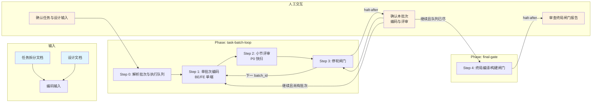

# 前后端代码实现技能

## 概述

用于基于任务拆分和设计文档完成前后端代码实现。它以 `task/task-split.md` 与设计文档为输入，按 5 步（解析批次 → 按执行队列逐批编码与小节评审 → 停轮确认 → 终局编译/构建闸门）推进，在业务仓库内产出代码变更，并在 `_workspace` 沉淀评审与闸门记录；全部批次确认后可进入 `fullstack-code-review` 终审。

## 目录结构

```text
fullstack-code-implementation/
├── SKILL.md                                      # 技能编排入口：定义 phases、steps、交付物与执行原则
├── README.md                                     # 技能说明文档：面向使用者的说明、流程图与能力概览
├── steps/
│   ├── step-00-parse-task-groups.md              # 解析后端/前端主分类与执行队列
│   ├── step-01-task-group-coding.md              # 按 batch_id 单端编码（template）
│   ├── step-02-section-review.md                 # 按 batch_id 小节评审（template，L1.5）
│   ├── step-03-halt-gate.md                      # 写 halt-gate 与批次交付报告（inline，每批停轮）
│   └── step-04-final-verify-and-gate.md          # 全量自检与编译/构建终局闸门
├── checkpoints/                                  # 各步骤与最终交付的校验规则
│   ├── step-00-checkpoint.md
│   ├── step-01-checkpoint.md
│   ├── step-02-checkpoint.md
│   ├── step-03-checkpoint.md
│   └── step-04-final.md
└── references/
    ├── batch-gate-protocol.md                    # 批次门禁、停轮与用户确认（业务权威）
    ├── section-review-config-backend.md          # 后端小节评审与白名单
    ├── section-review-config-frontend.md         # 前端(PC Web)小节评审与白名单（frontend-web.md）
    ├── section-review-config-iOS.md              # iOS 小节评审与白名单（frontend-ios.md）
    ├── section-review-config-Android.md          # Android 小节评审与白名单（frontend-android.md）
    ├── section-review-config-HMOS.md             # HMOS 小节评审与白名单（frontend-hmos.md）
    ├── section-review-config-H5.md               # H5 小节评审与白名单（frontend-h5.md）
    ├── section-review-verify.md                  # 小节评审与停轮检查说明
    ├── section-review-progress-template.tsv      # 批次进度表模板
    ├── backend/
    │   └── coding-standard.md                    # 后端编码标准
    └── frontend/
        ├── coding_standard.md                    # 前端编码规范
        ├── component-patterns.md                 # 组件设计模式
        ├── api-integration.md                    # API 集成实践
        └── performance-optimization.md           # 性能优化指南
```

## 执行流程图



## Agent 职责矩阵

| 步骤 | 负责的 Agent | AI 做什么 | 人工需要做什么 |
|------|-------------|-----------|---------------|
| **Step 0** 解析批次 | `backend-coder`（inline） | 从 task-split 分别解析 `BE-*` / `FE-*` 批次，生成执行队列与进度表 | 确认待映射项（如有） |
| **Step 1** 单批次编码 | `backend-coder` / `frontend-coder` | 按当前 `batch_id` 实现本端全部子任务，写入编码日志 | 无（批内自动）；每回合仅一个 batch |
| **Step 2** 小节评审 | `code-reviewer` | 对本批次变更做 P0 快扫，追加 `review-log.md`，可白名单修复 | 无（批内自动） |
| **Step 3** 停轮闸门 | `backend-coder`（inline） | 写 `halt-gate.md`，输出批次交付报告，结束本回合 | **确认本批次**：回复「继续」后方可下一 `batch_id` |
| **Step 4** 终局闸门 | `build-verifier` | 核对全量批次进度，执行编译/构建闸门 | **审查终局报告**：通过后建议触发终审 |

## 核心能力

- 后端/前端任务清单独立解析（`## N.` → `BE-{N}`；功能点 → `FE-{N}` / `FE-shared`）
- 按执行队列单端分批编码（默认先全部后端批次，再全部前端批次）
- 编码中融合小节评审（复用 `fullstack-code-review` P0 清单，写入 `review-log.md`）
- 每批次强制停轮（单回合最多一个 `batch_id`，须用户确认后继续）
- 编码规范自检与 AI-Generate 标注（后端/前端 references）
- 终局后端编译与前端构建闸门
- L1 / L1.5 / L2 分层 checkpoint 审查

## 产出物

| 产出 | 路径 | 作用 |
|------|------|------|
| 代码变更 | `repos.txt` 对应业务仓库 | 按 `batch_id` 分批交付的实现代码 |
| 批次清单 | `_workspace/code/00-task-groups.md` | 执行队列与 BE/FE 主分类表 |
| 编码日志 | `_workspace/code/01-task-group-log-{batch_id}.md` | 各批次实现记录 |
| 小节评审 | `_workspace/code/02-section-review-{batch_id}.md` | 各批次评审详情 |
| 评审日志 | `_workspace/review/review-log.md` | 小节评审章节（供终审 `supplement`） |
| 停轮闸门 | `_workspace/code/halt-gate.md` | 当前待确认批次（`user_confirmed=no` 时阻塞下一批） |
| 进度表 | `_workspace/code/section-review-progress.tsv` | 各批次 impl/review/确认状态 |
| 终局报告 | `_workspace/code/04-verify-and-gate-report.md` | 全量自检与编译/构建结果 |
| 中间产出 | `_workspace/code/`、`review/` | 步骤间传递（用户确认交付后删除） |

## 架构层级

| 层 | 载体 | 本技能对应 |
|----|------|-----------|
| L5 编排层 | `SKILL.md` | `skills/fullstack-code-implementation/SKILL.md` |
| L4 步骤层 | `steps/` | `skills/fullstack-code-implementation/steps/step-00~04.md` |
| L3 调度层 | `commands/` | `commands/scheduler-protocol.md`（共享） |
| L2 执行层 | `agents/` | `agents/backend-coder.md`、`agents/frontend-coder.md`、`agents/code-reviewer.md`、`agents/build-verifier.md` |
