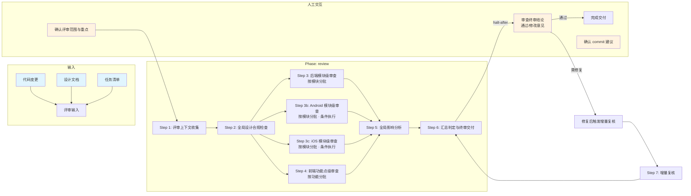

# 前后端代码评审技能

## 概述

用于对前后端及 Android / iOS 移动端代码变更进行结构化审查并输出终审结论。它以代码变更、设计文档和任务清单为输入，按 6+1 步完成全局合规检查、模块审查、影响分析与增量复核，最终产出 `review/review-log.md` 和 `review/commit-suggestion.md`。

## 目录结构

```text
fullstack-code-review/
├── SKILL.md                                      # 技能编排入口：定义 phases、steps、交付物与执行原则
├── README.md                                     # 技能说明文档：面向使用者的说明、流程图与能力概览
├── steps/
│   ├── step-01-review-context.md                 # 收集终审输入、设计基线与历史评审结果
│   ├── step-02-global-compliance.md              # 执行全局设计合规检查
│   ├── step-03-backend-review.md                 # 按后端模块分批执行代码审查
│   ├── step-03b-android-review.md                # 按 Android 模块分批执行代码审查（仅当存在 Android 模块）
│   ├── step-03c-ios-review.md                    # 按 iOS 模块分批执行代码审查（仅当存在 iOS 模块）
│   ├── step-04-frontend-review.md                # 按前端功能点分批执行代码审查
│   ├── step-05-impact-analysis.md                # 评估跨模块与全局影响
│   ├── step-06-summary-delivery.md               # 汇总终审结论并生成交付结果
│   └── step-07-incremental-recheck.md            # 对修复后的变更执行增量复核
├── checkpoints/                                  # 各步骤与最终交付的校验规则
│   ├── step-01-checkpoint.md
│   ├── step-02-checkpoint.md
│   ├── step-03-checkpoint.md
│   ├── step-03b-checkpoint.md
│   ├── step-03c-checkpoint.md
│   ├── step-04-checkpoint.md
│   ├── step-05-checkpoint.md
│   ├── step-06-checkpoint.md
│   └── step-07-checkpoint.md
└── references/
    ├── p0/                                       # P0 级检查项（后端/前端/Android/iOS）
    ├── backend/                                  # 后端审查与业务质量检查项
    ├── frontend/                                 # 前端审查与质量检查项
    ├── android/                                  # Android 审查与质量检查项
    ├── ios/                                      # iOS 审查与质量检查项
    └── common/                                   # 横切审查、影响分析与输出模板
```

## 执行流程图



## Agent 职责矩阵

| 步骤 | 负责的 Agent | AI 做什么 | 人工需要做什么 |
|------|-------------|-----------|---------------|
| **Step 1** 上下文收集 | `input-analyzer` | 收集变更范围、读取设计文档、提取小节评审结果 | 确认评审范围与重点关注模块 |
| **Step 2** 全局合规 | `code-reviewer` | 设计项覆盖度对比、任务完整性验证、架构合规检查 | 无（自动执行） |
| **Step 3** 后端审查 | `code-reviewer` | 按后端模块分批，执行 P0+P1 检查项审查 | 无（自动分批执行） |
| **Step 3b** Android 审查 | `code-reviewer` | 按 Android 模块分批，执行 P0+P1 检查项审查（仅当存在 Android 模块） | 无（自动分批执行） |
| **Step 3c** iOS 审查 | `code-reviewer` | 按 iOS 模块分批，执行 P0+P1 检查项审查（仅当存在 iOS 模块） | 无（自动分批执行） |
| **Step 4** 前端审查 | `code-reviewer` | 按前端功能点分批，执行 P0+P1 检查项审查 | 无（自动分批执行） |
| **Step 5** 影响分析 | `code-reviewer` | 全局确认清单复核、IA-* 四维度影响分析 | 无（自动执行） |
| **Step 6** 汇总交付 | `code-reviewer` | 读各步 Summary → 汇总统计 → 最终判定 → commit 建议 | **审查终审结论**：通过后接收 commit 建议，或给出修改意见 |
| **Step 7** 增量复核 | `code-reviewer` | 旧发现复核 + 修复文件 P0 快扫 | 在修复完成后触发增量复核 |

## 核心能力

- 全局设计合规检查（设计项覆盖度、任务完整性）
- 后端模块级代码审查（按模块动态分批）
- 前端功能点级代码审查（按功能点动态分批）
- Android 模块级代码审查（按模块动态分批，条件执行）
- iOS 模块级代码审查（按模块动态分批，条件执行）
- 跨模块影响分析（四维度：数据/接口/流程/用户体验 + 移动端影响 IA-MOBILE）
- P0/P1 检查项分层审查（跳过小节评审已覆盖的 P0）
- 增量复核机制（最多 3 轮循环）
- 评审日志增量追加（不覆盖已有内容）
- commit 建议自动生成
- L2 层级规则审查

## 产出物

| 产出 | 路径 | 作用 |
|------|------|------|
| 评审日志 | `review/review-log.md` | 小节评审 + 终审 + 增量复核的完整记录 |
| commit 建议 | `review/commit-suggestion.md` | 终审通过后的提交建议（仅终审通过时生成） |
| 中间产出 | `review/01~05-*.md` | 各步骤的分析结果 |
| Summary | `review/summaries/01~05-*.summary.md` | 各步骤的结构化摘要 |

## 架构层级

| 层 | 载体 | 本技能对应 |
|----|------|-----------|
| L5 编排层 | `SKILL.md` | `skills/fullstack-code-review/SKILL.md` |
| L4 步骤层 | `steps/` | `skills/fullstack-code-review/steps/step-01~07.md` |
| L3 调度层 | `commands/` | `commands/scheduler-protocol.md`（共享） |
| L2 执行层 | `agents/` | `agents/input-analyzer.md`、`agents/code-reviewer.md` |

