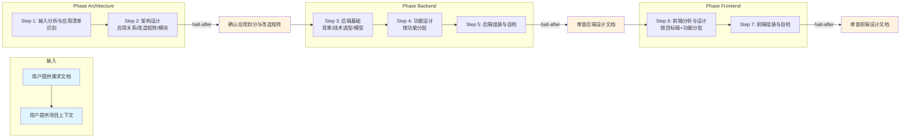

# 前后端技术方案设计技能

## 概述

用于在同一需求上下文中完成架构设计、后端设计与前端设计。它以需求文档和项目上下文为输入，按 7 步 / 3 phase 完成分析、架构、后端、前端的设计、组装与校验，最终产出 `design/architecture-design.md`、`design/backend-design.md`、前端入口索引 `design/frontend-design.md` 及各目标端分端设计文件（`frontend-web.md` / `frontend-ios.md` / `frontend-android.md` / `frontend-hmos.md` / `frontend-h5.md`）。

## 目录结构

```text
fullstack-design/
├── SKILL.md                                      # 技能编排入口：定义 phases、steps、交付物与执行原则
├── README.md                                     # 技能说明文档：面向使用者的说明、流程图与能力概览
├── steps/
│   ├── step-01-input-analysis.md                 # 读取需求与项目上下文，形成统一输入摘要（含应用清单）
│   ├── step-02-architecture.md                   # 架构设计：应用关系/改造矩阵/应用内模块/概览 ER 与时序
│   ├── step-03-backend-foundation.md             # 产出后端背景、目标、技术选型与模型设计
│   ├── step-04-function-design.md                # 按功能点分批完成后端功能设计
│   ├── step-05-backend-assembly.md               # 组装后端设计文档并完成后端阶段自检
│   ├── step-06-frontend-design.md                # 按目标端+功能点分批完成前端分析与分端方案设计
│   └── step-07-frontend-assembly.md              # 生成入口索引 frontend-design.md 并组装各分端设计文件
├── checkpoints/                                  # 各步骤与各阶段最终交付的校验规则
│   ├── step-01-checkpoint.md
│   ├── step-02-architecture-final.md
│   ├── step-03-checkpoint.md
│   ├── step-04-checkpoint.md
│   ├── step-05-backend-final.md
│   ├── step-06-checkpoint.md
│   └── step-07-frontend-final.md
└── references/
    ├── design-architecture-standard.md           # 架构设计正文标准
    ├── design-backend-standard.md                # 后端设计正文标准
    ├── design_frontend_standard.md               # PC Web 分端设计标准（frontend-web.md）
    ├── design_ios_standard.md                    # iOS 分端设计标准（frontend-ios.md）
    ├── design_android_standard.md                # Android 分端设计标准（frontend-android.md）
    ├── design_hmos_standard.md                   # 鸿蒙 HMOS 分端设计标准（frontend-hmos.md）
    ├── design_h5_standard.md                     # H5 分端设计标准（frontend-h5.md）
    ├── design_template.md                        # 设计文档排版模板
    ├── sequence-diagrams.md                      # 时序图规范
    ├── flowcharts.md                             # 流程图规范
    └── erd-diagrams.md                           # ER 图规范
```

## 前端设计产出结构

前端阶段采用「入口索引 + 分端设计文件」结构：

- `design/frontend-design.md`：**固定入口索引文件**，为 PC Web、iOS、Android、HMOS、H5 五端各设访问章节，说明各分端设计文件的访问方式、引用工程与使用条件；是 `task-split` 引用前端设计的**唯一入口**，本身不承载分端设计正文。
- `design/frontend-web.md` / `frontend-ios.md` / `frontend-android.md` / `frontend-hmos.md` / `frontend-h5.md`：各目标端的分端设计文件，仅生成本次实际涉及的目标端。同一项目目录下存在多端工程时，每个被执行的目标端各产出一个分端设计文件。

## 执行流程图



## Agent 职责矩阵

| 步骤 | 执行方式 | AI 做什么 | 人工需要做什么 |
|------|---------|-----------|---------------|
| **Step 1** 输入分析 | inline | 读取需求与项目上下文，提取功能清单、应用清单、技术栈、非功能要求、角色权限、外部依赖，标注复杂度 | 提供需求文档路径；可选提供项目上下文；确认待澄清问题 |
| **Step 2** 架构设计 | agent: `architect` | 应用清单、应用间依赖图、应用×功能点改造矩阵、应用职责边界、应用内模块设计、概览级 ER 与应用间时序 | **审查架构文档**：确认应用划分与改造范围，通过后进入后端阶段 |
| **Step 3** 后端基础 | agent: `architect` | 背景目标、技术选型、领域模型、数据模型、状态机 | 无（自动执行，由架构与输入摘要驱动） |
| **Step 4** 功能设计 | agent: `function-designer` | 按功能点动态分批，逐个设计后端功能细节 | 无（自动分批执行） |
| **Step 5** 后端组装 | inline | 全文组装、一致性校验、L2 审查，产出 `backend-design.md` | **审查后端设计文档**：通过后进入前端阶段，或给出修改意见 |
| **Step 6** 前端设计 | agent: `function-designer` | Phase A 前端分析（需求驱动，含目标端识别）→ Phase B 按目标端分批做分端方案设计 | 无（自动执行，以后端设计为基准对齐） |
| **Step 7** 前端组装 | inline | 生成入口索引 `frontend-design.md`、按目标端组装各分端设计文件、前后端接口对齐校验、L2 审查 | **审查前端设计文档**：通过后完成交付 |

## 核心能力

- 架构设计（应用清单、应用间依赖、应用×功能点改造矩阵、应用职责边界）
- 应用内模块设计（模块清单与依赖，作为模块命名唯一权威源）
- 概览级数据建模与应用间时序（表级 ER 总览、应用级泳道）
- 后端数据建模（ER 图、表结构、领域模型）
- 接口设计（Controller/Service 层接口定义、时序图）
- 业务流程建模（流程图、状态机）
- 前端架构设计（组件树、路由结构、状态管理方案，含 PC Web、iOS、Android、HMOS、H5 五类目标端）
- 前端功能点设计（按目标端+页面/组件拆分，交互细节定义）
- 需求追溯矩阵（设计项 ↔ REQ 编号映射）
- 前后端接口一致性校验
- 边界场景完整性举证（据输入摘要 §3 边界与交互线索复核）
- 动态分批执行（按目标端与功能复杂度自适应分批）
- L2 层级规则审查（格式、结构、引用完整性校验）

## 产出物

| 产出 | 路径 | 作用 |
|------|------|------|
| 架构设计文档 | `design/architecture-design.md` | Phase architecture 交付（后两阶段共同锚点） |
| 后端设计文档 | `design/backend-design.md` | Phase backend 交付 |
| 前端设计入口 | `design/frontend-design.md` | Phase frontend 交付，固定入口索引文件 |
| 分端设计文件 | `design/frontend-web.md` / `frontend-ios.md` / `frontend-android.md` / `frontend-hmos.md` / `frontend-h5.md` | Phase frontend 交付，按本次涉及目标端生成 |
| 中间产出 | `{WORKSPACE}/design/` | 各步骤的分析结果（用户确认后删除） |

## 架构层级

| 层 | 载体 | 本技能对应 |
|----|------|-----------|
| L5 编排层 | `SKILL.md` | `skills/fullstack-design/SKILL.md` |
| L4 步骤层 | `steps/` | `skills/fullstack-design/steps/step-01~07.md` |
| L3 调度层 | `commands/` | `commands/scheduler-protocol.md`（共享） |
| L2 执行层 | `agents/` | `agents/architect.md`、`agents/function-designer.md`（Step 1/5/7 为 inline，无 agent） |
