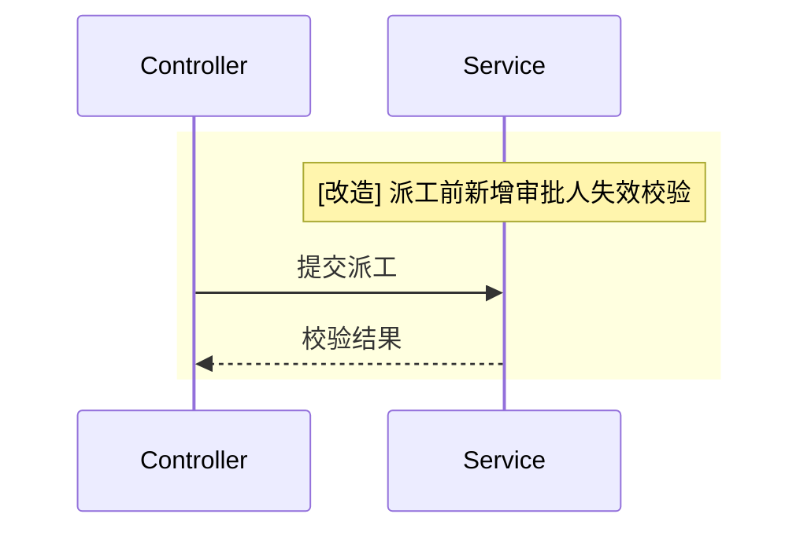
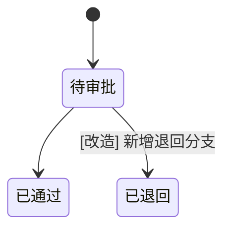
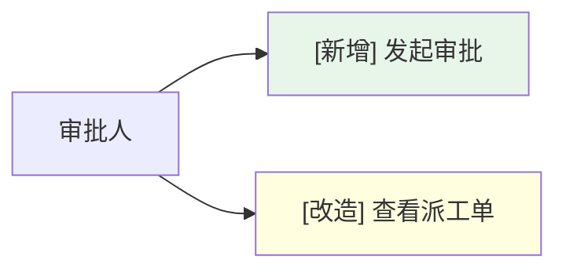

# 改动点标注规范

定位: 需求/设计文档中「改动点」的统一标注规范，覆盖四类图（时序图、数据模型、状态机、用例图）的视觉高亮与接口章节的三态标注。供 `fullstack-design` 后端/前端设计与 `requirement-analysis` 用例图共同遵循。

## 0. 前提声明（适用场景）

- **默认场景为存量项目**（已有现网 + 知识库，本次需求产出具体改动）：标注**一律强制**，四类图与接口都须标注。
- **纯新项目**（全量新建、无现网）：标注退化为可选——全部内容即新增，可仅在文档头声明"本文档全部为新建"，不强制逐项标注。

## 1. 适用范围与强制声明

存量项目的需求文档与前后端设计文档，凡出现以下对象，须按本规范标注本期改动：
- **四类图**：时序图、数据模型（erDiagram）、状态机（stateDiagram）、用例图（flowchart）
- **接口章节**：后端对外接口、依赖接口

每张图、每个接口都必须能区分「本期改动」与「复用既有」。

## 2. 三态定义与配色

| 三态 | 判定标准（存量项目，相对现网） | 高亮色 | Hex / RGB | 附带要求 |
|------|------|--------|-----------|---------|
| `[新增]` | 现网无此接口/表/状态/用例，本次全新建立 | 浅绿 | `#E8F5E9` = `rgb(232,245,233)` | 整体即改动 |
| `[改造]` | 现网已有，本次改了路径/入参/出参/核心逻辑/字段/状态任一项 | 浅黄 | `#FFFFE0` = `rgb(255,255,224)` | **必带"改造点说明"**：改了什么、改前→改后 |
| `[复用]` | 现网已有且本次零改动，仅被调用/引用 | 不上色 | —（默认底色） | **必标现网出处**（类·方法 / 原路径 / 原表名） |

**判定按序短路**：① 现网是否存在？否 → `[新增]`；② 存在且有任一改动 → `[改造]`；③ 否 → `[复用]`。

**全局默认语义（消歧根）**：图中**着色或带三态标签的元素 = 本期新增/改造；无标注元素 = 复用既有**。每张图必须能区分改动与非改动，不允许"有改动却整图零标注且无声明"（无法区分即视为漏标）。

**标注退化规则（按改动占比）**：
- **局部改动**（图/表内既有改动元素、也有复用元素）：逐元素标三态，复用元素不标。
- **整体全改**（整张图/整个状态机/整张表全部为本期改动、无复用元素）：**不逐元素标注**，改为在图下用一句「改动标注约定」声明本图改动构成——全为单态写"本图全部为本期[新增]"（或[改造]）；混合两态写"本图全部为本期改动：新增 X 项、改造 Y 项"。逐元素全标视为冗余。

### 2.x 与既有用词的映射注解（避免"两套语义"误读）

- **架构改造矩阵**：`design-architecture-standard.md §3 应用×功能点改造矩阵`已使用同一套 `[新增]/[改造]/[复用]`。本规范的三态与架构层**逐字一致**，确保「架构矩阵标 [改造] 的应用 → 后端功能/接口标 [改造] → 前端字段标 [改造]」三层贯通同义同词。
- **应用内模块清单**：`design-architecture-standard.md §5` 沿用"既有/新增/调整"用词，**不改名**。语义对齐关系为：`既有 ≈ [复用]`、`新增 = [新增]`、`调整 ≈ [改造]`。二者是同义不同词，非两套语义。

## 3. 接口三态标签（后端）

- 每个对外接口、依赖接口的**标题层**标注三态之一：`[新增]` / `[改造]` / `[复用]`。
- `[改造]` 接口必须带"改造点说明"，命中路径/入参/出参/核心逻辑之一（不得空壳）。
- `[复用]` 接口必须标现网出处（原路径 / 原 Controller·方法）。
- **三态未确定时**（如复用哪个现网接口尚待核实）：标 `[需人工确认]` + 一句假设依据，**不得同时叠加 `[复用]`/`[新增]`**（两者互斥）；待人工确认后再落定为确定的三态之一。`[需人工确认]` 由终稿清零检查统一收口。

**`[改造]` 改造点说明模板**：
```markdown
#### 接口N：xxx [改造]
- 改造点说明：
  - 路径：无变化 / 改前→改后
  - 入参：新增字段 xxx / 无变化
  - 出参：无变化
  - 核心逻辑：派工前新增审批人失效校验分支
```

## 4. 四类图标注落地（按 Mermaid 各图语法能力分别落地）

> 着色因图而异是 Mermaid 语法能力所限（erDiagram 无上色能力，stateDiagram 中文节点 classDef 渲染不稳）；**三态文字标签是所有图的统一底线**，着色是支持的图上的增强。配色为浅底深字，灰度打印 / 色盲场景靠 `[新增]/[改造]` 文字标签区分，不单纯依赖颜色。

### 4.1 时序图 `sequenceDiagram`
- 改动交互用 `rect rgb(...)` 区块包裹：新增用绿 `rgb(232,245,233)`，改造用黄 `rgb(255,255,224)`。
- **rect 块的首条 Note/消息须以 `[新增]`/`[改造]` 开头**（灰度/色盲下区分改动的底线）；块内其余 Note 不强制带词。
- **rect 必须完整嵌套在单个 alt/opt/loop 分支内**，不得跨控制块的 `else`/`end` 边界（跨界会导致 mermaid 渲染错乱）；与相邻未标注块的改动边界靠 Note 文字明确，不依赖背景色范围推断。
- 禁用 `<span style="color:red">` 行内红字（mermaid 内 HTML span 渲染不可靠）。



### 4.2 状态机 `stateDiagram-v2`
- **文字标签优先**：改动状态/转换的 label 加 `[新增]`/`[改造]` 前缀。
- `classDef changed` 上色为**可选增强**（项目 mermaid 版本支持且中文节点名无渲染问题时使用）。
- 状态机整体全新时，**不在每条转换上标 `[新增]`**，仅在图下声明"本状态机为本期全新设计"。



### 4.3 用例图 `flowchart`
- 改动用例节点加 `:::chg-new`/`:::chg-mod` 着色 + 文字前缀；二者同时给，**文字标签为准**。



### 4.4 数据模型 `erDiagram`
- erDiagram **不支持任何上色**，用**纯文字标签**：表标题标三态。
- **`[新增]` 表（整表新建）字段免逐个标注**，清单表"改动字段"列写"全表"即可。
- **`[改造]` 表**需在 erDiagram 内变更字段的注释位标注：本期新加字段标 `[新增]`、改了类型/约束/含义的字段标 `[改造]`，未改动的既有字段不标；仅这些变更字段参与与清单表的差集核对。
- **图下强制配「数据模型改动清单表」为权威**，表归属须与 `design-architecture-standard.md §6 ER 总览`一致。
- 清单表**仅收录表结构（DDL）变更**；数据字典值 / DML 变更不混入，另在功能设计或单独小节说明。

**数据模型改动清单表（强制）**：

| 表名 | 性质 | 改动字段 | 改动说明 |
|------|------|----------|----------|
| clm_admin_approval | [新增] | 全表 | 本期新增审批主表 |
| clm_report_info | [改造] | chain_snapshot_json | 新增 CLOB 列存审批链快照 |

## 5. 文档级「改动标注约定」声明块模板

**触发条件**：仅在"整体全改"（按 §2 退化）或"局部改动需列改动项清单说明"时附；常规局部标注靠图内标签自明，**不强制每图都附**。

```markdown
> **改动标注约定**：
> - 着色/带三态标签元素 = 本期新增（绿 #E8F5E9）或改造（黄 #FFFFE0）；无标注 = 复用既有。
> - 本图改动项：[逐项列出，与图内标注一一对应]
> - [若整体全改] 本图全部为本期改动：新增 X 项、改造 Y 项
```

## 6. 常见漏标点自检

1. 时序图 rect 包了但没说明改了什么（只有色块无信息）
2. 接口标 `[改造]` 但无改造点说明，或说明空壳
3. erDiagram 改造表只标了标题，字段注释位漏标
4. 状态机只标状态、漏标改动的转换
5. 用例图新增用例漏加着色/前缀
6. 整图全改动却漏写"全部新增/改造"声明，导致无法区分
7. `[复用]` 接口/表漏标现网出处，下游无法核实
8. 后端接口三态与架构改造矩阵对同一对象判定打架（如矩阵标复用、后端标新增）
9. 「数据模型改动清单表」混入 DML/数据字典变更（应只收 DDL）
10. rect 块首条 Note 未以 `[新增]/[改造]` 开头，灰度下无法区分
11. 整体全改却逐元素全标，或整图有改动却既无标签又无声明块
