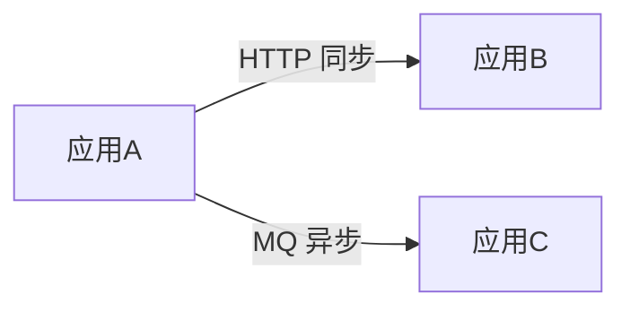
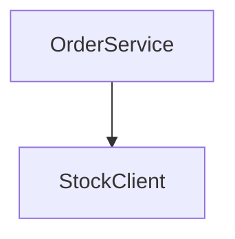
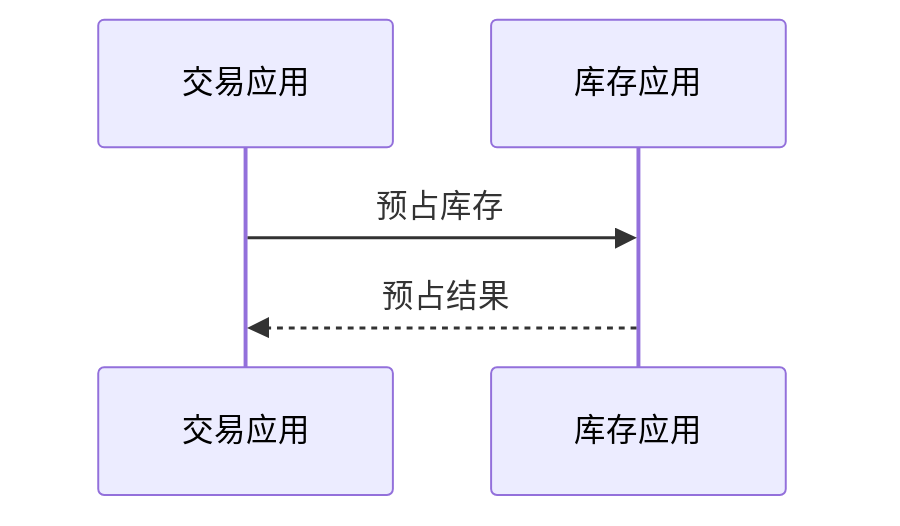

# 架构设计文档标准

定位: 应用间架构设计 + 应用内模块设计的正文规范，**覆盖应用间（应用关系/依赖/改造矩阵/职责）与应用内模块（模块清单/依赖）两个层级**。适用于多应用或单应用的新需求设计阶段。

衔接关系: 上承「通用需求规范」的功能/非功能需求与项目应用拓扑（`{KNOWLEDGE}/application/`、`backend-project.md`），是后端设计（backend-design.md）与前端设计（frontend-design.md）的**共同锚点**与前置文档；本文产出的应用清单、改造矩阵、应用内模块清单、表级 ER 总览、应用间时序，作为后端/前端详细设计的范围基准与命名权威源。

## 编写总原则

- **置前产出**：本文档是三份设计文档（架构 → 后端 → 前端）的第一份，先于后端/前端产出，供后两者引用对齐。
- **粒度边界（强制）**：本文档止于「应用级 / 模块级 / 表级」，**不下钻**到「类级 / 方法级 / 字段级」（那是后端 backend-design.md §3.1/§3.2 的职责）。
- **单一权威源**：应用名、模块名、表名、功能点 ID 以本文档为权威源，后端/前端文档对齐、引用、不反向覆盖。
- **存量项目**：与现状对齐，突出本期增量与变更（既有/新增/调整）。
- **新项目**：可完整描述目标应用划分与模块结构。
- 缺失信息标注 `[需与产品确认]`。

## 1. 应用清单与定位

列出本次需求涉及的全部应用/服务及其定位。

- **应用/服务名**：与项目应用拓扑（`{KNOWLEDGE}/application/applications-and-domains.md` 或 `backend-project.md`）一致
- **定位**：该应用在系统中的职责定位（如：核心交易、用户中心、对接网关等）
- **本次是否涉及改造**：是/否
- **来源**：识别依据（application 知识库 / backend-project / 需求推断）

**示例结构**：
```markdown
## 1. 应用清单与定位

| 应用/服务 | 定位 | 本次是否涉及改造 | 来源 |
|----------|------|----------------|------|
| {应用A} | [职责定位] | 是 | application 知识库 |
| {应用B} | [职责定位] | 否 | backend-project |
```

> 单应用需求：本节只列 1 行，并在「来源」或备注标注「单应用需求」。

## 2. 应用间依赖关系图

用 Mermaid flowchart 展示本次涉及应用之间的调用/依赖关系，标注调用方向与方式（同步 HTTP / MQ / RPC 等）。规范见 `flowcharts.md`。

**示例结构**：
```markdown
## 2. 应用间依赖关系图
```


> 单应用需求：若无应用间依赖，标注「单应用，无应用间依赖」或仅画该应用与外部系统的边界关系。

## 3. 应用 × 功能点改造矩阵

**核心产出**：明确每个应用涉及本次哪几个功能点的改造，做了什么。

- **多应用**：行=应用，列=本次功能点；格子标 `[新增]` / `[改造]` / `[复用]` + 一句话说明改了什么对象/行为；不涉及留空或标「不涉及」。
- **单应用**：退化为「应用职责说明」——该应用承担哪些功能点、各做什么改造，不强制矩阵形式，但须注明「单应用需求」。

**矩阵有效性要求（防空壳走过场）**：
- 列覆盖功能清单全部功能点（无遗漏）；行覆盖「涉及改造」的全部应用
- 每个功能点至少落到一个应用（无悬空）
- 改造说明须指明改了什么对象/行为，**拒绝「相应改造 / 适配调整 / 相应优化」类套话**
- 待产品确认的格子标 `[需与产品确认]`

**示例结构**：
```markdown
## 3. 应用 × 功能点改造矩阵

| 应用 \ 功能点 | REQ-001 下单 | REQ-002 退款 |
|--------------|-------------|-------------|
| 交易应用 | [改造] 新增预占库存校验 | [复用] 复用现有退款流水 |
| 库存应用 | [新增] 库存预占接口 | 不涉及 |
```

## 4. 各应用职责与边界

**应用级**：逐应用说明在本次需求中承担的职责与边界（做什么、不做什么、与相邻应用的边界）。

> 本节为**应用级**视角，**不下钻到模块**（模块归 §5）。

## 5. 应用内模块设计

**模块级**：每个「涉及改造」的应用，列出本期涉及的模块及职责。

- 每个模块：模块名 + 一句话职责 + 标注 `既有` / `新增` / `调整`
- 模块 ≥ 4 个时用 Mermaid flowchart 展示模块依赖
- **粒度**：模块级（应用内 package / service 边界），**不下钻到具体类 / 方法名**
- 模块清单须覆盖改造矩阵中该应用承担的功能点所需的模块

> **本节是下游 function-design 时序图参与者命名的权威源**：后端功能设计的时序图参与者名须取自本节模块名；后端 backend-design.md **引用本节、不重列模块清单**。

**示例结构**：
```markdown
## 5. 应用内模块设计

### 交易应用
| 模块 | 职责 | 既有/新增/调整 |
|------|------|---------------|
| OrderService | 订单主流程编排 | 调整 |
| StockClient | 库存应用调用封装 | 新增 |
```


## 6. ER 模型变更总览

**表级（概览）**：列出本次涉及新增/改造的表，及其所属应用，每张表一句话说明改了什么。

- **禁字段级**：不展开字段定义、不写建表 SQL（那是后端 §3.1.2 的职责）
- 多应用：按应用分组列表；单应用：退化为「本应用涉及的表变更总览」，不强制分组

**示例结构**：
```markdown
## 6. ER 模型变更总览

| 表名 | 所属应用 | 新增/改造 | 变更摘要（一句话） |
|------|---------|----------|------------------|
| stock_occupy | 库存应用 | 新增 | 记录订单预占库存 |
| order_main | 交易应用 | 改造 | 增加预占状态字段 |
```

## 7. 应用间关键交互时序

**应用级泳道（概览）**：展示跨应用的主干调用链。规范见 `sequence-diagrams.md`。

- **禁下钻**：泳道参与者为应用级，**不出现 Controller / Service / Mapper 等应用内部参与者**（那是后端 §3.2 单功能时序的职责）
- 单应用：无应用间交互时，显式标注「单应用，无应用间交互时序」，或退化为「应用内主干流程概览」（仍止于应用级）；**禁止**为凑章节复制后端 §3.2 单功能时序

**示例结构**：
```markdown
## 7. 应用间关键交互时序
```


## 文档编写规范

- 使用 Markdown 格式；Mermaid 用于依赖图（flowchart）、模块依赖（flowchart）、ER 总览、应用间时序（sequenceDiagram）
- 所有章节必须完整，单应用按退化形态产出，不得为凑章节堆砌空壳
- 改动标注：涉及改造点可套用 `change-annotation-standard.md` 的标注规范（**若该规范已落地**；未落地则跳过，不引用、不报错）
- 全文 UTF-8
