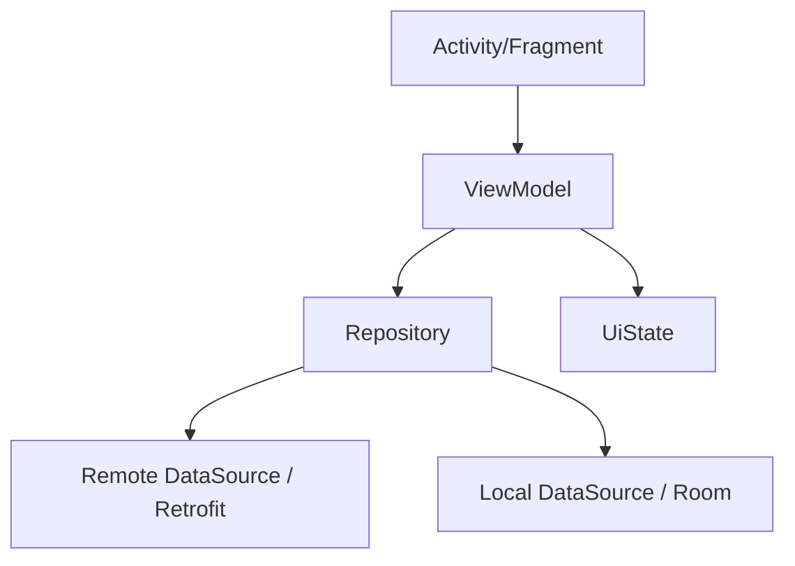

# Android 分端设计标准（frontend-android.md）

> 本标准用于 `fullstack-design` 产出 Android 分端设计文件 `frontend-android.md`。
> 仅当 Phase A 功能点清单中存在 **目标端 = Android** 的功能点时加载并执行。
> Android 设计写入**独立分端设计文件** `design/frontend-android.md`，不再作为 `frontend-design.md` 的内嵌章节；`frontend-design.md` 为入口索引文件，通过「Android」访问章节指向本文件（与编码侧 `step-00-parse-task-groups.md` 的 `Android-{N} → frontend-android.md` 约定一致）。
> 涉及后端接口时，须与同需求 `backend-design.md` 一致，禁止臆造冲突接口。

---

## 文件定位

Android 设计写入独立文件 `design/frontend-android.md`，文件标题固定为：

```markdown
# [需求名称] — Android 分端设计（frontend-android.md）
```

其下按功能点组织，每个功能点的标题格式须为 `### 功能点 N：{名称}`，以便 `task-split` 与编码侧 `step-00` 正确解析为 `Android-{N}` 批次。`frontend-design.md` 入口文件的「Android」访问章节须指向本文件。

---

## 一、Android 概述

- **功能概述**：该功能在 App 内实现什么、解决什么问题、在 App 整体中的定位
- **功能定位**：新增页面/功能还是对现有页面的扩展；依赖的现有模块
- **目标端范围**：仅 Android 原生（Kotlin / Java）；不含跨平台（Flutter / RN）
- **最低版本与兼容**：minSdk、targetSdk；涉及新 API 时标注兼容策略

---

## 二、Android 架构说明

> 使用与项目现状一致的架构模式（MVVM / MVP / MVI）；从 `frontend-project.md` 的 Android 项目信息获取，无则扫描仓库归纳。

### 1、模块划分

- **模块名称**：[职责、输入、输出、边界]

### 2、架构层次

- **界面层（UI）**：Activity / Fragment / Compose 屏幕的组成与职责
- **状态层（ViewModel）**：状态承载方式（LiveData / StateFlow / Compose State），状态流转
- **数据层（Repository）**：数据来源（网络 / 本地）、缓存与切换策略
- **网络层**：复用现有 Retrofit / OkHttp 封装；Service 接口定义风格
- **本地存储层**：Room / DataStore / SharedPreferences 的使用边界



### 3、模块化设计原则

- **单一职责**：每个类/文件职责单一
- **ViewModel 不持有 View/Context 引用**（避免内存泄漏）
- **数据层分离**：UI 不直接调用网络/数据库，统一经 Repository
- **依赖注入**：与项目一致（Hilt / Dagger / Koin / 手动），不混用

---

## 三、规范文档对齐

### 1、技术标准

- **语言**：Kotlin / Java / 混编（与所在模块现状一致）
- **架构组件**：ViewModel / Lifecycle / Navigation / Room / WorkManager 等使用范围
- **UI 方式**：XML + ViewBinding / Jetpack Compose（与项目一致）
- **异步方案**：Coroutine + Flow / RxJava / Thread（与项目一致）
- **网络**：复用现有网络层封装，列出新增 Service 接口

### 2、项目结构

严格遵循 `frontend-project.md` 的 Android 目录约定：

- **新增/修改的目录与文件**：`[路径]`：[用途]
- **包结构**：与现有包命名约定一致（feature 包 / 分层包）

### 3、UI 风格与组件对齐

- **设计体系**：Material Design 版本 / 项目自定义主题
- **复用控件**：列出本次使用的自定义 View、通用组件、样式（theme/style/dimens）
- **参照页面**：选定 2-3 个现有同类型页面作为 UI 与交互基准

---

## 四、功能逻辑实现（逐功能点）

> 每个功能点必须包含以下全部子章节。

### 功能点 N：{名称}

#### N.1 功能概述

- **功能描述**（用户视角）
- **实现位置**：Activity / Fragment / Compose 屏幕路径、ViewModel 路径
- **关联需求**：REQ 编号

#### N.2 数据与接口

> 凡后端 HTTP/API，须标注 `来源：backend-design.md §x.x 接口N`，禁止臆造；后端未覆盖标注 `[需后端设计补充]`。

- **数据模型**：给出 Kotlin data class / Java POJO 定义，逐字段标注来源
  ```kotlin
  data class ClaimItem(
      val id: Long,        // 来源：backend-design.md §3.2 出参字段 id
      val claimNo: String, // 来源：backend-design.md §3.2 出参字段 claimNo
  )
  ```
- **接口依赖**（逐接口展开入参/出参字段表）：
  - `[Retrofit Service 方法]`（`[Service 文件路径]`）— **来源：backend-design.md §x.x 接口N**
    - 方法 / 路径 / 调用时机
    - 入参字段表、出参字段表（与 Web 前端标准同格式）
- **字段映射**：客户端字段名/类型与后端不一致时逐字段说明
- **本地存储**（如涉及）：Room Entity / DAO 字段定义、与后端模型的映射、迁移策略

#### N.3 代码复用分析

- **可复用组件/View**：[路径、用途]
- **可复用数据/类型**：[路径、用途]
- **可复用服务/工具**：网络封装、工具类、基类 [路径、用途]

#### N.4 实现方案 — 界面结构

- **界面载体**：Activity / Fragment / Compose 屏幕 — 职责
- **布局**：XML 布局文件路径 / Composable 函数；列出关键控件
- **条件显隐**：列出需按状态/权限显隐的 UI 区域及条件
- **导航**：进入/退出本界面的导航关系（Navigation Component / Intent / startActivityForResult 等）

#### N.5 实现方案 — 状态定义与流转

- **UiState 结构**：给出完整定义（如 `sealed interface` 或 data class）
  ```kotlin
  data class ClaimListUiState(
      val loading: Boolean = false,
      val items: List<ClaimItem> = emptyList(),
      val error: String? = null,
  )
  ```
- **状态承载**：LiveData / StateFlow / Compose State（与项目一致）
- **流转**：复杂流转用 mermaid stateDiagram 表达（含 loading / 空态 / 错误态）

#### N.6 实现方案 — 交互流程

必须包含 Mermaid 图 + 文字说明，覆盖：

- **页面初始化流程**（sequenceDiagram：用户 → Activity/Fragment → ViewModel → Repository → 网络/本地），含 loading / 空态 / 错误态切换
- **用户操作清单**（逐一列出可交互元素：触发动作、处理流程、用户反馈）

  | 交互元素 | 触发动作 | 处理流程 | 用户反馈 |
  |----------|----------|----------|----------|
  | [按钮/输入/列表项] | [点击/输入/下拉刷新/加载更多] | [校验 → ViewModel → Repository → 状态更新] | [Loading/Toast/对话框/页面跳转] |

- **列表交互**（如有 RecyclerView/LazyColumn）：Adapter/ItemViewModel、下拉刷新、分页加载、空态、Diff 策略
- **表单交互**（如有）：逐字段校验规则表、校验时机、联动
- **对话框/BottomSheet 交互**（如有）：打开条件、关闭方式、回调

#### N.7 生命周期与资源管理

- **生命周期处理**：数据加载时机（onCreate/onViewCreated/onResume）、配置变更（旋转）处理、进程重建恢复
- **资源释放**：协程作用域（viewModelScope/lifecycleScope）、Observer 注销、Binding 置空（Fragment onDestroyView）、监听器/广播注销
- **后台与前台**：是否需要在后台停止刷新/定位/轮询

#### N.8 权限与安全

- **运行时权限**（如涉及）：申请的权限、申请时机、拒绝后的降级处理
- **数据安全**：敏感数据存储方式、传输加密、日志脱敏
- **AndroidManifest 声明**：新增的权限、组件、intent-filter

#### N.9 边界与错误处理

- 空数据 / 网络异常 / 超时 / 接口错误码的处理与用户反馈
- 弱网与无网处理、重试与降级
- 错误恢复机制（重试入口、缓存兜底）
