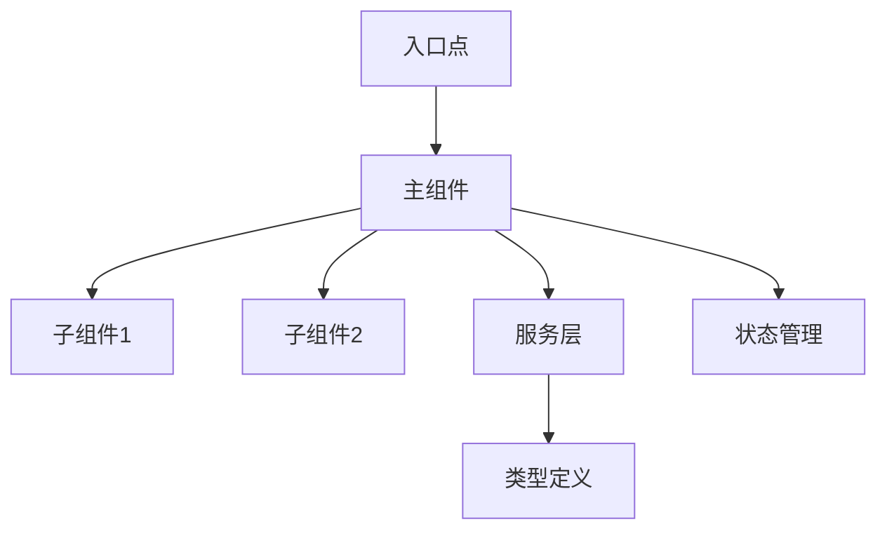
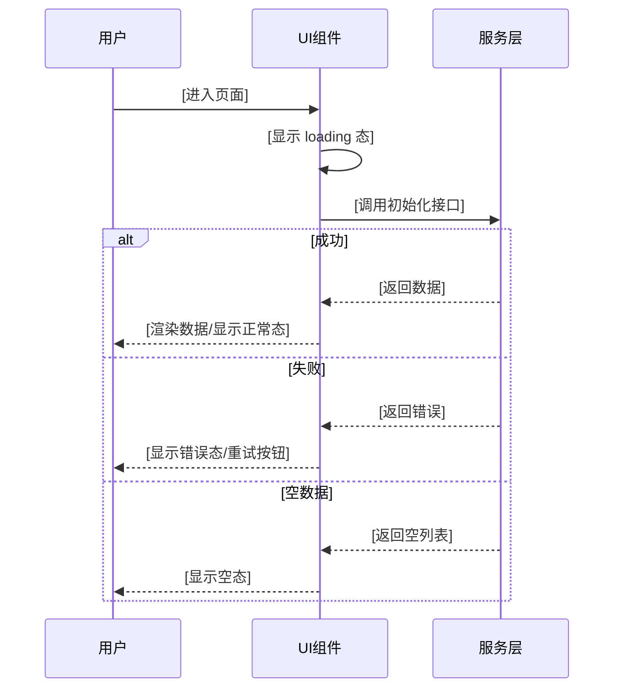

# PC Web 分端设计标准（frontend-web.md）

> 本标准用于 `fullstack-design` 产出 PC Web 分端设计文件 `frontend-web.md`。
> 仅当 Phase A 功能点清单中存在 **目标端 = Web** 的功能点时加载并执行。
> Web 设计写入**独立分端设计文件** `design/frontend-web.md`，不再作为 `frontend-design.md` 的内嵌章节；`frontend-design.md` 为入口索引文件，通过「PC Web」访问章节指向本文件（与编码侧 `step-00-parse-task-groups.md` 的 `FE-{N} → frontend-web.md` 约定一致）。
> 文件标题固定为 `# [需求名称] — PC Web 分端设计（frontend-web.md）`；其下按下方「一～四」章节结构组织，功能点标题为 `### 功能点 N：{名称}`（供 `task-split` 与编码侧解析为 `FE-{N}`）。
> 涉及后端接口时，须与同需求 `backend-design.md` 一致，禁止臆造冲突接口。

---

## 一、概述

[功能概述：简要描述该功能是什么，解决什么问题，在整体系统中的定位]

[功能定位：说明该功能基于哪些现有模块，是新增功能还是对现有功能的扩展/优化]

[架构定位：说明该功能在整体架构中的位置，与现有模块的关系，遵循的项目规范。涉及应用间关系/承载应用时，参见 architecture-design.md（§1 应用清单、§3 改造矩阵）]

---

## 二、架构说明

### 1、模块划分

[清晰描述功能模块的划分，每个模块的职责和边界]

- **模块名称 **: [模块职责说明]
  - 职责范围: [说明该模块负责的功能]
  - 输入: [模块的输入，如数据、事件等]
  - 输出: [模块的输出，如数据、状态变更等]
  - 边界: [说明模块的边界，与其他模块的关系]

### 2、架构层次

> **说明**：以下描述使用技术栈无关的通用术语，具体实现需遵循项目实际使用的框架约定。

- **UI 层**: [说明 UI 层的组成，如主组件和子组件，各组件职责，使用项目框架的组件机制]
- **状态层**: [说明状态管理方案，如局部状态、全局状态管理，状态流转关系，使用项目实际的状态管理方式]
- **服务层**: [说明服务层的组织，如复用现有服务、新增服务，服务职责划分]
- **类型层**: [说明类型定义的组织（如项目使用 TypeScript），如复用现有类型、新增类型，类型关系]



### 3、模块化设计原则

- **单一文件职责**
  - [说明每个文件/组件的职责划分，避免职责重叠]
- **组件隔离**
  - [说明组件的隔离和复用原则，组件间的通信方式]
- **服务层分离**
  - [说明服务层的分离原则，业务逻辑与UI逻辑的分离]
- **工具模块化**
  - [说明工具函数的模块化原则，通用逻辑的抽取]

---

## 三、规范文档对齐

> 参考 `frontend-project.md` 和 steering 文档（如存在）中的项目规范。

### 1、技术标准 (tech)

> **说明**：严格遵循 `frontend-project.md` 中的技术栈约定，使用通用术语描述，不绑定特定框架。

- **技术栈**: [列出使用的技术栈（从 frontend-project.md 获取），如前端框架、语言、构建工具、状态管理库、路由库、UI组件库等，使用通用描述]
- **路由**: [说明路由配置，如路由路径、懒加载方式等，使用项目实际的路由库约定]
- **状态管理**: [说明状态管理方案，如使用全局状态管理、局部状态等，使用项目实际的状态管理方式]
- **HTTP**: [说明接口调用方式，如复用现有接口、新增接口等]

### 2、项目结构 (structure)

严格遵循 `frontend-project.md` 中的目录结构约定：

- **新增/修改的目录结构**:
  - `[目录路径]`: [说明该目录的用途和包含的文件]
  - `[文件路径]`: [说明该文件的用途]
- **逻辑组织**:
  - [说明轻量逻辑和复杂逻辑的组织方式，如放在组件中或抽离到逻辑复用目录（hooks/composables/services 等，根据项目框架约定）]

### 3、UI 组件与风格对齐

> **说明**：当未提供详细设计稿或仅有简单视觉图片时，本节为保证 UI 一致性的关键依据。优先从 `frontend-project.md` 的「UI 风格与组件参考」章节获取；若无此章节，则基于现有项目代码扫描归纳。

- **UI 组件库**: [组件库名称及版本，如 `element-plus@2.x`、`ant-design-vue@4.x`]
- **主题与设计 Token**: [主色、辅助色、圆角、间距等关键设计 Token，来源于主题配置文件或 CSS 变量]
- **本次使用的 UI 组件清单**:

| 场景　　　| UI 库组件　　　　　　　　　　| 使用方式　　　　　　　　　　　　 | 参照现有页面　 |
| -----------| ------------------------------| ----------------------------------| ----------------|
| 列表/表格 | [如 `ElTable`]　　　　　　　 | [如 `ElTable` + `ElTableColumn`] | [参照页面路径] |
| 搜索/筛选 | [如 `ElForm` + `ElInput`]　　| [组合方式]　　　　　　　　　　　 | [参照页面路径] |
| 表单　　　| [如 `ElForm` + `ElFormItem`] | [组合方式]　　　　　　　　　　　 | [参照页面路径] |
| 弹窗　　　| [如 `ElDialog`]　　　　　　　| [使用方式]　　　　　　　　　　　 | [参照页面路径] |
| 分页　　　| [如 `ElPagination`]　　　　　| [使用方式]　　　　　　　　　　　 | [参照页面路径] |
| 消息提示　| [如 `ElMessage`]　　　　　　 | [使用方式]　　　　　　　　　　　 | [参照页面路径] |
| 其他　　　| [根据功能需要列出]　　　　　 | 　　　　　　　　　　　　　　　　 | 　　　　　　　 |

- **布局与交互模式参照**:
  - 页面布局方式: [如栅格布局/弹性布局，与参照页面一致]
  - 加载态展示: [如骨架屏/Loading 遮罩/按钮 Loading，与参照页面一致]
  - 空态展示: [如 `ElEmpty` / 自定义空态组件，与参照页面一致]
  - 错误态展示: [如 `ElMessage.error` / 内联错误提示，与参照页面一致]

- **UI 参照页面索引**（列出本次设计参照的现有页面）:
  - `[页面路径1]`: [页面类型，如「标准列表页」]
  - `[页面路径2]`: [页面类型，如「弹窗表单页」]

---

## 四、功能逻辑实现

> **说明**：功能点描述遵循"必要信息优先"原则。对于简单功能点或与架构说明重复的内容，可适当精简。多个功能点共享的接口、状态管理方式等，可在首个功能点中详细说明，后续功能点引用即可。

### 功能点 1

#### 1.1 功能概述

- **功能描述**: [简要描述该功能点实现什么，解决什么问题]
- **实现位置**: [说明该功能点对应的组件/页面路径]
- **关联需求**: [说明该功能点实现哪些需求编号]

#### 1.2 数据与接口

> **与后端设计一致（强制）**：凡**后端 HTTP/API** 的方法、路径、入参/出参、错误语义等，须从同需求 **`backend-design.md`** 查询并与之一致后填写；每个接口条目须标注 **`来源：backend-design.md §x.x.x.x 接口N`**。禁止在本节单独臆造与 `backend-design.md` 冲突的接口定义。若后端设计未覆盖某接口，标注 **`[需后端设计补充]`** 并列入开放问题。

- **数据类型**:
  - `[类型名称]`（`[类型定义文件路径]`）：[简要说明用途]
    ```ts
    export interface [类型名称] {
      [字段名]: [类型]; // [字段说明]（来源：backend-design.md §x.x 出参字段 [字段名]）
    }
    ```
  - 数据来源: [接口响应/本地计算/状态管理等]
  - **字段映射说明**（如有）：若前端字段名或类型与后端不一致，须逐字段注明映射规则与原因

- **接口依赖**（须逐接口展开入参/出参字段表）:
  - `[接口函数名]`（`[服务模块文件路径]`）— **来源：backend-design.md §x.x.x.x 接口N**
    - 方法: [GET/POST/PUT/DELETE]
    - 路径: `/api/path/to/endpoint`
    - 调用时机: [组件挂载/用户操作触发等]
    - **入参字段表**：

      | 字段 | 类型 | 必填 | 说明 | 备注 |
      |------|------|------|------|------|
      | `field1` | `string` | 是 | [说明] | [条件必填说明/映射说明等] |
      | `field2` | `number` | 否 | [说明] | [默认值等] |

    - **出参字段表**（展开到叶子字段）：

      | 字段路径 | 类型 | 说明 | 标记 |
      |----------|------|------|------|
      | `data.field1` | `string` | [说明] | [新增]/[改造]/— |
      | `data.nested.field2` | `number` | [说明] | — |

- **工具依赖**:
  - `[工具/服务名称]`（`[文件路径]`）：[用途说明，如需要扩展则说明]

#### 1.3 代码复用分析

- **可复用组件**:
  - `[组件名称]`（`[文件路径]`）：[用途，Props 简要说明]
  - `[组件名称]`（`[文件路径]`）：[用途，Props 简要说明]

- **可复用数据/类型**:
  - `[类型名称]`（`[类型定义文件路径]`）：[用途说明]
  - `[枚举名称]`（`[枚举定义文件路径]`）：[用途说明]

- **可复用服务/工具**:
  - `[服务/工具名称]`（`[文件路径]`）：[用途说明]
  - `[服务/工具名称]`（`[文件路径]`）：[用途说明]

#### 1.4 实现方案

> **说明**：以下内容按前端开发流程的先后顺序排列，从组件结构搭建到最终错误处理。

##### 1.4.1 组件结构

- 主组件: `[组件文件路径]` - [职责说明]
- 子组件: `[组件文件路径]` - [职责说明]
- **UI 组件选型**（无详细设计稿时须明确标注）:
  - 使用的 UI 库组件: [列出本功能点使用的 UI 库组件，如 `ElTable`、`ElForm`、`ElDialog` 等]
  - UI 参照页面: `[参照页面路径]` — [说明参照该页面的哪些 UI 模式，如布局、表格列配置、操作列样式等]
- **条件渲染逻辑**（列出所有需要条件显隐的 UI 区域）:
  - [UI 区域/组件]: 显示条件 `[条件表达式]`，隐藏时 [不渲染/占位/禁用]
- **组件接口定义**（每个子组件必须列出完整的 Props 和 Events）:

  `[子组件名]` Props:

  | Prop | 类型 | 必填 | 默认值 | 说明 |
  |------|------|------|--------|------|
  | `prop1` | `string` | 是 | — | [说明] |
  | `prop2` | `boolean` | 否 | `false` | [说明] |

  `[子组件名]` Events:

  | 事件名 | 回调参数 | 触发时机 |
  |--------|----------|----------|
  | `event1` | `(data: XxxType) => void` | [触发时机说明] |

##### 1.4.2 状态定义与流转

- 状态结构: `{ loading: boolean; data: XxxData | null; ... }`
- 存储位置: [组件内部状态 / 全局状态管理 / URL 参数，使用项目实际的状态管理方式]
- 状态流转: [简要说明状态变化，复杂流程可用 mermaid 图]
- 改动标注: 复杂流转用 mermaid stateDiagram 表达时，本期新增/改造的状态/转换加 `[新增]/[改造]` 文字前缀（见 `change-annotation-standard.md §4.2`）

##### 1.4.3 生命周期管理

- 挂载时: [组件挂载时的初始化操作，如数据加载、事件监听等，使用项目框架的生命周期机制]
- 更新时: [组件更新时的处理，如依赖变化时的重新计算等，使用项目框架的响应式/更新机制]
- 卸载时: [组件卸载时的清理操作，如取消请求、移除事件监听、清理定时器等，使用项目框架的清理机制]

##### 1.4.4 核心逻辑

- [逻辑名称]：使用 [逻辑复用机制/工具函数] 实现（如 hooks/computed/effects 等，根据项目框架约定）
- 关键步骤: 1) [步骤1] 2) [步骤2] 3) [步骤3]
- 接口响应校验: [接口返回数据的校验，如类型校验、必填字段校验、异常数据格式处理等]

##### 1.4.5 交互流程

> **说明**：交互流程必须覆盖页面上所有可交互元素，不能只画一个笼统的时序图。
>
> **改动标注**：本期新增/改造的交互（页面/操作/分支）须标注、复用既有交互不标——**按图类型落地**：时序图（`sequenceDiagram`）用 `rect`（新增绿 `rgb(232,245,233)`、改造黄 `rgb(255,255,224)`）+ Note；流程图（`flowchart`）用 `classDef`+`:::chg-new`/`:::chg-mod`；两类均可叠加 `[新增]/[改造]` 文字前缀作底线。详见 `change-annotation-standard.md §4.1/§4.3`

**页面初始化流程**:



**用户操作清单**（逐一列出页面上所有可交互元素）:

| 交互元素 | 触发动作 | 处理流程 | 用户反馈 |
|----------|----------|----------|----------|
| `[按钮/输入框/选择器名称]` | [点击/输入/选择/切换] | [前端校验 → 状态变更 → 接口调用 → 响应处理 → UI 更新] | [loading 态/成功提示/错误提示/确认弹窗] |

**表单交互**（如有表单，必须包含以下内容）:

- 表单字段校验规则表:

  | 字段名 | 校验类型 | 规则 | 错误提示文案 | 触发时机 |
  |--------|----------|------|-------------|----------|
  | `field1` | 必填 | 不能为空 | "请输入XXX" | 失焦/提交 |
  | `field2` | 格式 | 正则/长度/范围 | "XXX格式不正确" | 实时/失焦 |
  | `field3` | 自定义 | [自定义校验逻辑] | "[错误提示]" | [触发时机] |

- 校验触发时机: [失焦校验/实时校验/提交时校验，或混合策略]
- 表单联动逻辑:
  - [字段A] 变化时 → [字段B 的响应：显隐/禁用/重置/选项变化等]

**列表/表格交互**（如有列表，必须包含以下内容）:

- 表格列定义:

  | 列名 | 字段映射 | 宽度 | 可排序 | 格式化方式 | 固定列 | 说明 |
  |------|----------|------|--------|-----------|--------|------|
  | [列名] | `data.field` | [auto/固定px] | [是/否] | [日期格式化/枚举映射/自定义渲染等] | [左/右/否] | [说明] |

- 操作列:

  | 按钮名称 | 显示条件 | 点击流程 |
  |----------|----------|----------|
  | [按钮名] | [始终显示/条件显示：条件表达式] | [确认弹窗 → 调用接口 → 刷新列表/跳转页面等] |

- 筛选/搜索: [触发方式：按钮触发/回车触发/实时搜索]，防抖策略: [防抖时间 ms]
- 分页: 默认每页 [N] 条，可选 [10/20/50/100]，切换页码/每页条数时 [重新请求/前端分页]

**弹窗/抽屉交互**（如有弹窗或抽屉，必须包含以下内容）:

- 打开条件: [用户点击某按钮/满足某条件时自动弹出]
- 弹窗内容: [表单/详情/确认提示等]
- 关闭方式: [确认关闭/取消关闭/点击遮罩关闭/ESC 关闭]
- 关闭后回调: [刷新列表/清空表单/无操作等]

- 触发条件: [用户点击/组件挂载等]
- 用户反馈: [加载状态/成功提示/错误提示]
- 输入校验: [用户输入数据的校验规则，如格式校验、范围校验等]

##### 1.4.6 边界情况处理

- 空数据处理: [空数据、null/undefined 的处理方式]
- 异常数据格式: [异常数据格式的处理方式]
- 边界值处理: [边界值的处理，如最大值、最小值等]

##### 1.4.7 错误处理

- [错误场景1]：[处理方式] - [用户影响]
- [错误场景2]：[处理方式] - [用户影响]
- 错误恢复: [如提供重试机制、降级方案等]

---

### [继续添加其他功能点...]
