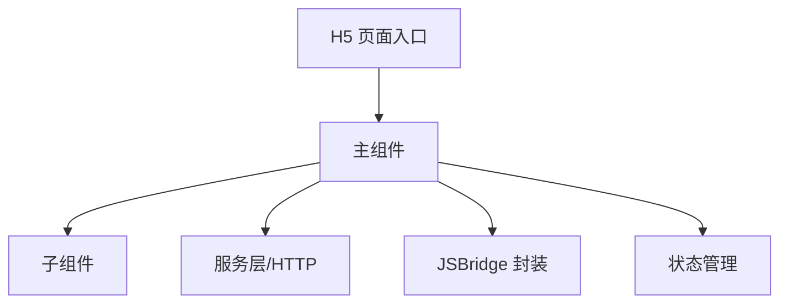

# H5 分端设计标准（frontend-h5.md）

> 本标准用于 `fullstack-design` 产出 H5 分端设计文件 `frontend-h5.md`。
> 仅当 Phase A 功能点清单中存在 **目标端 = H5** 的功能点时加载并执行。
> H5 设计写入**独立分端设计文件** `design/frontend-h5.md`，不再作为 `frontend-design.md` 的内嵌章节；`frontend-design.md` 为入口索引文件，通过「H5」访问章节指向本文件（与编码侧 `step-00-parse-task-groups.md` 的 `H5-{N} → frontend-h5.md` 约定一致）。
> 涉及后端接口时，须与同需求 `backend-design.md` 一致，禁止臆造冲突接口。

---

## 文件定位

H5 设计写入独立文件 `design/frontend-h5.md`，文件标题固定为：

```markdown
# [需求名称] — H5 分端设计（frontend-h5.md）
```

其下按功能点组织，每个功能点的标题格式须为 `### 功能点 N：{名称}`，以便 `task-split` 与编码侧 `step-00` 正确解析为 `H5-{N}` 批次。`frontend-design.md` 入口文件的「H5」访问章节须指向本文件。

> **与 PC Web 的区别**：H5 面向移动端浏览器 / App WebView，须额外覆盖移动端适配（rem/vw、安全区）、触摸手势、与原生容器的 JSBridge 交互、弱网与首屏性能。

---

## 一、概述

- **功能概述**：该功能在 H5 页面内实现什么、解决什么问题、在整体中的定位
- **功能定位**：新增页面/功能还是对现有页面的扩展；依赖的现有模块
- **运行载体**：移动端浏览器 / App 内嵌 WebView（标注宿主 App 与 JSBridge 依赖，如有）
- **适配范围**：目标机型与浏览器（iOS Safari / Android Chrome / 宿主 WebView 内核）

---

## 二、架构说明

### 1、模块划分

- **模块名称**：[职责、输入、输出、边界]

### 2、架构层次

- **UI 层**：页面组件与子组件（H5 框架的组件机制，如 Vue/React 移动端）
- **状态层**：局部状态 / 全局状态管理，状态流转
- **服务层**：接口调用封装、JSBridge 封装（与原生容器通信）
- **类型层**：类型定义组织（TypeScript）



### 3、模块化设计原则

- **单一文件职责**：每个组件/文件职责单一
- **组件隔离**：组件通过 Props/Events 通信
- **服务层分离**：接口调用与 JSBridge 统一封装，组件不直接裸调
- **工具模块化**：适配、格式化、手势等通用逻辑抽离

---

## 三、规范文档对齐

### 1、技术标准

- **技术栈**：H5 框架（从 `frontend-project.md` 获取，如 Vue/React 移动端）、TypeScript、构建工具、UI 组件库（如 Vant/NutUI）
- **路由**：H5 路由方式（hash / history）、与宿主 App 的返回栈协作
- **状态管理**：项目实际方案
- **HTTP**：复用现有接口封装，列出新增接口
- **移动端适配**：视口方案（rem / vw / flexible）、安全区（`env(safe-area-inset-*)`）、1px 方案
- **JSBridge**（如运行于 WebView）：与原生的通信协议、可用能力清单、降级策略（纯浏览器环境）

### 2、项目结构

严格遵循 `frontend-project.md` 的 H5 目录约定：

- **新增/修改的目录与文件**：`[路径]`：[用途]
- **逻辑组织**：轻量逻辑放组件内，复杂逻辑抽离（hooks/composables/services）

### 3、UI 风格与组件对齐

- **UI 组件库**：移动端组件库名称及版本（如 `vant@4.x`）
- **主题与设计 Token**：主色、圆角、间距（来源于主题配置或 CSS 变量）
- **本次使用的 UI 组件清单**（场景 / UI 库组件 / 使用方式 / 参照页面，表格形式）
- **布局与交互模式参照**：页面布局、加载态、空态、错误态、下拉刷新与上拉加载模式
- **UI 参照页面索引**：列出本次参照的现有 H5 页面

---

## 四、功能逻辑实现（逐功能点）

> 每个功能点必须包含以下全部子章节。

### 功能点 N：{名称}

#### N.1 功能概述

- **功能描述**（用户视角）
- **实现位置**：页面路径、组件路径
- **关联需求**：REQ 编号
- **是否涉及后端接口 / JSBridge**

#### N.2 数据与接口

> 凡后端 HTTP/API，须标注 `来源：backend-design.md §x.x 接口N`，禁止臆造；后端未覆盖标注 `[需后端设计补充]`。

- **数据类型**：给出完整 TypeScript interface，逐字段标注来源
- **接口依赖**（逐接口展开入参/出参字段表，与 Web 前端标准同格式）
- **JSBridge 依赖**（如涉及）：调用的原生方法、入参/回调结构、超时与失败降级
- **字段映射**：前端字段名/类型与后端不一致时逐字段说明

#### N.3 代码复用分析

- **可复用组件**：[路径、Props 简要说明]
- **可复用数据/类型**：[路径、用途]
- **可复用服务/工具**：HTTP 封装、JSBridge 封装、适配/手势工具 [路径、用途]

#### N.4 实现方案 — 组件结构

- **组件树**：主组件 + 子组件，各标注文件路径与职责
- **UI 组件选型**：本功能点使用的移动端 UI 组件，标注参照页面
- **条件渲染逻辑**：需条件显隐的 UI 区域及条件
- **组件接口定义**：每个子组件的 Props / Events 表

#### N.5 实现方案 — 状态定义与流转

- 完整状态结构定义（TypeScript 类型）
- 存储位置（组件内 / 全局状态 / URL 参数）
- 复杂流转用 mermaid stateDiagram 或 flowchart 表达（含 loading / 空态 / 错误态）

#### N.6 实现方案 — 交互流程

必须包含 Mermaid 图 + 文字说明，覆盖：

- **页面初始化流程**（sequenceDiagram：用户 → 组件 → 服务层/JSBridge → 后端/原生），含 loading / 空态 / 错误态切换
- **用户操作清单**（逐一列出可交互元素：触发动作、处理流程、用户反馈）

  | 交互元素 | 触发动作 | 处理流程 | 用户反馈 |
  |----------|----------|----------|----------|
  | [按钮/输入/列表项] | [点击/输入/下拉刷新/上拉加载/手势] | [校验 → 状态变更 → 接口/JSBridge → 响应处理 → UI 更新] | [Loading/Toast/弹窗/页面跳转] |

- **列表交互**（如有）：下拉刷新、上拉加载更多、空态、骨架屏
- **表单交互**（如有）：逐字段校验规则表、校验时机、联动
- **弹窗/浮层交互**（如有）：打开条件、关闭方式、回调
- **触摸与手势**（如有）：滑动/长按/左滑操作等手势的处理

#### N.7 移动端适配与生命周期

- **适配**：视口与安全区处理、横竖屏、软键盘遮挡与滚动
- **生命周期**：页面进入（`onMounted`）数据加载、页面切换/隐藏（`visibilitychange`/`pagehide`）处理、返回刷新
- **资源释放**：取消未完成请求、移除事件监听、清理定时器

#### N.8 性能与边界

- **首屏与性能**：懒加载、分包、图片压缩与懒加载、防抖/节流
- **弱网与无网**：加载失败重试、缓存兜底
- **边界与错误处理**：空数据 / 异常数据格式 / 接口错误码 / JSBridge 不可用（纯浏览器）降级
