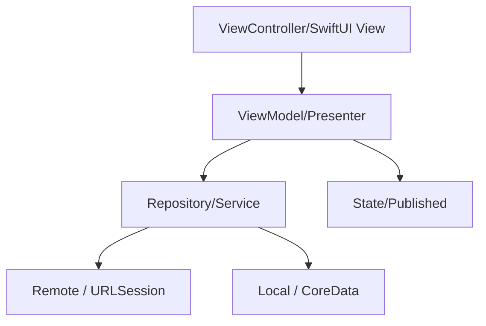

# iOS 分端设计标准（frontend-ios.md）

> 本标准用于 `fullstack-design` 产出 iOS 分端设计文件 `frontend-ios.md`。
> 仅当 Phase A 功能点清单中存在 **目标端 = iOS** 的功能点时加载并执行。
> iOS 设计写入**独立分端设计文件** `design/frontend-ios.md`，不再作为 `frontend-design.md` 的内嵌章节；`frontend-design.md` 为入口索引文件，通过「iOS」访问章节指向本文件（与编码侧 `step-00-parse-task-groups.md` 的 `iOS-{N} → frontend-ios.md` 约定一致）。
> 涉及后端接口时，须与同需求 `backend-design.md` 一致，禁止臆造冲突接口。

---

## 文件定位

iOS 设计写入独立文件 `design/frontend-ios.md`，文件标题固定为：

```markdown
# [需求名称] — iOS 分端设计（frontend-ios.md）
```

其下按功能点组织，每个功能点的标题格式须为 `### 功能点 N：{名称}`，以便 `task-split` 与编码侧 `step-00` 正确解析为 `iOS-{N}` 批次。`frontend-design.md` 入口文件的「iOS」访问章节须指向本文件。

---

## 一、iOS 概述

- **功能概述**：该功能在 App 内实现什么、解决什么问题、在 App 整体中的定位
- **功能定位**：新增页面/功能还是对现有页面的扩展；依赖的现有模块
- **目标端范围**：仅 iOS 原生（Swift / Objective-C）；不含跨平台（Flutter / RN）
- **最低版本与兼容**：Deployment Target（最低 iOS 版本）；涉及新 API 时标注 `@available` 兼容策略

---

## 二、iOS 架构说明

> 使用与项目现状一致的架构模式（MVC / MVVM / VIPER / TCA）；从 `frontend-project.md` 的 iOS 项目信息获取，无则扫描仓库归纳。

### 1、模块划分

- **模块名称**：[职责、输入、输出、边界]

### 2、架构层次

- **界面层（View）**：ViewController / SwiftUI View 的组成与职责
- **状态/展示层（ViewModel/Presenter）**：状态承载方式（ObservableObject / Combine / 闭包回调），状态流转
- **数据层（Repository/Service）**：数据来源（网络 / 本地）、缓存与切换策略
- **网络层**：复用现有网络封装（URLSession / Alamofire / Moya）；接口定义风格
- **本地存储层**：CoreData / UserDefaults / Keychain / 文件 的使用边界



### 3、模块化设计原则

- **单一职责**：每个类型/文件职责单一
- **避免 Massive View Controller**：业务逻辑下沉到 ViewModel/Presenter，VC 只负责视图与事件转发
- **数据层分离**：View/VC 不直接调用网络/数据库，统一经 Repository/Service
- **依赖注入**：与项目一致（构造注入 / 属性注入 / 容器），不混用

---

## 三、规范文档对齐

### 1、技术标准

- **语言**：Swift / Objective-C / 混编（与所在模块现状一致）
- **UI 方式**：UIKit（Storyboard/XIB/纯代码）/ SwiftUI（与项目一致）
- **异步方案**：async/await / Combine / GCD / RxSwift（与项目一致）
- **网络**：复用现有网络层封装，列出新增接口
- **架构组件**：Coordinator / Router、依赖容器等使用范围

### 2、项目结构

严格遵循 `frontend-project.md` 的 iOS 目录约定：

- **新增/修改的目录与文件**：`[路径]`：[用途]
- **分组结构**：与现有 group/文件命名约定一致（feature 分组 / 分层分组）

### 3、UI 风格与组件对齐

- **设计体系**：Human Interface Guidelines / 项目自定义主题
- **复用控件**：列出本次使用的自定义 View、通用组件、样式（UIColor/UIFont 扩展等）
- **参照页面**：选定 2-3 个现有同类型页面作为 UI 与交互基准

---

## 四、功能逻辑实现（逐功能点）

> 每个功能点必须包含以下全部子章节。

### 功能点 N：{名称}

#### N.1 功能概述

- **功能描述**（用户视角）
- **实现位置**：ViewController / SwiftUI View 路径、ViewModel/Presenter 路径
- **关联需求**：REQ 编号

#### N.2 数据与接口

> 凡后端 HTTP/API，须标注 `来源：backend-design.md §x.x 接口N`，禁止臆造；后端未覆盖标注 `[需后端设计补充]`。

- **数据模型**：给出 Swift struct/class（`Codable`）或 ObjC 模型定义，逐字段标注来源
  ```swift
  struct ClaimItem: Codable {
      let id: Int64       // 来源：backend-design.md §3.2 出参字段 id
      let claimNo: String // 来源：backend-design.md §3.2 出参字段 claimNo
  }
  ```
- **接口依赖**（逐接口展开入参/出参字段表）：
  - `[网络方法/API]`（`[Service 文件路径]`）— **来源：backend-design.md §x.x 接口N**
    - 方法 / 路径 / 调用时机
    - 入参字段表、出参字段表（与 Web 前端标准同格式）
- **字段映射**：客户端字段名/类型与后端不一致时逐字段说明
- **本地存储**（如涉及）：CoreData 实体 / Keychain 项定义、与后端模型的映射、迁移策略

#### N.3 代码复用分析

- **可复用组件/View**：[路径、用途]
- **可复用数据/类型**：[路径、用途]
- **可复用服务/工具**：网络封装、工具类、Category/Extension [路径、用途]

#### N.4 实现方案 — 界面结构

- **界面载体**：ViewController / SwiftUI View — 职责
- **布局**：Storyboard/XIB/纯代码 AutoLayout / SwiftUI 布局；列出关键控件
- **条件显隐**：列出需按状态/权限显隐的 UI 区域及条件
- **导航**：进入/退出本界面的导航关系（NavigationController / Segue / Coordinator / SwiftUI NavigationStack）

#### N.5 实现方案 — 状态定义与流转

- **状态结构**：给出完整定义（ViewModel 的 `@Published` 属性 / 状态枚举）
  ```swift
  enum ClaimListState {
      case loading
      case loaded([ClaimItem])
      case empty
      case error(String)
  }
  ```
- **状态承载**：ObservableObject + @Published / Combine / 闭包回调（与项目一致）
- **流转**：复杂流转用 mermaid stateDiagram 表达（含 loading / 空态 / 错误态）

#### N.6 实现方案 — 交互流程

必须包含 Mermaid 图 + 文字说明，覆盖：

- **页面初始化流程**（sequenceDiagram：用户 → ViewController → ViewModel → Repository → 网络/本地），含 loading / 空态 / 错误态切换
- **用户操作清单**（逐一列出可交互元素：触发动作、处理流程、用户反馈）

  | 交互元素 | 触发动作 | 处理流程 | 用户反馈 |
  |----------|----------|----------|----------|
  | [按钮/输入/列表项] | [点击/输入/下拉刷新/上拉加载] | [校验 → ViewModel → Repository → 状态更新] | [Loading/HUD/Alert/页面跳转] |

- **列表交互**（如有 UITableView/UICollectionView/List）：DataSource/Cell、下拉刷新、分页加载、空态、Diffable DataSource 策略
- **表单交互**（如有）：逐字段校验规则表、校验时机、联动
- **弹窗/ActionSheet 交互**（如有）：弹出条件、关闭方式、回调

#### N.7 生命周期与资源管理

- **生命周期处理**：数据加载时机（viewDidLoad/viewWillAppear）、内存警告处理、状态恢复
- **资源释放**：Combine cancellables 释放、通知/KVO 观察者移除、Timer 失效、闭包 `[weak self]`
- **后台与前台**：是否需要在后台停止刷新/定位/轮询

#### N.8 权限与安全

- **运行时权限**（如涉及）：申请的权限（相机/定位/通知等）、Info.plist 用途描述、拒绝后的降级处理
- **数据安全**：敏感数据存储方式（Keychain）、传输加密、日志脱敏
- **Info.plist 声明**：新增的权限用途 key、URL Scheme、ATS 例外

#### N.9 边界与错误处理

- 空数据 / 网络异常 / 超时 / 接口错误码的处理与用户反馈
- 弱网与无网处理、重试与降级
- 错误恢复机制（重试入口、缓存兜底）
