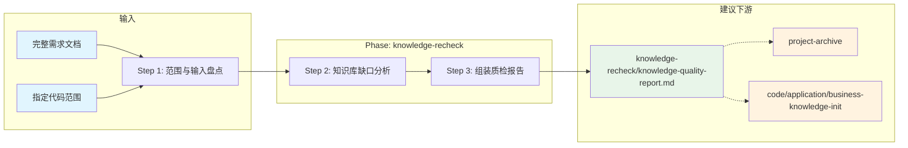

# 交付追溯审计技能

## 概述

用于在需求实现过程中或交付前，对**需求文档**或**指定代码范围**做横切质检：对照 ocspec 知识库 **`knowledge/code`、`knowledge/application`、`knowledge/business` 三层**与需求目录 design/task/archive 等产出，**逐项完整覆盖**检测各层沉淀是否完整、三层是否一致、是否存在未归档需求，并输出结构化质检报告（**禁止抽样检测**）。

## 目录结构

```text
knowledge-recheck/
├── SKILL.md                                      # 技能编排入口
├── README.md                                     # 本说明
├── steps/
│   ├── step-01-intake-and-scope.md               # 复检范围与输入盘点
│   ├── step-02-knowledge-gap-analysis.md         # 知识库覆盖与缺口分析
│   └── step-03-assemble-report.md                # 质检报告组装
├── checkpoints/
│   ├── step-01-checkpoint.md
│   ├── step-02-checkpoint.md
│   └── step-03-final.md
└── references/
    ├── knowledge-quality-report-standard.md                # 质检报告模板与判定规则
    ├── knowledge-coverage-checklist.md           # knowledge/ 各层检查项
    └── pipeline-readiness-checklist.md           # 流水线与归档就绪检查项
```

## 执行流程图



## Agent 职责矩阵

| 步骤 | 负责的 Agent | AI 做什么 | 人工需要做什么 |
|------|-------------|-----------|---------------|
| **Step 1** 范围盘点 | `input-analyzer` | 确定复检模式、需求项索引、流水线产出与**三层**知识库入口清单（code / application / business） | 提供需求文档路径或代码范围；确认待确认项 |
| **Step 2** 缺口分析 | `input-analyzer` | 对**全部**需求项逐行比对 **code / application / business** 三层知识、三层一致性及归档状态 | 确认 `[需人工确认]` 项 |
| **Step 3** 报告组装 | `assembler` | 按标准模板生成终稿、总体判定与 P0/P1 建议 | **审查质检报告**，按建议执行归档或知识库更新 |

## 输入模式

| 模式 | 触发方式 | 说明 |
|------|---------|------|
| **requirement-doc** | @ `requirement.md` 或使用当前 `{REQ}/requirement.md` | 以需求项为主轴检查流水线与知识库 |
| **code-scope** | 指定仓库路径、模块或文件列表 | 从代码反查需求覆盖与知识库更新 |
| **hybrid** | 同时提供需求文档与代码范围 | 双向交叉验证 |

## 产出物与路径约定

Init 须输出 `[路径解析]`（含 `{OCSPEC_ROOT}`、`{BASE_DIR}`、`{KNOWLEDGE}`、`{CODE_KNOWLEDGE}`，并扫描 `{KNOWLEDGE}/application/`、`{KNOWLEDGE}/business/`）。

### 知识库三层对照范围

| 层级 | 路径 | 说明 |
|------|------|------|
| 代码 | `{CODE_KNOWLEDGE}/` | 工程、接口、库表、前端说明 |
| 应用 | `{KNOWLEDGE}/application/` | 系统拓扑、应用域、组件与调用链 |
| 业务 | `{KNOWLEDGE}/business/` | 业务全景、流程用例、领域与能力 |

| 产出 | 路径 | 作用 |
|------|------|------|
| 质检报告（终稿） | `{BASE_DIR}/knowledge-recheck/knowledge-quality-report.md` | 未归档提示、知识库缺口、建议动作 |
| 中间产出 | `{BASE_DIR}/_workspace/knowledge-recheck/` | 步骤间传递（交付后可清理） |

**只读边界**：不修改 `knowledge/`、`custom/`、业务仓库与需求/design 终稿。

## 架构层级

| 层 | 载体 | 本技能对应 |
|----|------|-----------|
| L5 编排层 | `SKILL.md` | `skills/knowledge-recheck/SKILL.md` |
| L4 步骤层 | `steps/` | `step-01~03.md` |
| L3 调度层 | `commands/` | `scheduler-protocol.md`（共享） |
| L2 执行层 | `agents/` | `input-analyzer`、`assembler` |
