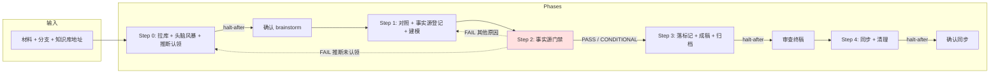

# 产品需求分析技能

## 概述

面向**产品人员**的需求分析技能。在 `requirement-analysis` 基础上增加：

- **Step 0**：Intake → 知识库拉取 → Pin → **功能向头脑风暴**（单步骤，halt-after）→ **推断认领门**
- **Step 1 增强**：以 brainstorm 已认领结论 + 知识库/历史对照 → 事实源登记 → 5W1H / 建模
- **Step 2 门禁**：事实源与合理性校验，**全 6 维度**（含知识库引用真伪、推断升格检测、历史需求只读）
- **Step 4**：同步终稿与事实源归档至知识库 + 清理过程产出

## 适用场景

| 场景 | 行为 |
|------|------|
| 产品仅给简单背景 | Step 0：拉库 + 推断背景 + 2～4 轮功能澄清 + 草案确认（**≤10 轮**）+ 推断认领 |
| 材料已较完整 | 可「跳过头脑风暴」→ Step 0 压缩为草案确认 |
| 根目录已有 ocspec-* | 须确认是否为知识库或提供 URL |
| 迭代需求 | 关联历史需求 **只读**参照，Step 2 维度 5 校验只读合规 |

## 目录结构

```text
product-requirement-analysis/
├── SKILL.md
├── README.md
├── steps/
│   ├── step-00-knowledge-base-pull.md    # Intake + 拉库 + 头脑风暴 + 推断认领门
│   ├── step-01-analysis-and-modeling.md  # 知识库对照 + 事实源登记 + 5W1H + 建模
│   ├── step-02-fact-source-verify.md     # 事实源门禁（全 6 维度）
│   ├── step-03-assemble.md               # 落标记 + 成稿 + 事实源归档
│   └── step-04-kb-sync-and-cleanup.md    # 同步 + 清理
├── checkpoints/
│   ├── step-00-checkpoint.md             # 拉库 + brainstorm + 认领门
│   ├── step-01-checkpoint.md
│   ├── step-02-checkpoint.md
│   ├── step-03-final.md
│   └── step-04-checkpoint.md
└── references/
    ├── product-brainstorm-guide.md
    ├── fact-source-standard.md           # 事实源分级、双信号校验、门禁；§9 产品版专属
    ├── knowledge-cross-reference-guide.md
    ├── knowledge-requirement-sync-guide.md
    └── …
```

## 执行流程图



## Agent 职责矩阵

| 步骤 | Agent | 职责 |
|------|-------|------|
| **Step 0** | `requirement-modeler` | Intake、拉库、Pin、功能澄清、推断认领门、`00-brainstorm.md` |
| **Step 1** | `requirement-modeler` | 知识库对照（带锚点）、事实源登记、5W1H、建模 + 溯源挂载 |
| **Step 2** | `requirement-verifier` | 溯源核验、无源断言检测、知识库真伪、推断升格、历史只读、内部一致性 → `GATE_RESULT` |
| **Step 3** | `assembler` | 按门禁报告落标记、成稿、事实源归档 |
| **Step 4** | `ops-executor` | 同步提示、清理、git push（终稿 + `sources/`） |

## 交付物

| 产出 | 路径 | 备注 |
|------|------|------|
| Brainstorm | `.../_workspace/requirement/00-brainstorm.md` | Step 4 前中间产物 |
| 事实源表（中间） | `.../_workspace/requirement/01-fact-source.md` | Step 3 归档后随 `_workspace` 清理 |
| 门禁报告 | `.../_workspace/requirement/02-verify-report.md` | 过程产物，不入库 |
| 需求终稿 | `.../requirement/requirement.md` | Step 4 push 入库 |
| 事实源归档 | `.../sources/fact-source.md` | **持久**，Step 4 一并 push；**不属于**清理范围 |
| 过程产出 | `_workspace/` 等 | Step 4 **强制清理** |

## 下游交付物等价性

与 `requirement-analysis` 终稿结构相同；brainstorm、门禁报告等 **不进终稿、不进库**。

`sources/fact-source.md` 供 `fullstack-design` 区分**硬约束**（F1/F2/F3 且校验状态可信）与**待确认项**（存疑/缺失/推断）。终稿中的 `[FS-00X]` 溯源引用与 §1.1「事实源索引」行属正式交付内容。

## 反臆造要点

| 风险 | 拦截点 |
|------|--------|
| 推断被当作确定需求 | Step 0 认领门 + Step 2 维度 4 |
| 知识库引用臆造 | Step 1 引用即验证 + Step 2 维度 3（检索验证，判 FAIL） |
| 接口名编造 | Step 1 接口专项登记 + Step 2 100% 检索验证 |
| 数字臆造 | Step 1 数字型专项（仅 F1/F2）+ Step 2 100% 核验 + 正文禁裸数字 |
| 历史需求被改写或抄袭 | Step 2 维度 5（只读合规 + 大段复制检测） |

## 完整聊天示例（Step 0 节选）

**用户：** 知识库 URL + 分支 + 一句背景

**Agent（Step 0 Part1）：** Step 0 拉库完成 → Init 解析路径

**Agent（Step 0 Part2）：** 推断背景（标 `[AI推断]`）→ 2～3 轮功能问 → 合并草案 → 推断认领 → `00-brainstorm.md` approved

**用户：** 继续 → Step 1 建模 → Step 2 门禁 → Step 3 成稿 → Step 4 同步提示 → 确认同步 → 清理 + push

| 环节 | 行为 |
|------|------|
| Step 0 | **单步骤**完成拉库与头脑风暴；Phase C 后 Init；approved 前须处理完 `[AI推断]` |
| 对话 | 功能向；**≤10 轮** |
| Step 2 | 门禁；`FAIL` 阻止成稿，按原因回退 Step 1 或 Step 0 Phase F |
| Step 4 | 强制同步提示；先清理再 push；`sources/` 一并入库且不清理 |
