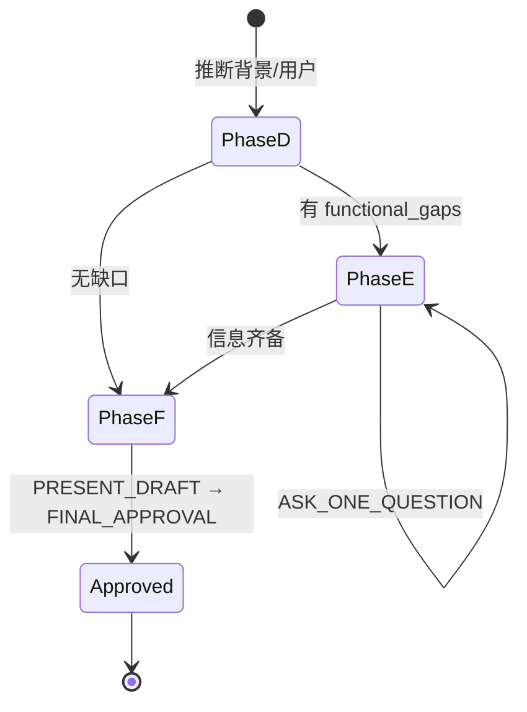

# 产品需求头脑风暴规范（Step 0 Phase D～F）

面向**功能澄清**与**设计存疑**的轻量对话，产出供 Step 1 使用的 `00-brainstorm.md`。背景、用户、业务价值由 Agent 在 **Phase D** **推断落稿**，**不单独停轮确认**。**不做方案对比步骤**。

## 设计原则

| 原则 | 说明 |
|------|------|
| **对话聚焦功能** | 停轮仅用于功能边界、流程分支、与现有能力关系、设计存疑、材料不足以定功能/验收的点 |
| **背景类推断** | 背景目标、用户场景、业务价值从材料 + 知识库推断，写入草案 §1～§2，不逐条 Halt |
| **无方案对比** | 分歧在 **Phase E** 用选择题澄清，草案给出唯一结论 |
| **轮次有上限** | 全程 `total_rounds ≤ 10`；典型 3～6 轮 |
| **单 Exec 单轮** | 每 Exec 最多一问或一草案，然后 Halt |
| **合并确认** | **Phase F** 一次呈现功能+范围+验收草案 |

## 单 Exec 动作与轮次



| 动作 | 何时使用 | 计轮 |
|------|---------|------|
| `ASK_ONE_QUESTION` | 功能/设计/信息缺口 | +1 |
| `PRESENT_DRAFT` | 合并草案确认 | +1 |
| `FINAL_APPROVAL` | 写 approved 文件 | +1 |

**轮次上限：** `total_rounds > 10` 禁止再提问；强制 `PRESENT_DRAFT`。

## 应问 vs 不应问

### ✅ 应停轮问（functional_gaps）

- 功能包含/不包含边界
- 核心流程分支（如 H5 与 PC 并行还是替代）— **用选择题澄清，非方案对比**
- 与知识库现有能力的关系（复用 vs 新建）
- 设计存疑（多种合理形态时，**一问选定**即可，不另开方案对比轮）
- 背景不足以确定功能或验收的关键事实

### ❌ 不应停轮问

- 背景、用户、业务价值、成功标准（Phase A 推断）
- **2～3 套产品范围方案对比与选型**（本技能不包含此步骤）

### 错误 vs 正确

**❌ 方案对比（禁止）：**

> 基于您的回答有三种方案… 请选 1/2/3

**✅ 设计存疑用一问澄清：**

> H5 与 PC 材料上传的关系？
> - A. 并行补传  B. 现场首选 H5，PC 审核  C. 替代 PC

**✅ 合并草案一轮确认：**

> 草案（§1～§2 由材料推断）：范围… 功能… 验收… 请确认或修改。

## 状态文件

### `00-brainstorm-state.md`

```markdown
# Step 0 头脑风暴状态机

current_phase: D | E | F | DONE
last_action: ASK_ONE_QUESTION | PRESENT_DRAFT | FINAL_APPROVAL
awaiting_user: true | false
total_rounds: 0
max_rounds: 10
functional_gaps: [与PC关系, 明确不做, 上传上限, ...]
answered_gaps: []
inferred_context: { background: "...", users: "...", value: "..." }
draft_confirmed: false
skip_brainstorm: false
```

## 跳过条件

满足**全部**时可压缩（约 2 轮：`PRESENT_DRAFT` + `FINAL_APPROVAL`）：

1. 用户明确「跳过头脑风暴」或「材料已完整，直接分析」
2. 材料已含：功能范围、明确不做、至少 1 条验收口径

## Phase F 合并草案（`PRESENT_DRAFT`）

```markdown
## 草案确认（请核对或修改）

> §1 背景与目标、§2 用户与场景：由材料/知识库推断。

### 范围（包含 / 明确不做）
...

### 功能清单草案
| 功能 | 优先级 | 说明 |
...

### 验收口径草案（Given-When-Then）
| Given | When | Then |
...

### 待 Step 1 细化
- [需与产品确认] …
```

用户确认 → `FINAL_APPROVAL` 写入 `00-brainstorm.md`。

## 产出模板（00-brainstorm.md）

```markdown
# 产品需求头脑风暴结论

BRAINSTORM_STATUS: approved
APPROVED_AT: <ISO8601>
TOTAL_ROUNDS: <N>

## 1. 背景与目标

## 2. 用户与场景

## 3. 范围（包含 / 明确不做）

## 4. 功能清单草案（表格）

## 5. 验收口径草案（Given-When-Then 表格）

## 6. 与知识库/历史需求关系（摘要）

## 7. 约束与非功能线索

## 8. 待 Step 1 细化项（非阻塞）
```

## 禁止事项

- **禁止**方案对比 / `PRESENT_SCHEMES` / 多方案选型停轮
- 禁止对背景/用户/价值逐段 Halt
- 禁止 `total_rounds > 10` 仍提问
- 禁止 log 类文件；禁止 skip 外零交互即 approved

`BRAINSTORM_STATUS: approved` 为 Step 1 前置条件。
