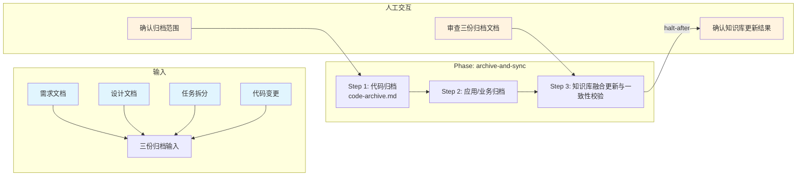

# 项目统一归档技能

## 概述

用于在同一需求上下文中完成前后端统一归档并更新知识库。它以需求、设计、任务拆分和代码变更为输入，按 3 步完成代码归档、应用/业务归档与知识库融合，最终产出 3 份归档文档和知识库更新结果。

## 目录结构

```text
project-archive/
├── SKILL.md                                      # 技能编排入口：定义 phases、steps、交付物与执行原则
├── README.md                                     # 技能说明文档：面向使用者的说明、流程图与能力概览
├── steps/
│   ├── step-01-code-archive.md                   # 编写代码归档，沉淀接口、数据与实现追溯
│   ├── step-02-app-biz-archive.md                # 编写应用归档与业务归档
│   └── step-03-fusion-and-check.md               # 融合更新知识库并完成一致性校验
├── checkpoints/                                  # 各步骤与最终交付的校验规则
│   ├── step-01-checkpoint.md
│   ├── step-02-archive-final.md
│   └── step-03-final.md
└── references/
    ├── unified_archive_outputs_standard.md       # 统一归档输出模板与章节标准
    ├── frontend_project_archive_standard.md      # 前端归档章节深度参考
    └── backend_project_archive_standard.md       # 后端归档章节深度参考
```

## 执行流程图



## Agent 职责矩阵

| 步骤 | 负责的 Agent | AI 做什么 | 人工需要做什么 |
|------|-------------|-----------|---------------|
| **Step 1** 代码归档 | `archive-writer` | 从需求/设计/任务拆分/知识库收集输入，编写 code-archive.md（代码、接口、数据追溯） | 确认归档范围与重点关注的模块 |
| **Step 2** 应用/业务归档 | `archive-writer` | 编写 appliaction-archive.md（调用链、数据流）和 business-archive.md（流程、规则、追溯矩阵） | 无（自动执行） |
| **Step 3** 知识库融合 | `knowledge-fuser` | 按 5 步融合流程更新知识库，执行一致性校验 | **审查归档文档与知识库更新结果**：通过后完成归档 |

## 核心能力

- 代码层归档（接口变更、数据模型、前后端实现追溯）
- 应用层归档（调用链路、数据流、跨系统协同）
- 业务层归档（业务目标、流程、规则、需求追溯矩阵）
- 知识库融合更新（增量合并，非简单追加）
- 归档正文一致性校验
- 知识库完整性校验
- 交叉一致性校验（三份归档文档互相对齐）

## 产出物

| 产出 | 路径 | 作用 |
|------|------|------|
| 代码归档 | `archive/code-archive.md` | 代码、接口、数据追溯 |
| 应用归档 | `archive/appliaction-archive.md` | 应用层调用链与协同 |
| 业务归档 | `archive/business-archive.md` | 业务目标、流程、规则 |
| 知识库更新 | `knowledge/` 下各文件 | 增量融合 |

## 架构层级

| 层 | 载体 | 本技能对应 |
|----|------|-----------|
| L5 编排层 | `SKILL.md` | `skills/project-archive/SKILL.md` |
| L4 步骤层 | `steps/` | `skills/project-archive/steps/step-01~03.md` |
| L3 调度层 | `commands/` | `commands/scheduler-protocol.md`（共享） |
| L2 执行层 | `agents/` | `agents/archive-writer.md`、`agents/knowledge-fuser.md` |

