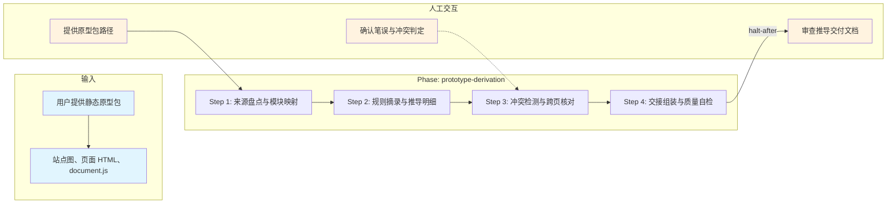

# 原型推导技能

## 概述

用于从 Axure HTML、Figma 导出或同类静态原型中提取规则并推导需求追溯物。它以原型包为输入，按 4 步完成来源盘点、规则摘录、冲突检测与交接组装，最终产出 `requirement/prototype-derivation.md`。

> **重要限制**：本技能**仅用于推导原型分析需求**，**严禁通过任何形式（写入、替换、追加、删除、重命名）变更或修改项目代码**。所有产出仅允许写入本技能指定的中间目录（`_workspace/prototype/`）与最终交付物（`requirement/prototype-derivation.md`）。

## 目录结构

```text
prototype-derivation/
├── SKILL.md                                      # 技能编排入口：定义 phases、steps、交付物与执行原则
├── README.md                                     # 技能说明文档：面向使用者的说明、流程图与能力概览
├── steps/
│   ├── step-01-source-inventory.md               # 盘点原型来源并建立页面/模块索引
│   ├── step-02-rule-extraction.md                # 摘录页面规则并形成推导明细
│   ├── step-03-conflict-detection.md             # 检测跨页冲突并记录决策日志
│   └── step-04-handover.md                       # 组装交付文档并输出交接说明
├── checkpoints/                                  # 各步骤与最终交付的校验规则
│   ├── step-01-checkpoint.md
│   ├── step-02-checkpoint.md
│   ├── step-03-checkpoint.md
│   └── step-04-final.md
└── references/
    └── prototype-derivation-reference.md         # 原型推导规范、索引模板与冲突日志模板
```

## 执行流程图



## Agent 职责矩阵

| 步骤 | 负责的 Agent | AI 做什么 | 人工需要做什么 |
|------|-------------|-----------|---------------|
| **Step 1** 来源盘点 | `input-analyzer` | 定位站点图、建立页面角色矩阵、产出推导索引表 | 提供原型包路径；确认 HTML 可见性规则 |
| **Step 2** 规则摘录 | `prototype-extractor` | 逐模块摘录规则（重点优先）、复杂模块深扫 | 无（自动执行） |
| **Step 3** 冲突检测 | `prototype-extractor` | 跨页一致性核对（时效/入口/类型/结果/状态）、产出冲突/决策日志 | 确认笔误归属与冲突判定结论 |
| **Step 4** 交接组装 | `assembler` | 组装推导交付文档、质量自检、撰写交接说明 | **审查推导交付文档**：通过后移交下游 requirement-analysis |

## 核心能力

- 原型来源盘点（站点图定位、页面角色矩阵）
- HTML 可见性过滤（跳过 display:none / visibility:hidden 节点）
- 规则摘录与追溯（从文本组件、表格中提取条文）
- 跨页冲突检测（时效、入口、类型、结果、状态映射一致性）
- 推导索引表生成（原型区块 ↔ 需求项 ID 追溯）
- 冲突/决策日志记录
- 交接说明撰写
- 笔误统一处理

## 产出物

| 产出 | 路径 | 作用 |
|------|------|------|
| 推导交付文档 | `requirement/prototype-derivation.md` | 推导索引表 + 推导明细 + 冲突日志 + 交接说明 |
| 中间产物 | `_workspace/prototype/` | 各步骤的分析结果（用户确认后删除） |

## 架构层级

| 层 | 载体 | 本技能对应 |
|----|------|-----------|
| L5 编排层 | `SKILL.md` | `skills/prototype-derivation/SKILL.md` |
| L4 步骤层 | `steps/` | `skills/prototype-derivation/steps/step-01~04.md` |
| L3 调度层 | `commands/` | `commands/scheduler-protocol.md`（共享） |
| L2 执行层 | `agents/` | `agents/input-analyzer.md`、`agents/prototype-extractor.md`、`agents/assembler.md` |

