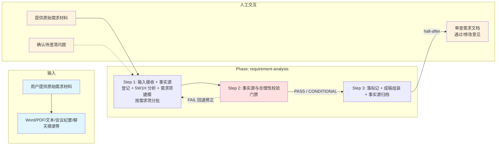

# 需求分析技能

## 概述

用于把原始需求材料整理为标准化需求文档并补足评审视角。它以原始需求材料为输入，按 3 步完成 5W1H 分析与需求项建模、事实源与合理性校验门禁、成稿组装与自检，最终产出 `requirement/requirement.md` 与 `sources/fact-source.md`。

## 目录结构

```text
requirement-analysis/
├── SKILL.md                                      # 技能编排入口：定义 phases、steps、交付物与执行原则
├── README.md                                     # 技能说明文档：面向使用者的说明、流程图与能力概览
├── steps/
│   ├── step-01-analysis-and-modeling.md          # 接收输入、登记事实源、执行 5W1H 分析并建模需求项
│   ├── step-02-fact-source-verify.md             # 事实源与合理性校验门禁（PASS/CONDITIONAL/FAIL）
│   └── step-03-assemble.md                       # 落标记、组装需求文档、归档事实源并执行评审自检
├── checkpoints/                                  # 各步骤与最终交付的校验规则
│   ├── step-01-checkpoint.md
│   ├── step-02-checkpoint.md
│   └── step-03-final.md
└── references/
    ├── requirement-analysis-standard.md          # 需求文档成稿结构标准
    ├── 5w1h-analysis-guide.md                    # 5W1H 分析指引
    ├── fact-source-standard.md                   # 事实源分级、锚点精度、双信号校验与门禁结论
    └── review-checklist.md                       # 需求评审与自检清单
```

## 执行流程图



## Agent 职责矩阵

| 步骤 | 负责的 Agent | AI 做什么 | 人工需要做什么 |
|------|-------------|-----------|---------------|
| **Step 1** 分析与建模 | `requirement-modeler` | Phase A: 接收材料，提取功能列表、角色、约束；Phase A3: 登记事实源（分级 + 锚点 + 数字型专项）；Phase B: 5W1H 穿透分析；Phase C: 逐需求项业务流程建模 + 溯源挂载（template 分批） | 提供原始需求材料；确认待澄清问题 |
| **Step 2** 事实源门禁 | `requirement-verifier` | 正向溯源核验（数字与关键规则 100%、其余 ≥30%）、反向无源断言检测、内部一致性；产出 `GATE_RESULT` | 一般无需介入；`FAIL` 且因材料缺失时澄清 |
| **Step 3** 成稿组装 | `assembler` | 按门禁报告落标记、全文组装、一致性校验、评审自检、事实源归档、L2 审查 | **审查需求文档**：通过后移交下游 fullstack-design |

## 核心能力

- 原始需求结构化（从 Word/PDF/文本/会议纪要中提取）
- 5W1H 分析（Why/What/Who/When/Where/How）
- 需求项建模（逐需求项业务流程建模）
- 隐藏场景补强（异常流、边界条件、权限校验）
- 三维度逻辑（页面操作维度、数据展示维度、数据交互维度）
- 核心流转与数据一致性分析（资金/数据流向、事务、幂等、重试补偿等）
- 需求文档成稿组装（文档信息、总体概述、需求概述、业务流程）
- Given-When-Then 规范转换
- 评审自检（完整性、非功能、跨系统协同）
- 图片提取识别归档 + 双信号合理性校验（材料内图片提取识别、归档到 `sources/media/` 并生成索引、归属存疑/无法识别打标记）
- 事实源登记与分级（F1 材料原文 / F2 用户确认 / F3 知识库 / F4 历史需求 / F5 AI 推断）
- 事实源门禁（正向溯源核验 + 反向无源断言检测 + 内部一致性；数字型事实与关键规则 100% 核验）
- 数字与接口反臆造（数字仅允许 F1/F2，正文禁裸数字；接口名无出处则写占位并标记）

## 产出物与路径约定

`{OCSPEC_ROOT}` 为工作区下 **`ocspec-<xxx>/`**（仅一个候选时自动选用；多个时用户在对话中指定；**没有任何 ocspec-* 时** Init 按 §1.2.2 兜底新建）。Init 须输出 `[路径解析]` 摘要（含 `OCSPEC_SCAN_RAW`）。

| 产出 | 路径（相对工作区根） | 作用 |
|------|----------------------|------|
| 需求文档 | `ocspec-<xxx>/requirements/<需求>_<日期>/requirement/requirement.md` | 终稿 |
| 事实源归档 | `ocspec-<xxx>/requirements/<需求>_<日期>/sources/fact-source.md` | 溯源索引，供下游区分硬约束与待确认项 |
| 图片归档 | `ocspec-<xxx>/requirements/<需求>_<日期>/sources/media/` | 原型图索引 |
| 中间产出 | `ocspec-<xxx>/requirements/<需求>_<日期>/_workspace/requirement/` | 步骤间传递（交付后删除） |

**禁止**：工作区根 `_workspace/`、工作区根 `requirements/`、未经 Init 选定的并行 `ocspec-*` 目录。详见 `commands/scheduler-protocol.md` §1。

## 架构层级

| 层 | 载体 | 本技能对应 |
|----|------|-----------|
| L5 编排层 | `SKILL.md` | `skills/requirement-analysis/SKILL.md` |
| L4 步骤层 | `steps/` | `skills/requirement-analysis/steps/step-01~03.md` |
| L3 调度层 | `commands/` | `commands/scheduler-protocol.md`（共享） |
| L2 执行层 | `agents/` | `agents/requirement-modeler.md`、`agents/requirement-verifier.md`、`agents/assembler.md` |

