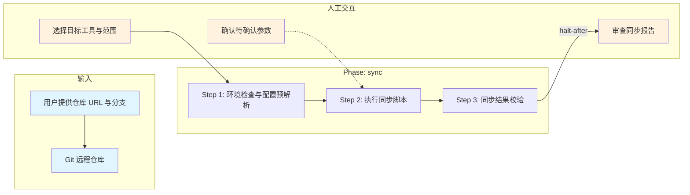

# 规范技能刷新技能

## 概述

用于从远程仓库拉取最新技能包并同步到目标 AI 工具目录。它以仓库 URL、分支、目标工具与同步范围为输入，按 3 步完成环境检查、脚本同步与结果校验，最终更新目标工具下的 `skills/`、`agents/`、`commands/` 文件。

## 目录结构

```text
spec-skills-refresh/
├── SKILL.md                                      # 技能编排入口：定义 phases、steps、交付物与执行原则
├── README.md                                     # 技能说明文档：面向使用者的说明、流程图与能力概览
├── steps/
│   ├── step-01-env-check.md                      # 检查环境、解析参数并确定执行模式
│   ├── step-02-execute-sync.md                   # 拉取最新脚本并执行同步
│   └── step-03-verify-result.md                  # 校验同步结果并输出报告
├── checkpoints/                                  # 各步骤的校验规则
│   ├── step-01-checkpoint.md
│   ├── step-02-checkpoint.md
│   └── step-03-checkpoint.md
├── references/
│   └── sync-layout.md                            # 各工具的目标路径、同步方式与环境说明
└── script/
    └── spec-skills-refresh.sh                    # 技能同步脚本入口
```

## 执行流程图



## 职责矩阵

| 步骤 | AI 做什么 | 人工需要做什么 |
|------|-----------|---------------|
| **Step 1** 环境检查 | 检查 bash/git 是否可用，解析命令行参数与配置文件，汇总参数来源，判定执行模式（交互/非交互） | 选择目标工具（Cursor/Kiro/Claude Code/OpenCode/Trae）与同步范围（global/project） |
| **Step 2** 执行同步 | 从远程仓库拉取最新脚本到临时目录，执行同步脚本（交互或非交互模式），清理临时目录 | 在交互模式下确认待确认参数（仓库 URL、分支、工具、范围） |
| **Step 3** 结果校验 | 校验脚本退出码、日志输出，判定同步成功/失败，输出同步报告 | **审查同步报告**：确认各工具同步状态，失败时按提示排查 |

## 核心能力

- 环境预检查（bash 可用性、git 可用性）
- bash 路径智能探测（Linux/macOS/WSL/Git Bash/Windows 路径推导）
- 配置预解析（命令行参数 > 配置文件 > 默认值）
- sparse-checkout 拉取（仅拉取 spec-skills-refresh 目录，减少传输量）
- 临时目录管理（同步后自动清理）
- 多工具支持（Cursor / Kiro / Claude Code / OpenCode / Trae）
- 交互/非交互双模式
- 备份机制（覆盖前自动备份已有文件）
- 同步报告生成（工具/路径/技能数/备份数/状态）

## 支持工具

Cursor / Kiro / Claude Code / OpenCode / Trae

## 产出物

| 产出 | 路径 | 作用 |
|------|------|------|
| 同步文件更新 | 各目标工具的 skills/agents/commands 目录 | 由 references/sync-layout.md 定义路径，持久化 |
| 同步报告 | 控制台输出 | 工具/路径/技能数/备份数/状态，非持久化 |

## 架构层级

| 层 | 载体 | 本技能对应 |
|----|------|-----------|
| L5 编排层 | `SKILL.md` | `skills/spec-skills-refresh/SKILL.md` |
| L4 步骤层 | `steps/` | `skills/spec-skills-refresh/steps/step-01~03.md` |
| L3 调度层 | `commands/` | `commands/scheduler-protocol.md`（共享） |

## 快速使用

```bash
# 在 ai-coding-skills 仓库根目录执行
bash skills/spec-skills-refresh/script/spec-skills-refresh.sh

# 非交互模式
bash skills/spec-skills-refresh/script/spec-skills-refresh.sh \
  --tool kiro --scope project --branch main
```
