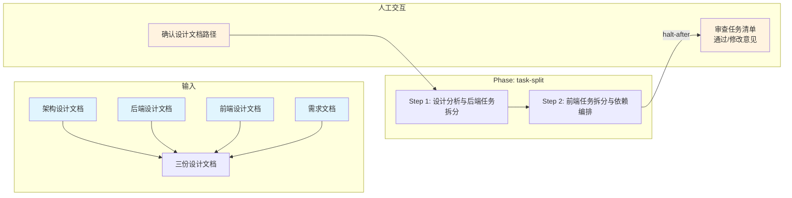

# 任务拆分技能

## 概述

用于把前后端设计文档拆分为可执行的开发任务清单。它以需求文档、后端设计与前端入口索引 `frontend-design.md`（经其定位各分端设计文件 `frontend-web.md` / `frontend-ios.md` / `frontend-android.md` / `frontend-hmos.md` / `frontend-h5.md`）为输入，按 2 步完成后端任务拆分、各目标端前端任务拆分（并标注所属平台）、依赖编排与文档组装，最终产出 `task/task-split.md`。

## 目录结构

```text
task-split/
├── SKILL.md                                      # 技能编排入口：定义 phases、steps、交付物与执行原则
├── README.md                                     # 技能说明文档：面向使用者的说明、流程图与能力概览
├── steps/
│   ├── step-01-backend-tasks.md                  # 拆分后端任务并建立 REQ 追溯关系
│   └── step-02-frontend-and-assembly.md          # 拆分前端任务、编排依赖并组装文档
├── checkpoints/                                  # 各步骤与最终交付的校验规则
│   ├── step-01-checkpoint.md
│   └── step-02-final.md
└── references/
    ├── task_split_standard.md                    # 任务拆分标准与章节结构
    └── task_split_template.md                    # task-split 文档模板
```

## 执行流程图



## Agent 职责矩阵

| 步骤 | 负责的 Agent | AI 做什么 | 人工需要做什么 |
|------|-------------|-----------|---------------|
| **Step 1** 后端任务拆分 | `task-splitter` | 从前后端设计文档提炼工作包 + REQ 追溯，按模块/技术层次生成后端任务清单 | 确认设计文档路径与拆分粒度偏好 |
| **Step 2** 前端任务拆分 | `task-splitter` + `assembler` | 按功能点分组生成前端任务清单 → 生成任务级依赖关系 → 组装为完整的 task-split.md + L2 审查 | **审查任务拆分文档**：通过后移交下游 fullstack-code-implementation |

## 核心能力

- 设计文档解析（后端/前端设计 → 工作包映射）
- 后端任务拆分（按模块/技术层次分层生成）
- 前端任务拆分（按目标端 + 功能点/组件边界分组，覆盖 PC Web / iOS / Android / HMOS / H5，并标注所属平台）
- 任务依赖关系推导（先后端 → 后前端，任务间前置依赖）
- REQ 编号追溯（任务 ↔ 需求项映射）
- 开放问题识别（设计不一致项标注）
- 任务复杂度评估
- L2 层级规则审查

## 产出物

| 产出 | 路径 | 作用 |
|------|------|------|
| 任务拆分文档 | `task/task-split.md` | 后端任务清单 + 前端(PC Web)任务清单 + iOS/Android/HMOS/H5 任务清单（按已生成分端设计文件）+ 依赖关系 + 开放问题 |
| 中间产出 | `_workspace/task/` | 各步骤的分析结果（用户确认后删除） |

## 架构层级

| 层 | 载体 | 本技能对应 |
|----|------|-----------|
| L5 编排层 | `SKILL.md` | `skills/task-split/SKILL.md` |
| L4 步骤层 | `steps/` | `skills/task-split/steps/step-01~02.md` |
| L3 调度层 | `commands/` | `commands/scheduler-protocol.md`（共享） |
| L2 执行层 | `agents/` | `agents/task-splitter.md`、`agents/assembler.md` |

