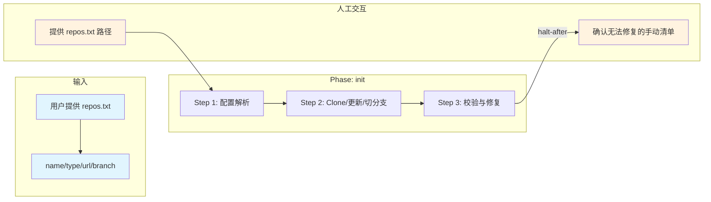

# 工作区初始化技能

## 概述

用于根据 `repos.txt` 批量初始化开发工作区。它以仓库清单为输入，按 3 步完成配置解析、仓库 clone/更新与状态校验修复，最终在工作区生成可用仓库目录并输出执行报告。

## 目录结构

```text
workspace-init/
├── SKILL.md                                      # 技能编排入口：定义 phases、steps、交付物与执行原则
├── README.md                                     # 技能说明文档：面向使用者的说明、流程图与能力概览
├── steps/
│   ├── step-01-parse-config.md                   # 解析 repos 配置并建立执行计划
│   ├── step-02-clone-update.md                   # 执行批量 clone / update / checkout
│   └── step-03-verify-repair.md                  # 校验仓库状态并尝试安全修复
├── checkpoints/                                  # 各步骤的校验规则
│   ├── step-01-checkpoint.md
│   ├── step-02-checkpoint.md
│   └── step-03-checkpoint.md
└── references/
    ├── repos-template.md                         # repos.txt 格式模板与示例
    └── repos.txt                                 # 参考配置文件
```

## 执行流程图



## Agent 职责矩阵

| 步骤 | 负责的 Agent | AI 做什么 | 人工需要做什么 |
|------|-------------|-----------|---------------|
| **Step 1** 配置解析 | `ops-executor` | 读取 repos.txt，解析 TSV 格式，校验必填字段 | 提供 repos.txt 文件 |
| **Step 2** Clone/更新 | `ops-executor` | 逐行执行 clone（目录不存在）或 fetch+checkout（目录存在），自动切换分支 | 无（自动执行） |
| **Step 3** 校验与修复 | `ops-executor` | 校验各仓库状态（分支是否正确、代码是否最新），尝试安全修复异常，输出手动清单 | 对无法修复的仓库按手动清单处理 |

## 核心能力

- 批量仓库克隆（按 repos.txt 驱动）
- 幂等执行（目录存在则 fetch+checkout，不存在则 clone）
- 自动切换分支（支持非默认分支）
- 仓库状态校验（分支正确性、代码最新状态）
- 安全修复（不执行 reset --hard、不删除目录）
- 异常报告与手动清单输出
- 安全边界控制（不覆盖非 git 目录、不自动 merge）

## 产出物

| 产出 | 路径 | 作用 |
|------|------|------|
| 仓库目录 | 工作区根目录下各 `<name>/` | 由 repos.txt 驱动，持久化 |
| 执行报告 | 控制台输出 | 通过/已修复/失败汇总 + 手动清单，非持久化 |

## 架构层级

| 层 | 载体 | 本技能对应 |
|----|------|-----------|
| L5 编排层 | `SKILL.md` | `skills/workspace-init/SKILL.md` |
| L4 步骤层 | `steps/` | `skills/workspace-init/steps/step-01~03.md` |
| L3 调度层 | `commands/` | `commands/scheduler-protocol.md`（共享） |
| L2 执行层 | `agents/` | `agents/ops-executor.md` |

