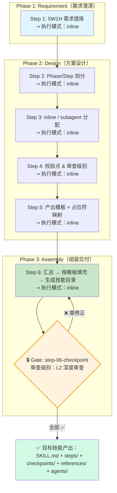

# Agent Skill 设计器

## 概述

借鉴 `sql-impact-analyzer` 的分阶段、分步骤、校验机制驱动、模板引用的设计模式，为任意 Agent Skill 的系统化设计提供标准化流程和产出模板。

区别于 `skill-creator`（仅定义文件格式），本技能提供完整的设计方法论：从需求澄清到阶段划分、代理分配、质量机制设计、产出模板设计，最终组装为可用的 SKILL.md。

## 目录结构

```text
agent-skill-design/
├── SKILL.md                              # 技能编排入口
├── README.md                             # 本文件
├── steps/
│   ├── step-01-requirement-clarification.md  # 技能需求澄清（5W1H）
│   ├── step-02-phase-design.md               # 阶段与步骤划分
│   ├── step-03-agent-design.md               # 代理与执行模式设计
│   ├── step-04-quality-mechanism.md           # 质量机制设计
│   ├── step-05-output-template.md             # 产出模板设计
│   └── step-06-assemble-skill.md              # 组装 SKILL.md
├── checkpoints/
│   └── step-06-checkpoint.md                  # 组装完成校验清单（L2 门禁）
├── references/
│   ├── skill-template.md                      # SKILL.md 填充模板
│   ├── step-template.md                       # Step 文件模板
│   ├── checkpoint-template.md                 # Checkpoint 文件模板
│   └── agent-template.md                      # Agent 指令文件模板
└── agents/
    └── (目标技能的子代理指令，按需生成)
```

## 执行流程图



## 执行流程详解

### Phase 1: Requirement — 需求澄清（1 步）

| 步骤 | 执行模式 | 输入 → 输出 |
|------|----------|------------|
| **Step 1** 5W1H 需求提炼 | `inline` | 用户自然语言描述 → 结构化技能需求规格清单（What/Who/When/Where/Why/How + 输入输出契约 + 触发词 + 约束） |

> **为什么用 inline**：需求澄清需要与用户交互确认，必须在主流程中完成，不适合委派给子代理。

---

### Phase 2: Design — 方案设计（4 步，可并行 Step 3/4/5）

| 步骤 | 执行模式 | 输入 → 输出 |
|------|----------|------------|
| **Step 2** Phase/Step 划分 | `inline` | Step 1 需求规格 → 阶段划分方案 + 步骤间数据流 |
| **Step 3** inline/subagent 分配 | `inline` | Step 2 划分方案 → 执行模式分配表 + 子代理定义（若需要） |
| **Step 4** 校验机制设计 | `inline` | Step 2+3 产出 → 校验点位置 + 审查级别 + 重试策略 |
| **Step 5** 产出模板设计 | `inline` | Step 1-4 全部产出 → 模板文件 + 占位符映射表 |

> **为什么全部 inline**：设计阶段是集中决策过程，所有步骤共享同一上下文（用户意图 + 技能规格），委派给子代理会丢失上下文连贯性。

#### Step 3 中的 inline / subagent 决策树

Step 3 为**目标技能**的每个步骤分配执行模式（注意：这是设计目标技能的 Agent，不是本技能的 Agent）：

```
目标技能的某个 Step 是否需要独立搜索/遍历大量文件？
├── 是 → subagent（选择合适的 agent 类型）
│        ├── context-gatherer：搜索代码库、收集引用
│        ├── general-task-execution：交叉校验、独立性验证
│        └── explore-agent：多源信息合成
└── 否 → 是否需要验证前面步骤的产出（而非生成新内容）？
    ├── 是 → subagent（独立审查者视角更可靠）
    └── 否 → inline
```

---

### Phase 3: Assembly — 组装交付（1 步 + 1 门禁）

| 步骤 | 执行模式 | 输入 → 输出 |
|------|----------|------------|
| **Step 6** 组装 SKILL.md | `inline` | Step 1-5 全部设计决策 → 完整技能目录（SKILL.md + steps/ + checkpoints/ + references/ + agents/） |

> **为什么用 inline**：组装是纯写文件操作，无搜索/验证需求，inline 即可高效完成。

---

### 🔒 门禁（Gate）机制

本技能在 Phase 3 末尾设置唯一门禁：`checkpoints/step-06-checkpoint.md`。

| 属性 | 值 |
|------|-----|
| 审查级别 | **L2 深度审查** |
| 触发时机 | Step 6 组装完成后 |
| 审查原则 | 独立校验目标技能的所有文件完整性和内容自洽性 |

#### 门禁校验维度

| 维度 | 检查项 | 判定 |
|------|--------|------|
| **文件完整性** | SKILL.md 存在且 frontmatter 完整；每个 Phase 引用的 Step 文件存在；每个 subagent 步骤对应的 agents/*.md 存在；每个校验点对应的 checkpoints/*.md 存在 | ✅/❌ |
| **内容一致性** | 触发词与 Step 1 一致；交付物命名与输出契约一致；执行原则与关键约束一致；责任矩阵与执行模式分配一致 | ✅/❌ |
| **可用性** | description 含功能说明+触发条件；步骤间无悬空引用；模板文件可打开 | ✅/❌ |
| **模板可用性** | HTML 可在浏览器打开；占位符命名统一（`{KEY_NAME}`）；占位符有填充来源说明 | ✅/⚠️ |

#### 门禁判定与重试

```
全部 ✅ → 技能设计完成，产出可投入使用
存在 ❌ → 修正对应文件后回到 Step 6 重新组装，重新触发门禁（最多 2 次）
仅 ⚠️ → 标注 [建议优化] 后交付，不阻塞流程
超过 2 次重试仍有 ❌ → 标注 [需人工确认] 后强制交付
```

---

## 设计原则

1. **Phase 驱动**：技能执行分为 Requirement → Design → Assembly 三个阶段，清晰分离关注点
2. **模板先行**：先设计 references 模板，再填充 step 内容，确保产出一致性
3. **校验内建**：关键节点设置校验点，用 checkpoints 清单确保质量
4. **代理分工**：明确 inline（主流程处理）和 subagent（独立搜索/验证）的边界
5. **门禁兜底**：组装完成后 L2 门禁强制审查，不合格不允许交付
6. **代理最小化**：只在需要独立搜索或独立验证时使用 subagent，其余保持 inline
7. **占位符统一**：模板中所有插入点使用 `{SNAKE_CASE}` 格式，避免命名冲突

## 使用方式

```
请使用 Agent Skill 设计器帮我设计一个技能：

我想做一个 {功能描述}，用来 {解决什么问题}，
用户会 {典型使用场景}。
```

## 产出物

| 产出 | 路径 | 说明 |
|------|------|------|
| 目标技能 SKILL.md | `{target-skill}/SKILL.md` | 技能编排入口 |
| 步骤文件 | `{target-skill}/steps/*.md` | 按 Phase 分组的执行步骤 |
| 校验清单 | `{target-skill}/checkpoints/*.md` | 质量控制点（门禁） |
| 产出模板 | `{target-skill}/references/*` | 最终交付物的格式模板 |
| 代理指令 | `{target-skill}/agents/*.md` | 子代理的行为定义 |
